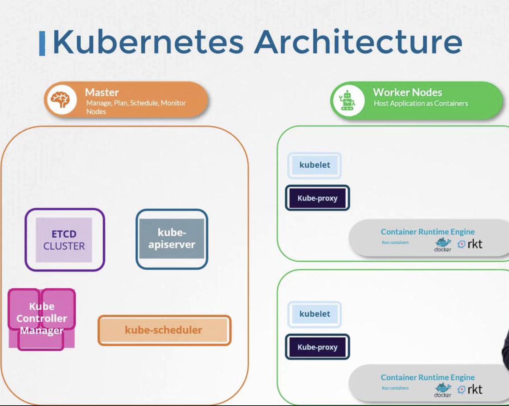

# Cluster Architecture

> This article provides an overview of Kubernetes cluster architecture, detailing the roles and components of master and worker nodes in managing containerized applications.

Kubernetes simplifies the deployment, scaling, and management of containerized applications through automation. In Kubernetes, the cluster consists of nodes—whether physical or virtual, on-premises or cloud-hosted—that host your containerized applications.

## Master Node Components

The master node contains several control plane components that manage the entire Kubernetes cluster. It keeps track of all nodes, decides where applications should run, and continuously monitors the cluster.

Kubernetes maintains detailed information about each container and its corresponding node in a highly available key-value store called etcd. Etcd uses a simple key-value format along with a quorum mechanism, ensuring reliable and consistent data storage across the cluster.

When a new container is ready, the Kubernetes scheduler determines which worker node should host it based on current load, resource requirements, and specific constraints like taints, tolerations, or node affinity rules. This scheduling process is vital for efficient cluster operation.

> 💡 The Kubernetes replication controller and other controllers ensure that the desired number of containers are running and managing node operations.

Other key master node components include:

- **ETCD Cluster:** Stores cluster-wide configuration and state data.
- **Kube Scheduler:** Determines the best node for new container deployments.
- **Controllers:** Manage node lifecycle, container replication, and system stability.
- **Kube API Server:** Acts as the central hub for cluster communication and management.

## Worker Node Components

Worker nodes, are responsible for running the containerized applications. Each node is managed by the Kubelet, which ensures that containers are running as instructed.

- **Kubelet:** Manages container lifecycle on an individual node. It receives instructions from the Kube API server to create, update, or delete containers, and regularly reports the node's status.
- **Kube Proxy:** Configures networking rules on worker nodes, thus enabling smooth inter-container communication across nodes. For instance, it allows a web server on one node to interact with a database on another.

> 💡 The entire control system is containerized. Whether you are using Docker, Containerd, or CRI-O, every node (including master nodes with containerized components) requires a compatible container runtime engine.

The high-level worker node architecture ensures that applications remain available and responsive, even as they communicate across a distributed network.

## Summary of Kubernetes Architecture

The Kubernetes cluster architecture is divided into two main segments:

| Component Category | Key Components                                     | Description                                                                                                 |
| ------------------ | -------------------------------------------------- | ----------------------------------------------------------------------------------------------------------- |
| **Master Node**    | etcd, Kube Scheduler, Controllers, Kube API Server | Centralized control and management of the entire cluster.                                                   |
| **Worker Node**    | Kubelet, Kube Proxy                                | Responsible for the lifecycle management of containers and ensuring network communication between services. |

This clear separation and coordination between master and worker nodes is fundamental to Kubernetes' ability to automate and streamline container orchestration.

We hope this detailed overview of Kubernetes cluster architecture has provided valuable insights. In upcoming articles, we will explore each component in depth, offering practical examples and exercises to further enhance your understanding of Kubernetes systems.

Happy learning and stay tuned for more Kubernetes content!
