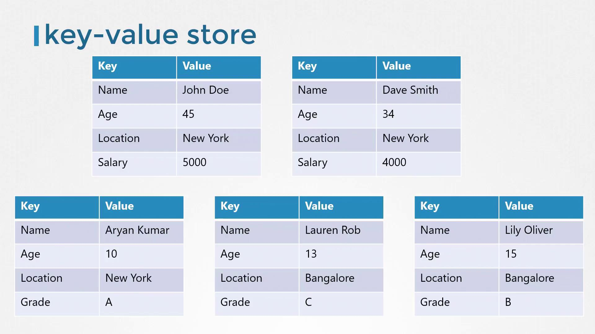

# ETCD for Beginners

> 💡 This article introduces etcd, a distributed key-value store, covering its operation, installation, and transition from API v2 to v3.

Later in the article, we will dive deeper into high availability topics. You’ll learn about distributed systems, how etcd operates in cluster mode, the Raft consensus protocol, and best practices for configuring a resilient etcd cluster.

## What Is a Key-Value Store?

Traditional relational databases, such as SQL databases, store data in tables with rows and columns. For example, a table that contains information about individuals might look like this:

- Each row represents a single person.
- Each column holds a specific detail about that person (e.g., name, age).

If you need to include additional information (like salary data for employed individuals or grades for students), you must expand the table. This means adding columns that may not apply universally to every row.

In contrast, a key-value store organizes data as independent documents or files. Each document contains all relevant information for an individual, allowing flexible and dynamic data structures:

- Working individuals can have documents with salary details.
- Students can have documents with grade details.



For complex data transactions, structured formats like JSON or YAML are used. Here are some examples of key-value pairs stored as JSON documents:

```json theme={null}
{
  "name": "John Doe",
  "age": 45,
  "location": "New York",
  "salary": 5000
}
```

```json theme={null}
{
  "name": "Dave Smith",
  "age": 34,
  "location": "New York",
  "salary": 4000,
  "organization": "ACME"
}
```

```json theme={null}
{
  "name": "Aryan Kumar",
  "age": 10,
  "location": "New York",
  "Grade": "A"
}
```

```json theme={null}
{
  "name": "Lily Oliver",
  "age": 15,
  "location": "Bangalore",
  "Grade": "B"
}
```

```json theme={null}
{
  "name": "Lauren Rob",
  "age": 13,
  "location": "Bangalore",
  "Grade": "C"
}
```

## Installing and Getting Started with etcd

Getting started with etcd is straightforward. First, download the correct binary for your operating system from the GitHub releases page, extract the archive, and run the etcd executable. By default, etcd listens on port 2379, allowing you to use the etcdctl client tool to store and retrieve key-value pairs.

For example, you can download etcd using the following command:

```bash theme={null}
curl -L https://github.com/etcd-io/etcd/releases/download/v3.3.11/etcd-v3.3.11-linux-amd64.tar.gz -o etcd-v3.3.11-linux-amd64.tar.gz
```

After extracting and starting etcd, the accompanying command-line client, etcdctl, lets you interact with your etcd instance. To store a key-value pair using the etcd API v2, run:

```bash theme={null}
./etcdctl set key1 value1
```

And to retrieve it:

```bash theme={null}
./etcdctl get key1
```

If you run the etcdctl command without any arguments, it displays a list of available commands similar to this:

```bash theme={null}
./etcdctl
```

```text theme={null}
NAME:
etcdctl - A simple command line client for etcd.

COMMANDS:
  backup          backup an etcd directory
  cluster-health  check the health of the etcd cluster
  mk              make a new key with a given value
  mkdir           make a new directory
  rm              remove a key or a directory
  rmdir           removes the key if it is an empty directory or a key-value pair
  get             retrieve the value of a key
```

> 💡 Different articles may reference varying versions of etcd. Understanding its version history—starting with version 0.1 in August 2013, introducing the Raft consensus algorithm in version 2.0 (February 2015), and further optimizations in version 3 (January 2017)—can clarify command differences. The etcd project was incubated in the CNCF in November 2018.

## Transitioning from API v2 to v3

One critical change between etcd versions is the API version used by etcdctl. Although etcdctl may be configured to use API v2 by default, newer installations typically default to API v3. You can verify the API version by running:

```bash theme={null}
./etcdctl --version
```

This command might output:

```text theme={null}
etcdctl version: 3.3.11
API version: 2
```

When you list available commands in API v2 mode:

```bash theme={null}
./etcdctl
```

the command list includes options like:

```text theme={null}
COMMANDS:
  backup               backup an etcd directory
  cluster-health       check the health of the etcd cluster
  mk                   make a new key with a given value
  mkdir                make a new directory
  rm                   remove a key or a directory
  rmdir                removes the key if it is an empty directory or a key-value pair
  get                  retrieve the value of a key
  ls                   retrieve a directory
  set                  set the value of a key
  setdir               create a new directory or update an existing directory TTL
  update               update an existing key with a given value
  updatedir           update an existing directory
  watch                watch a key for changes
  exec-watch           watch a key for changes and exec an executable
  member               member add, remove and list subcommands
  user                 user add, grant and revoke subcommands
  role                 role add, grant and revoke subcommands
```

To switch etcdctl to use API v3, you have two options:

1. Prepend the environment variable to the command:

   ```bash theme={null}
   ETCDCTL_API=3 ./etcdctl version
   ```

   This produces the output:

   ```text theme={null}
   etcdctl version: 3.3.11
   API version: 3
   ```

2. Or, export the environment variable for your session:

   ```bash theme={null}
   export ETCDCTL_API=3
   ./etcdctl version
   ```

   The output will similarly confirm the switch to API v3.

> 💡 In API v3, the command for setting a key changes from "set" to "put", while retrieving a key remains the same ("get"). Note that the `version` command is now a subcommand rather than an option.

After setting the environment variable, you can perform key-value operations with API v3 commands. For example:

```bash theme={null}
export ETCDCTL_API=3
./etcdctl version
```

Expected output:

```text theme={null}
etcdctl version: 3.3.11
API version: 3
```

Then, set a key-value pair:

```bash theme={null}
./etcdctl put key1 value1
```

This should output:

```text theme={null}
OK
```

And retrieve the value:

```bash theme={null}
./etcdctl get key1
```

Expected output:

```text theme={null}
key1
value1
```

## Conclusion

In this article, we explored etcd and the fundamentals of key-value storage, contrasting it with traditional relational databases. We demonstrated how to install etcd, use the etcdctl command-line tool, and navigate the transition from API v2 to API v3. In our upcoming article, we will examine how to configure etcd in a high-availability environment and its seamless integration with Kubernetes.

Thank you for reading, and stay tuned for further insights into etcd and distributed systems.
