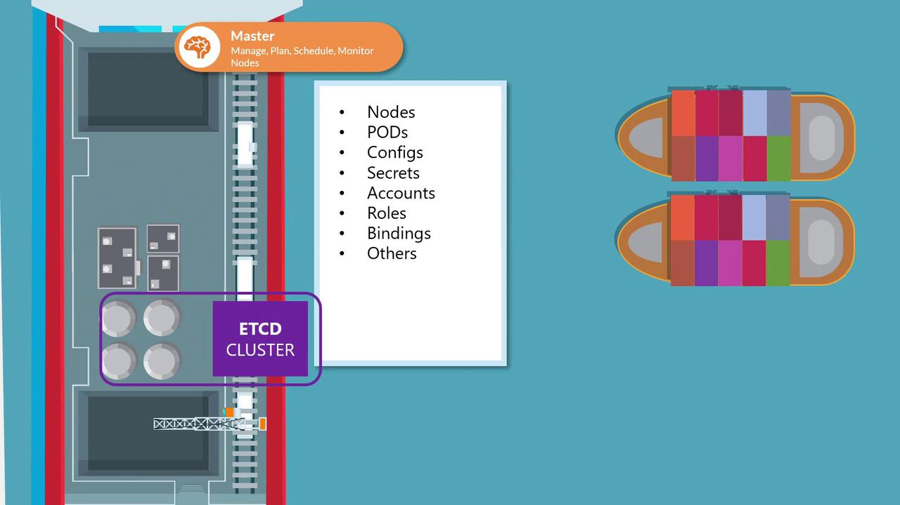

# ETCD in Kubernetes

> This article explores the role of etcd in Kubernetes, covering deployment methods and high availability considerations.

Whether you're setting up a Kubernetes cluster from scratch or using kubeadm, understanding etcd is essential.

etcd is a distributed key-value store that maintains configuration data, state information, and metadata for your Kubernetes cluster. Every object—nodes, pods, configurations, secrets, accounts, roles, and role bindings—is stored within etcd. When you run a command like `kubectl get`, the data is retrieved from this data store.



Any changes you make to the cluster—whether adding nodes, deploying pods, or configuring ReplicaSets—are first recorded in etcd. Only after etcd is updated then these changes considered to be complete.

> 💡 The etcd server typically listens on port 2379 for client requests. Ensuring that the advertised client URL (via the `--advertise-client-urls` option) is correctly configured is crucial for proper communication between the Kubernetes API Server and etcd.
> `--advertise-client-urls https://${INTERNAL_IP}:2379 `

## Deployment Methods

Depending on your Kubernetes setup, you can deploy etcd in two primary ways: manually from scratch or automatically with kubeadm. Each method has its use cases, with manual setups providing a deeper understanding of etcd configurations and kubeadm streamlining the deployment process.

---

## Deploying etcd from Scratch

When setting up your cluster manually, you'll need to download the etcd binaries, install them, and configure etcd as a service on your master node. Manual deployment gives you more control over configuration options, particularly for setting up TLS certificates.

Below is an example of how you might download the etcd binaries and configure the etcd service:

```bash theme={null}
wget -q --https-only \
"https://github.com/coreos/etcd/releases/download/v3.3.9/etcd-v3.3.9-linux-amd64.tar.gz"

# Example etcd service configuration
ExecStart=/usr/local/bin/etcd \
  --name ${ETCD_NAME} \
  --cert-file=/etc/etcd/kubernetes.pem \
  --key-file=/etc/etcd/kubernetes-key.pem \
  --peer-cert-file=/etc/etcd/kubernetes.pem \
  --peer-key-file=/etc/etcd/kubernetes-key.pem \
  --trusted-ca-file=/etc/etcd/ca.pem \
  --peer-trusted-ca-file=/etc/etcd/ca.pem \
  --peer-client-cert-auth \
  --client-cert-auth \
  --initial-advertise-peer-urls https://${INTERNAL_IP}:2380 \
  --listen-peer-urls https://${INTERNAL_IP}:2380 \
  --listen-client-urls https://${INTERNAL_IP}:2379,https://127.0.0.1:2379 \
  --advertise-client-urls https://${INTERNAL_IP}:2379 \
  --initial-cluster-token etcd-cluster-0 \
  --initial-cluster controller-0=https://${CONTROLLER0_IP}:2380,controller-1=https://${CONTROLLER1_IP}:2380 \
  --initial-cluster-state new \
  --data-dir=/var/lib/etcd
```

> For detailed information on configuring TLS certificates, refer to the Kubernetes documentation on [TLS Configuration](https://kubernetes.io/docs/concepts/cluster-administration/transport-layer-security/). Adjust certificate parameters according to your security requirements.

---

## High Availability Considerations

In a production Kubernetes environment, high availability (HA) is paramount. By running multiple master nodes with corresponding etcd instances, you ensure that your cluster remains resilient even if one node fails.

To enable HA, each etcd instance must know about its peers. This is achieved by configuring the `--initial-cluster` parameter with the details of each member in the cluster. For example:

```bash theme={null}
ExecStart=/usr/local/bin/etcd \
  --name ${ETCD_NAME} \
  --cert-file=/etc/etcd/kubernetes.pem \
  --key-file=/etc/etcd/kubernetes-key.pem \
  --peer-cert-file=/etc/etcd/kubernetes.pem \
  --peer-key-file=/etc/etcd/kubernetes-key.pem \
  --trusted-ca-file=/etc/etcd/ca.pem \
  --peer-trusted-ca-file=/etc/etcd/ca.pem \
  --peer-client-cert-auth \
  --client-cert-auth \
  --initial-advertise-peer-urls=https://${INTERNAL_IP}:2380 \
  --listen-peer-urls=https://${INTERNAL_IP}:2380 \
  --advertise-client-urls=https://${INTERNAL_IP}:2379 \
  --initial-cluster-token=etcd-cluster-0 \
  --initial-cluster controller-0=https://${CONTROLLER0_IP}:2380,controller-1=https://${CONTROLLER1_IP}:2380 \
  --initial-cluster-state=new \
  --data-dir=/var/lib/etcd
```

> In some deployments, you may use separate certificate files for peer communications (e.g., `/etc/etcd/peer.pem` and `/etc/etcd/peer-key.pem`). Always tailor these settings to match your desired security posture.

---

## Deploying etcd with kubeadm

For many test environments and streamlined deployments, kubeadm automatically configures etcd. When you use kubeadm, the etcd server runs as a pod within the kube-system namespace, abstracting away the manual setup details.

To view all the pods running in the kube-system namespace, including etcd, run:

```bash theme={null}
kubectl get pods -n kube-system
```

Example output:

```text theme={null}
NAMESPACE     NAME                                 READY   STATUS      RESTARTS   AGE
kube-system   coredns-78fcdf6894-prwl              1/1     Running     0          1h
kube-system   coredns-78fcdf6894-vqd9w             1/1     Running     0          1h
kube-system   etcd-master                          1/1     Running     0          1h
kube-system   kube-apiserver-master                1/1     Running     0          1h
kube-system   kube-controller-manager-master       1/1     Running     0          1h
kube-system   kube-proxy-f6k26                     1/1     Running     0          1h
kube-system   kube-proxy-hnzw                      1/1     Running     0          1h
kube-system   kube-scheduler-master                1/1     Running     0          1h
kube-system   weave-net-924k8                      2/2     Running     1          1h
kube-system   weave-net-hzfcz                      2/2     Running     1          1h
```

To examine the keys stored in etcd (organized under the registry directory), use the following command:

```bash theme={null}
kubectl exec etcd-master -n kube-system -- etcdctl get / --prefix --keys-only
```

Sample output:

```text theme={null}
/registry/apiregistration.k8s.io/apiservices/v1
/registry/apiregistration.k8s.io/apiservices/v1.apps
/registry/apiregistration.k8s.io/apiservices/v1.authentication.k8s.io
/registry/apiregistration.k8s.io/apiservices/v1.authorization.k8s.io
/registry/apiregistration.k8s.io/apiservices/v1.autoscaling
/registry/apiregistration.k8s.io/apiservices/v1.batch
/registry/apiregistration.k8s.io/apiservices/v1.networking.k8s.io
/registry/apiregistration.k8s.io/apiservices/v1.rbac.authorization.k8s.io
/registry/apiregistration.k8s.io/apiservices/v1beta1.admissionregistration.k8s.io
```

The etcd root directory, organized as the registry, contains subdirectories for various Kubernetes components such as nodes, pods, ReplicaSets, and Deployments.

---

## Conclusion

In this article, we examined etcd’s essential role in Kubernetes by exploring both manual deployment and automated configuration with kubeadm. We also discussed best practices for configuring high availability in multi-master environments. As you advance, further exploration into HA configurations and enhanced security measures will help you operate a robust and resilient Kubernetes cluster.

For more in-depth resources, check out:

- [Kubernetes Documentation](https://kubernetes.io/docs/)
- [Kubernetes Basics](https://kubernetes.io/docs/concepts/overview/what-is-kubernetes/)
- [Docker Hub](https://hub.docker.com/)
- [Terraform Registry](https://registry.terraform.io/)
