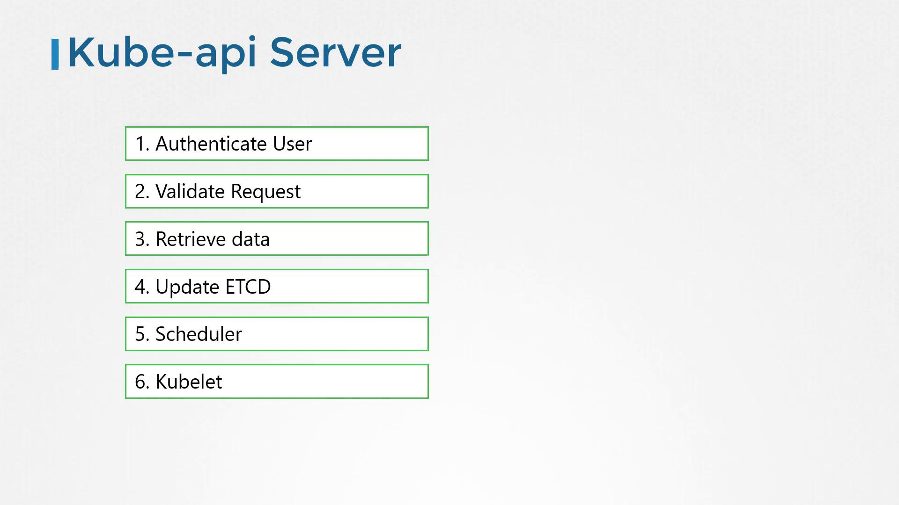

# Kube API Server

> 💡 This article provides a comprehensive guide on the Kube API Servers role in managing requests and coordinating components in a Kubernetes cluster.
> we explore how the Kube API Server acts as the central management component in a Kubernetes cluster by handling requests from kubectl, validating and authenticating them, interfacing with the etcd datastore, and coordinating with other system components.

When you execute a command like:

```bash theme={null}
kubectl get nodes
```

the utility sends a request to the API Server. The server processes this request by authenticating the user, validating the request, fetching data from the etcd cluster, and replying with the desired information. For example, the output of the command might be:

```plaintext theme={null}
NAME      STATUS   ROLES    AGE   VERSION
master    Ready    master   20m   v1.11.3
node01    Ready    <none>   20m   v1.11.3
```

## API Server Request Lifecycle

When a direct API POST request is made to create a pod, the API Server:

1. Authenticates and validates the request.
2. Constructs a pod object (initially without a node assignment) and updates the etcd store.
3. Notifies the requester that the pod has been created.

For instance, using a curl command:

```bash theme={null}
curl -X POST /api/v1/namespaces/default/pods ...[other]
Pod created!
```

The scheduler continuously monitors the API Server for pods that need node assignments. Once a new pod is detected, the scheduler selects an appropriate node and informs the API Server. The API Server then updates the etcd datastore with the new assignment and passes this information to the Kubelet on the worker node. The Kubelet deploys the pod via the container runtime and later updates the pod status back to the API Server for synchronization with etcd.

> 💡 At the heart of these operations is the Kube API Server, ensuring secure and validated communication between the cluster components.



## Deployment and Setup

If your cluster is bootstrapped with a kube admin tool, most of these intricate details are abstracted. However, when setting up a cluster on your own hardware, you need to download the Kube API Server binary from the [Kubernetes release page](https://kubernetes.io/releases/), configure it, and run it as a service on the Kubernetes master node.

## Typical Service Configuration

The Kube API Server is launched with a variety of parameters to secure communication and manage the cluster effectively. Below is an example of a typical service configuration file:

```bash theme={null}
wget https://storage.googleapis.com/kubernetes-release/release/v1.13.0/bin/linux/amd64/kube-apiserver

# kube-apiserver.service
ExecStart=/usr/local/bin/kube-apiserver \\
  --advertise-address=${INTERNAL_IP} \\
  --allow-privileged=true \\
  --apiserver-count=3 \\
  --authorization-mode=Node,RBAC \\
  --bind-address=0.0.0.0 \\
  --client-ca-file=/var/lib/kubernetes/ca.pem \\
  --enable-admission-plugins=Initializers,NamespaceLifecycle,NodeRestriction,LimitRanger,ServiceAccount,DefaultStorageClass,ResourceQuota \\
  --enable-swagger-ui=true \\
  --etcd-cafile=/var/lib/kubernetes/ca.pem \\
  --etcd-certfile=/var/lib/kubernetes/kubernetes.pem \\
  --etcd-keyfile=/var/lib/kubernetes/kubernetes-key.pem \\
  --etcd-servers=https://127.0.0.1:2379 \\
  --event-ttl=1h \\
  --experimental-encryption-provider-config=/var/lib/kubernetes/encryption-config.yaml \\
  --kubelet-certificate-authority=/var/lib/kubernetes/ca.pem \\
  --kubelet-client-certificate=/var/lib/kubernetes/kubernetes.pem \\
  --kubelet-client-key=/var/lib/kubernetes/kubernetes-key.pem \\
  --kubelet-https=true \\
  --runtime-config=api/all \\
  --service-account-key-file=/var/lib/kubernetes/service-account.pem \\
  --service-cluster-ip-range=10.32.0.0/24 \\
  --service-node-port-range=30000-32767 \\
  --v=2
```

> 💡 The configuration includes several certificate-related options, securing communication channels between various Kubernetes components. In upcoming sections, we will take a deeper look at SSL/TLS certificates and their role in ensuring secure interactions.

> 💡 `--etcd-servers=https://127.0.0.1:2379` - The option etcd servers is where you specify the location of the etcd servers.This is how kube API server connects to the etcd servers

## Verifying the Deployment

For clusters set up with kube-admin tools, the Kube API Server is deployed as a pod in the kube-system namespace. To inspect these pods, run:

```bash theme={null}
kubectl get pods -n kube-system
```

Expected output may include:

```plaintext theme={null}
NAMESPACE      NAME                                        READY   STATUS    RESTARTS   AGE
kube-system    coredns-78fcdf6894-hwrq9                    1/1     Running   0          16m
kube-system    coredns-78fcdf6894-rzhjr                    1/1     Running   0          16m
kube-system    etcd-master                                 1/1     Running   0          15m
kube-system    kube-apiserver-master                       1/1     Running   0          15m
kube-system    kube-controller-manager-master              1/1     Running   0          15m
kube-system    kube-proxy-lzt6f                            1/1     Running   0          16m
kube-system    kube-proxy-zm5qd                            1/1     Running   0          15m
kube-system    kube-scheduler-master                       1/1     Running   0          15m
kube-system    weave-net-29z42                             2/2     Running   1          16m
kube-system    weave-net-snm1l                             2/2     Running   1          16m
```

In kubeadm-based clusters, you can examine the container command options directly within the pod definition file located at /etc/kubernetes/manifests directory

```bash theme={null}
cat /etc/kubernetes/manifests/kube-apiserver
```

```yaml theme={null}
spec:
  containers:
    - command:
        - kube-apiserver
        - --authorization-mode=Node,RBAC
        - --advertise-address=172.17.0.32
        - --allow-privileged=true
        - --client-ca-file=/etc/kubernetes/pki/ca.crt
        - --disable-admission-plugins=PersistentVolumeLabel
        - --enable-admission-plugins=NodeRestriction
        - --enable-bootstrap-token-auth=true
        - --etcd-cafile=/etc/kubernetes/pki/etcd/ca.crt
        - --etcd-certfile=/etc/kubernetes/pki/apiserver-etcd-client.crt
        - --etcd-keyfile=/etc/kubernetes/pki/apiserver-etcd-client.key
        - --etcd-servers=https://127.0.0.1:2379
        - --insecure-port=0
        - --kubelet-client-certificate=/etc/kubernetes/pki/apiserver-kubelet-client.crt
        - --kubelet-client-key=/etc/kubernetes/pki/apiserver-kubelet-client.key
        - --kubelet-preferred-address-types=InternalIP,ExternalIP,Hostname
        - --proxy-client-cert-file=/etc/kubernetes/pki/front-proxy-client.crt
        - --proxy-client-key-file=/etc/kubernetes/pki/front-proxy-client.key
        - --requestheader-allowed-names=front-proxy-client
        - --requestheader-client-ca-file=/etc/kubernetes/pki/front-proxy-ca.crt
        - --requestheader-extra-headers-prefix=X-Remote-Extra-
        - --requestheader-group-headers=X-Remote-Group
        - --requestheader-username-headers=X-Remote-User
```

For non-kube-admin setups, to review the active API Server configuration is by checking the systemd service file on the master node:

```bash theme={null}
cat /etc/systemd/system/kube-apiserver.service
```

An example excerpt from this file might be:

```bash theme={null}
[Service]
ExecStart=/usr/local/bin/kube-apiserver \\
  --advertise-address=${INTERNAL_IP} \\
  --allow-privileged=true \\
  --apiserver-count=3 \\
  --audit-log-maxage=30 \\
  --audit-log-maxbackup=3 \\
  --audit-log-maxsize=100 \\
  --audit-log-path=/var/log/audit.log \\
  --authorization-mode=Node,RBAC \\
  --bind-address=0.0.0.0 \\
  --client-ca-file=/var/lib/kubernetes/ca.pem \\
  --enable-admission-plugins=Initializers,NamespaceLifecycle,NodeRestriction,LimitRanger,ServiceAccount,DefaultStorageClass,ResourceQuota \\
  --enable-swagger-ui=true \\
  --etcd-cafile=/var/lib/kubernetes/ca.pem \\
  --etcd-certfile=/var/lib/kubernetes/kubernetes.pem \\
  --etcd-keyfile=/var/lib/kubernetes/kubernetes-key.pem \\
  --etcd-servers=https://10.240.0.10:2379,https://10.240.0.11:2379,https://10.240.0.12:2379 \\
  --event-ttl=1h \\
  --experimental-encryption-provider-config=/var/lib/kubernetes/encryption-config.yaml \\
  --kubelet-certificate-authority=/var/lib/kubernetes/ca.pem \\
  --kubelet-client-certificate=/var/lib/kubernetes/kubernetes.pem \\
  --kubelet-client-key=/var/lib/kubernetes/kubernetes-key.pem \\
  ...
```

## Checking the Running Process

To verify that the Kube API server is running and to inspect its active options, execute the following command on the master node:

```
ps -aux | grep kube-apiserver

```

## Quick Reference Table

Below is a summary of some key Kubernetes components involved in the Kube API Server workflow:

| Component       | Role                                                                                   | Command/Action Example                            |
| --------------- | -------------------------------------------------------------------------------------- | ------------------------------------------------- |
| kubectl         | CLI tool to send API requests                                                          | `kubectl get nodes`                               |
| Kube API Server | Central component for processing, authenticating, and validating requests              | Processes API requests and interacts with etcd    |
| Scheduler       | Monitors API Server for unassigned pods and assigns them to worker nodes               | Automatically assigns node to newly created pods  |
| Kubelet         | Runs on worker nodes to manage pod lifecycle and communicate status back to API Server | Interacts with container runtime to deploy images |
| etcd            | Distributed key-value store used for saving cluster configuration                      | Stores all cluster state data                     |

## Summary

In this article, we provided an overview of the Kube API Server, its interactions with other essential components, and various methods to inspect its configuration—both through pod manifests and systemd service files. In subsequent sections, we will delve deeper into certificate management, including SSL/TLS configurations, to reinforce secure communications within your Kubernetes cluster.

> For a deeper understanding of Kubernetes and its components, explore the [Kubernetes Documentation](https://kubernetes.io/docs/).

This concludes our discussion on the Kube API Server.
