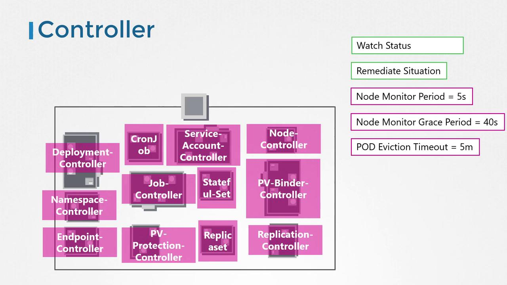

# Kube Controller Manager

> 💡 This guide covers the Kube Controller Managers role, configuration, and importance in managing controllers within a Kubernetes cluster. Understanding its role and configuration is crucial for ensuring a resilient and well-orchestrated Kubernetes environment.

## Overview

In Kubernetes, a controller acts like a department in an organization—each controller is tasked with handling a specific responsibility. For instance, one controller might monitor the health of nodes, while another ensures that the desired number of pods is always running. These controllers constantly observe system changes to drive the cluster toward its intended state.

> 💡 The Node Controller, for example, checks node statuses every five seconds through the Kube API Server. If a node stops sending heartbeats, it is not immediately marked as unreachable; instead, there is a grace period of 40 seconds followed by an additional five minutes for potential recovery before its pods are rescheduled onto a healthy node.

### Example: Checking Node Statuses

```bash theme={null}
kubectl get nodes
NAME         STATUS   ROLES    AGE   VERSION
worker-1     Ready    <none>   8d    v1.13.0
worker-2     Ready    <none>   8d    v1.13.0
```

In the case where a node fails to recover, the output might look like this:

```bash theme={null}
kubectl get nodes
NAME         STATUS     ROLES    AGE   VERSION
worker-1     Ready      <none>   8d    v1.13.0
worker-2     NotReady   <none>   8d    v1.13.0
```

Another essential controller is the Replication Controller, which ensures that the specified number of pods is maintained by creating new pods when needed. This mechanism reinforces the resilience and reliability of your Kubernetes cluster.

All core Kubernetes constructs—such as Deployments, Services, Namespaces, and Persistent Volumes—rely on these controllers. Essentially, controllers serve as the "brains" behind many operations in a Kubernetes cluster.

## How Controllers Are Packaged

All individual controllers are bundled into a single process known as the Kubernetes Controller Manager. When you deploy the Controller Manager, every associated controller is started together. This unified deployment simplifies management and configuration.

## Installing and Configuring the Kube Controller Manager

To install and view the Kube Controller Manager, follow these steps:

1. Download the Kube Controller Manager from the Kubernetes release page.
2. Extract the binary and run it as a service.
3. Review the configurable options provided, which allow you to tailor its behavior.

### Downloading the Controller Manager

```bash theme={null}
wget https://storage.googleapis.com/kubernetes-release/release/v1.13.0/bin/linux/amd64/kube-controller-manager
```

### Sample Service Configuration

Below is an example of a service file (`kube-controller-manager.service`) used to run the Controller Manager:

```bash theme={null}
ExecStart=/usr/local/bin/kube-controller-manager \
    --address=0.0.0.0 \
    --cluster-cidr=10.200.0.0/16 \
    --cluster-name=kubernetes \
    --cluster-signing-cert-file=/var/lib/kubernetes/ca.pem \
    --cluster-signing-key-file=/var/lib/kubernetes/ca-key.pem \
    --kubeconfig=/var/lib/kubernetes/kube-controller-manager.kubeconfig \
    --leader-elect=true \
    --root-ca-file=/var/lib/kubernetes/ca.pem \
    --service-account-private-key-file=/var/lib/kubernetes/service-account-key.pem \
    --service-cluster-ip-range=10.32.0.0/24 \
    --use-service-account-credentials=true \
    --v=2
```

This configuration includes additional options for the Node Controller, such as node monitor period, grace period, and eviction timeout. Additionally, you can control which controllers are enabled through the `--controllers` flag.

> By default, all controllers are enabled. You can selectively enable or disable controllers by using the syntax `foo` to enable and `-foo` to disable. For example, `--controllers=*,-tokencleaner` will disable the `tokencleaner` controller.

### Example of Specifying Controllers

```bash theme={null}
--controllers stringSlice       Default: [*]
A list of controllers to enable. '*' enables all on-by-default controllers, 'foo' enables the controller named 'foo', '-foo' disables the controller named 'foo'.
All controllers: attachdetach, bootstrapsigner, clusterrole-aggregation, cronjob, csrapproving,
csrcleaner, csrsigning, daemonset, deployment, disruption, endpoint, garbagecollector,
horizontalpodautoscaling, job, namespace, nodeipam, nodelifecycle, persistentvolume-binder,
persistentvolume-expander, podgc, pv-protection, pvc-protection, replicaset, replicationcontroller,
resourcequota, root-ca-cert-publisher, route, service, serviceaccount, serviceaccount-token, statefulset,
tokencleaner, ttl, ttl-after-finished
Disabled-by-default controllers: bootstrapsigner, tokencleaner
```

## Viewing the Controller Manager in Action

Depending on your cluster setup, the Controller Manager may run as a pod in the `kube-system` namespace (if set up using kubeadm)

```bash theme={null}
kubectl get pods -n kube-system
```

In kubeadm-based clusters, you can inspect the pod definition located in the `/etc/kubernetes/manifests` directory.

```bash theme={null}
cat /etc/kubernetes/manifests/kube-controller-manager.yaml
```

### Service Configuration Example (Non-Kubeadm Environments)

```bash theme={null}
cat /etc/systemd/system/kube-controller-manager.service
```

```plaintext theme={null}
[Service]
ExecStart=/usr/local/bin/kube-controller-manager \
  --address=0.0.0.0 \
  --cluster-cidr=10.200.0.0/16 \
  --cluster-name=kubernetes \
  --cluster-signing-cert-file=/var/lib/kubernetes/ca.pem \
  --cluster-signing-key-file=/var/lib/kubernetes/ca-key.pem \
  --kubeconfig=/var/lib/kubernetes/kube-controller-manager.kubeconfig \
  --leader-elect=true \
  --root-ca-file=/var/lib/kubernetes/ca.pem \
  --service-account-private-key-file=/var/lib/kubernetes/service-account-key.pem \
  --service-cluster-ip-range=10.32.0.0/24 \
  --use-service-account-credentials=true \
  --v=2
Restart=on-failure
RestartSec=5
```

### Checking the Running Process

To verify that the Kube Controller Manager is running and to inspect its active options, execute the following command on the master node:

```plaintext theme={null}
ps -aux | grep kube-controller-manager
```

An example output might be:

```plaintext theme={null}
root       1994  2.7  5.1 154360 105024 ?        Ssl  06:45   1:25 kube-controller-manager --address=127.0.0.1 --cluster-signing-cert-file=/etc/kubernetes/pki/ca.crt --cluster-signing-key-file=/etc/kubernetes/pki/ca.key --controllers=*,bootstrapsigner,tokencleaner --kubeconfig=/etc/kubernetes/controller-manager.conf --leader-elect=true --root-ca-file=/etc/kubernetes/pki/ca.crt --service-account-private-key-file=/etc/kubernetes/pki/sa.key --use-service-account-credentials=true
```



## Conclusion

This guide has provided an in-depth look at the Kube Controller Manager, detailing its critical functions in managing controllers, monitoring system changes, and ensuring the desired state within your Kubernetes cluster. By understanding and properly configuring the Controller Manager, you play a key role in maintaining a robust and scalable environment.

For additional details, you might find these resources useful:

- [Kubernetes Documentation](https://kubernetes.io/docs/)
- [Kubernetes Basics](https://kubernetes.io/docs/concepts/overview/what-is-kubernetes/)
