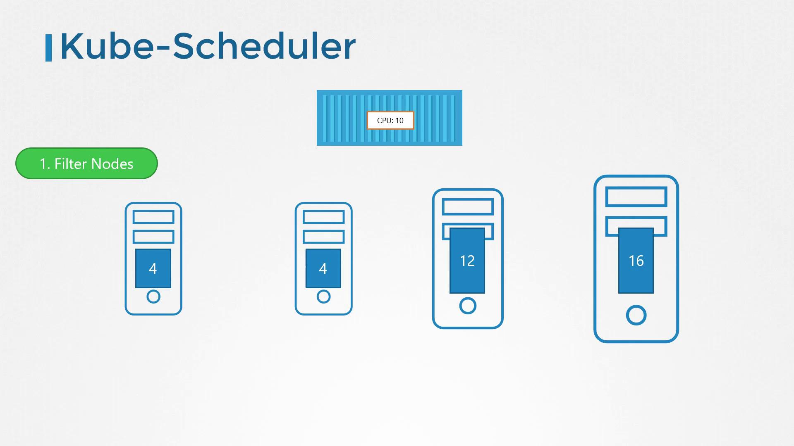
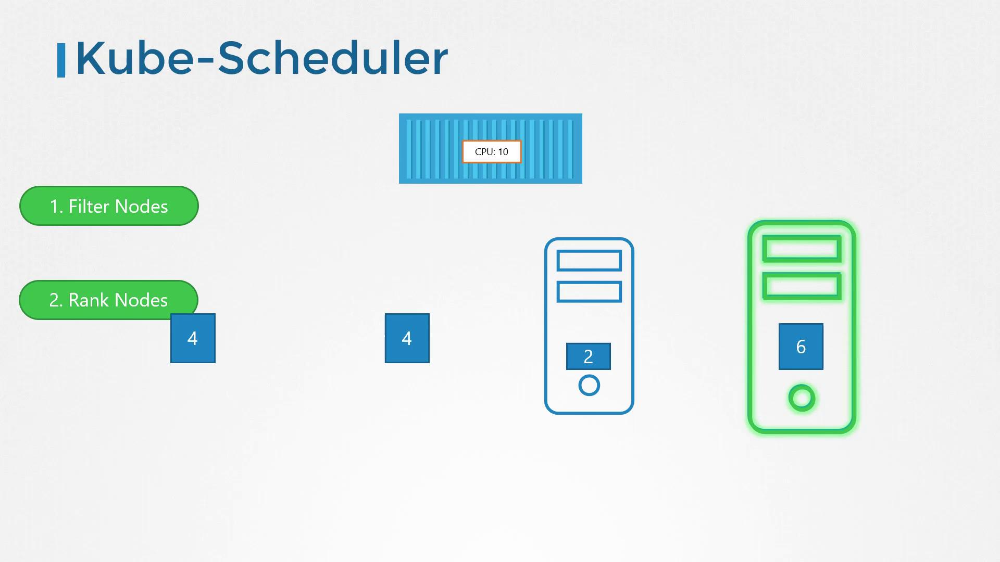

# Kube Scheduler

> 💡 In this guide, we delve into the scheduler’s role in determining on which node a pod should be placed. It is important to note that while the scheduler makes the placement decision, the actual creation of the pod on the selected node is carried out by the Kubelet.

## Scheduler Process Overview

The primary responsibility of the Kubernetes scheduler is to assign pods to nodes based on a series of criteria. This ensures that the selected node has sufficient resources and meets any specific requirements. For instance, different nodes may be designated for certain applications or come with varied resource capacities. When multiple pods and nodes are involved, the scheduler assesses each pod against the available nodes through a two-phase process: filtering and ranking.

### 1. Filtering Phase

In the filtering phase, the scheduler eliminates nodes that do not meet the pod's resource requirements. For example, nodes that lack sufficient CPU or memory are immediately excluded.



As depicted above, the diagram demonstrates the elimination of nodes with insufficient resources, leaving only the candidate nodes that can accommodate the pod's needs.

### 2. Ranking Phase

After filtering, the scheduler enters the ranking phase. Here, it uses a priority function to score and compare the remaining nodes on a scale from 0 to 10, ultimately selecting the best match. For instance, if placing a pod on one node would leave six free CPUs (four more than an alternative node), that node is assigned a higher score and is chosen.



This high-level overview outlines how Kubernetes efficiently filters and ranks nodes for optimal pod placement. The scheduler’s design is highly customizable, allowing you to develop your own scheduler if the need arises. For more advanced scheduling configurations—such as resource limits, taints and tolerations, node selectors, and affinity rules—refer to the [Kubernetes Documentation](https://kubernetes.io/docs/).

> 💡 Customizing the scheduling process can help tailor your Kubernetes environment to meet specific workloads and performance requirements.

## Installing and Running the Kube Scheduler

To install the kube-scheduler, download the binary from the Kubernetes release page. Once downloaded and extracted, you can run it as a service by specifying the scheduler configuration file. Below is a sample command for downloading the binary and an example systemd service configuration:

```bash theme={null}
wget https://storage.googleapis.com/kubernetes-release/release/v1.13.0/bin/linux/amd64/kube-scheduler
```

Below is an example of the systemd service configuration for the kube-scheduler:

```bash theme={null}
# File: kube-scheduler.service
ExecStart=/usr/local/bin/kube-scheduler \
  --config=/etc/kubernetes/config/kube-scheduler.yaml \
  --v=2
```

If you are using the kubeadm tool to set up your cluster, kubeadm deploys the kube-scheduler as a pod in the `kube-system` namespace on the master node. You can inspect the scheduler configuration by viewing the pod manifest file:

```bash theme={null}
cat /etc/kubernetes/manifests/kube-scheduler.yaml
```

This manifest file outlines the options used during the scheduler's deployment. To verify the running process and see the effective options, list the processes on the master node with:

```bash theme={null}
ps -aux | grep kube-scheduler
```

An example output might look similar to:

```bash theme={null}
root     2477  0.8  1.6  48524 34044 ?        Ssl  17:31   0:08 kube-scheduler --address=127.0.0.1 --kubeconfig=/etc/kubernetes/scheduler.conf --leader-elect=true
```

> 💡 If you need more detailed configuration options or troubleshooting tips for the kube-scheduler, refer to the [Kubernetes Documentation](https://kubernetes.io/docs/).

This concludes our in-depth lesson on the Kube Scheduler. In future modules, we will explore advanced scheduling concepts and configurations to further enhance your Kubernetes deployment strategies.
