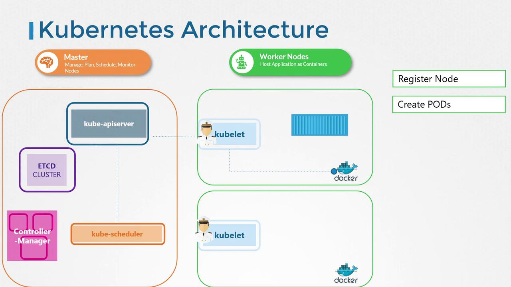

# Kubelet

> 💡 This article covers the Kubelets responsibilities, its role in Kubernetes, and instructions for installing it on worker nodes.

The Kubelet is often described as the "captain of the ship." It oversees node activities by managing container operations such as starting and stopping containers based on instructions from the master scheduler. Additionally, the Kubelet registers the node with the Kubernetes cluster and continuously monitors the state of pods and their containers. It regularly reports the status of the node and its workloads to the Kubernetes API server.

When the Kubelet receives instructions to run a container or pod, it communicates with the container runtime (e.g., Docker) to download the required image and initiate the container. It then maintains the health of these containers and ensures they operate as expected.



> 💡 The Kubelet is essential for node management in Kubernetes, acting as the intermediary between the cluster's control plane and the container runtime.

## Installing the Kubelet

Unlike other Kubernetes components, the Kubelet is not automatically deployed when you set up your cluster using tools like kubeadm. It must be installed manually on each worker node. Follow the steps below to install the Kubelet:

### Step 1: Download the Kubelet Binary

Execute the following command to download the Kubelet binary:

```bash theme={null}
wget https://storage.googleapis.com/kubernetes-release/release/v1.13.0/bin/linux/amd64/kubelet
```

### Step 2: Configure and Run the Kubelet as a Service

Set up the Kubelet with the required configuration by running it as a service. Use the command below to start the Kubelet with the necessary parameters:

```bash theme={null}
ExecStart=/usr/local/bin/kubelet \
  --config=/var/lib/kubelet/kubelet-config.yaml \
  --container-runtime=remote \
  --container-runtime-endpoint=unix:///var/run/containerd/containerd.sock \
  --image-pull-progress-deadline=2m \
  --kubeconfig=/var/lib/kubelet/kubeconfig \
  --network-plugin=cni \
  --register-node=true \
  --v=2
```

### Step 3: Verify the Kubelet Process

After installation, verify that the Kubelet is running by checking its process status on the worker node. Run the following command:

```bash theme={null}
ps -aux | grep kubelet
```

This command will display all active processes containing "kubelet" along with their configuration options. An example output might look like:

```bash theme={null}
root    2095  1.8  2.4 960676 98788 ?    Ssl  02:32   0:36 /usr/bin/kubelet --bootstrap-kubeconfig=/etc/kubernetes/bootstrap-kubelet.conf --kubeconfig=/etc/kubernetes/kubelet.conf --config=/var/lib/kubelet/config.yaml --cgroup-driver=cgroupfs --cni-bin-dir=/opt/cni/bin --cni-conf-dir=/etc/cni/net.d --network-plugin=cni
```

> 💡 Ensure that all paths and configuration files referenced in your commands exist and are correctly set up on your system.

## Next Steps

In the upcoming sections, we will explore additional Kubelet configurations, such as certificate generation and TLS bootstrapping, to further secure and optimize your Kubernetes nodes.

This concludes our lesson on the Kubelet. Continue learning in the next article to deepen your understanding of Kubernetes node management and cluster orchestration.

Happy learning!
