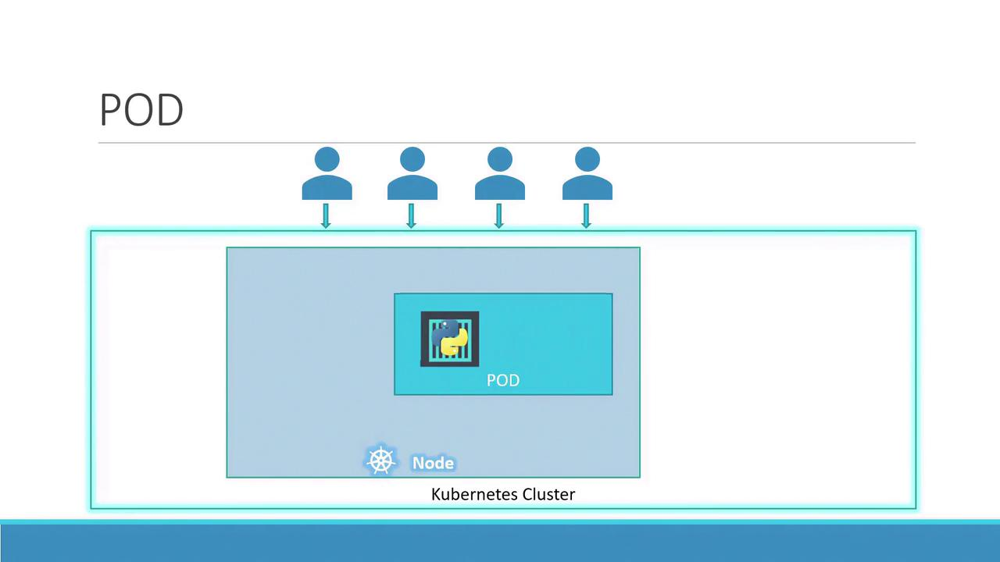
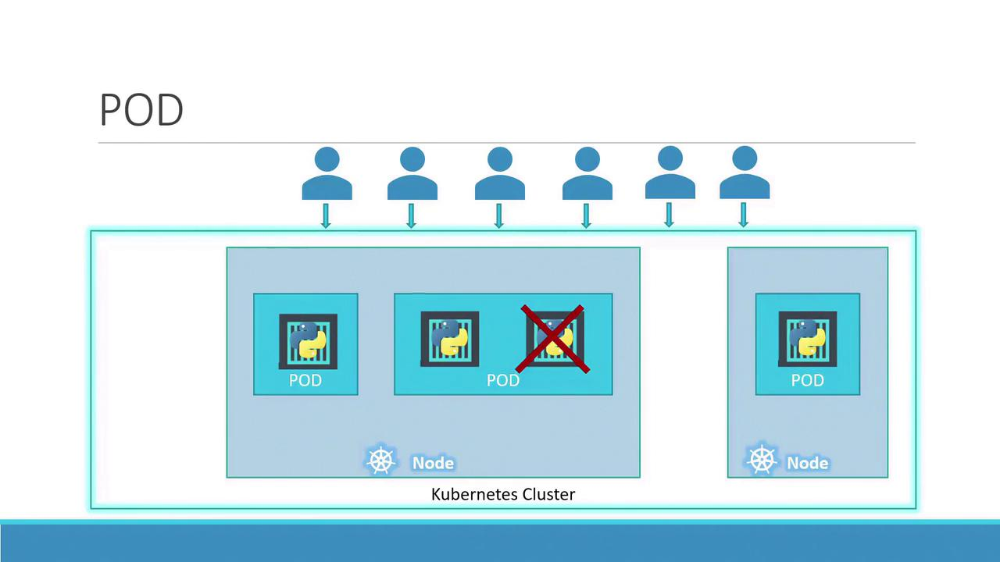
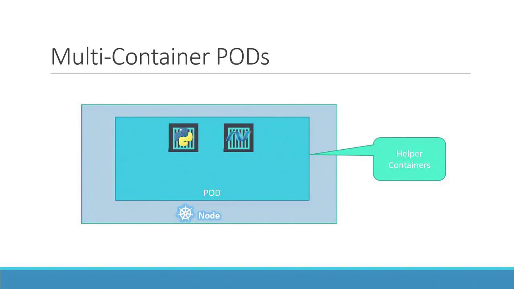

# Pods

> 💡 This article provides an in-depth guide on Kubernetes Pods, covering their deployment, scaling, and management within a Kubernetes cluster.

> 💡 We assume your application is already developed, built into Docker images, and hosted on a Docker repository (such as [Docker Hub](https://hub.docker.com/)). We also assume that your Kubernetes cluster is configured and operational—whether it is a single-node or multi-node cluster. With Kubernetes, the goal is to run containers on worker nodes, but rather than deploying containers directly, Kubernetes encapsulates them within an object called a pod. A pod represents a single instance of an application and is the smallest deployable unit in Kubernetes.

In the simplest scenario, a single-node Kubernetes cluster may run one instance of your application inside a Docker container encapsulated by a pod.

When user load increases, you can scale your application by spinning up additional instances—each running in its own pod. This approach isolates each instance, allowing Kubernetes to distribute the pods across available nodes as needed.



Instead of adding more containers to the same pod, additional pods are created. For instance, running two instances in separate pods allows the load to be shared across the node or even across multiple nodes if the demand escalates and additional cluster capacity is required.



> 💡 Remember, scaling an application in Kubernetes involves increasing or decreasing the number of pods, not the number of containers within a single pod.

Typically, each pod hosts a single container running your main application. However, a pod can also contain multiple containers, which are usually complementary rather than redundant. For example, you might include a helper container alongside your main application container to support tasks like data processing or file uploads. Both containers in the pod share the same network namespace (allowing direct communication via localhost), storage volumes, and lifecycle events, ensuring they start and stop together.



To better understand the concept, consider a basic Docker example. Suppose you initially deploy your application with a simple command:

```bash theme={null}
docker run python-app
```

When the load increases, you may launch additional instances manually:

```bash theme={null}
docker run python-app
docker run python-app
docker run python-app
docker run python-app
```

Now, if your application needs a helper container that communicates with each instance, managing links, custom networks, and shared volumes manually becomes complex. You’d have to run commands like:

```bash theme={null}
docker run helper --link app1
docker run helper --link app2
docker run helper --link app3
docker run helper --link app4
```

With Kubernetes pods, these challenges are resolved automatically. When a pod is defined with multiple containers, they share storage, the network namespace, and lifecycle events—ensuring seamless coordination and simplifying management.

Even if your current application design uses one container per pod, Kubernetes enforces the pod abstraction. This design prepares your application for future scaling and architectural changes, even though multi-container pods remain less common. This article primarily focuses on single-container pods for clarity.

## Deploying Pods

A common method to deploy pods is using the `kubectl run` command. For example, the following command creates a pod that deploys an instance of the nginx Docker image, pulling it from a Docker repository:

```bash theme={null}
kubectl run nginx --image nginx
```

Once deployed, you can verify the pod's status with the `kubectl get pods` command. Initially, the pod might be in a "ContainerCreating" state, followed by a transition to the "Running" state as the application container becomes active. Below is an example session:

```bash theme={null}
kubectl get pods
# Output:
# NAME                   READY   STATUS              RESTARTS   AGE
kubectl get pods
# Output after a few seconds:
# NAME                   READY   STATUS    RESTARTS   AGE
# nginx-8586cf59-whssr   1/1     Running   0          8s
```

At this stage, note that external access to the nginx web server has not been configured. The service is accessible only within the node. In a future article, we will explore configuring external access through Kubernetes networking and services.

> 💡 After mastering pod deployment, advance to networking and service configuration to expose your applications to end users.

That concludes our discussion on Kubernetes Pods. Proceed to the demo section to see these concepts in action, and stay tuned for the next article!
