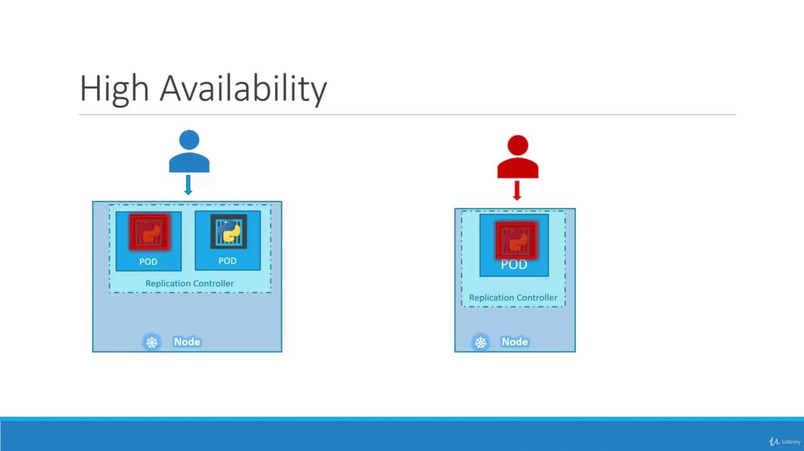
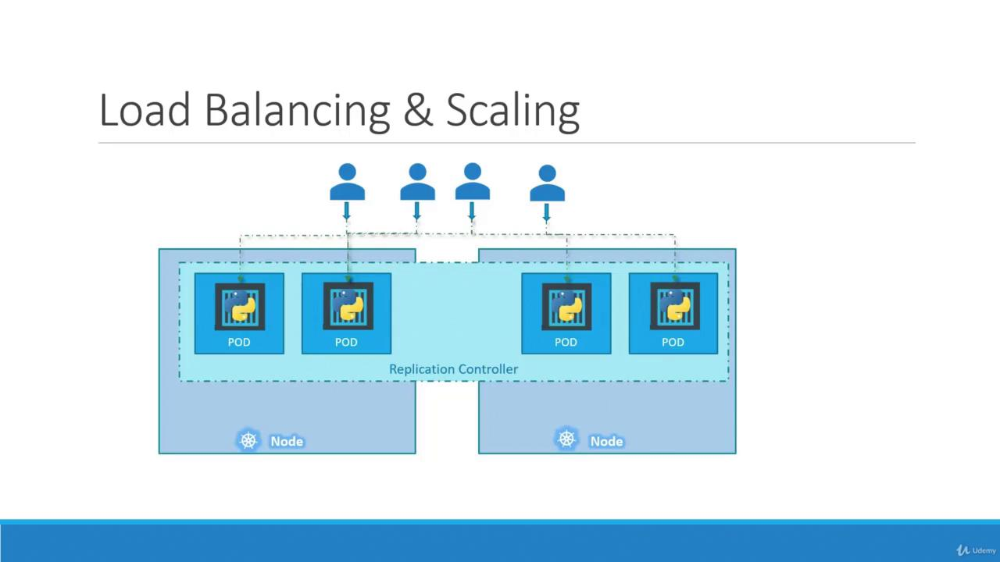

# ReplicaSets

> 💡 This article explains Kubernetes replication controllers and ReplicaSets, focusing on their roles in maintaining high availability and load balancing in clusters.

Kubernetes controllers continuously monitor objects and take necessary actions, and in this lesson, we focus on the replication controller—an essential building block for maintaining high availability in your cluster.

Imagine a scenario where a single pod runs your application. If that pod crashes or fails, users lose access. To prevent this risk, running multiple pod instances is key. A replication controller ensures high availability by creating and maintaining the desired number of pod replicas. Even if you intend to run a single pod, a replication controller adds redundancy by automatically creating a replacement if the pod fails.

If one pod serving your application crashes, the replication controller immediately deploys a new one to keep the service available.

For example, if you need to maintain a constant service level, the controller ensures the desired number of pods—whether one or one hundred—are always running.


Beyond availability, replication controllers also help distribute load. When user demand increases, additional pods can better balance that load. If resources on a particular node become scarce, new pods can be scheduled across other nodes in your cluster.



> 💡 While both replication controllers and replica sets serve similar purposes, the replication controller is the older technology being gradually replaced by the replica set. In this lesson, we will focus on replica sets for our demos and implementations.

---

## Creating a Replication Controller

To create a replication controller, start by writing a configuration file (e.g., `rc-definition.yaml`). Like any Kubernetes manifest, the file contains four main sections: `apiVersion`, `kind`, `metadata`, and `spec`.

1. **apiVersion**: For a replication controller, use `v1`.
2. **kind**: Set this to `ReplicationController`.
3. **metadata**: Provide a name (e.g., `myapp-rc`) and include labels such as `app` and `type`.
4. **spec**: This section is crucial. It not only defines the desired number of replicas with the `replicas` key but also includes a `template` section which serves as the blueprint for creating the pods. Ensure that all pod-related entries in the template are indented correctly and aligned with `replicas` as siblings.

Once your YAML file is ready, create the replication controller using the following command:

```bash theme={null}
kubectl create -f rc-definition.yml
```

Below is a complete example of a replication controller definition:

```yaml theme={null}
apiVersion: v1
kind: ReplicationController
metadata:
  name: myapp-rc
  labels:
    app: myapp
    type: front-end
spec:
  replicas: 3
  template:
    metadata:
      name: myapp-pod
      labels:
        app: myapp
        type: front-end
    spec:
      containers:
        - name: nginx-container
          image: nginx
```

When you run the following command, Kubernetes creates three pods according to the provided template:

```bash theme={null}
kubectl create -f rc-definition.yml
# Output:
# replicationcontroller "myapp-rc" created
```

To view the replication controller and its pods, run these commands:

```bash theme={null}
kubectl get replicationcontroller
kubectl get pods
```

A sample output might look like:

```bash theme={null}
> kubectl get replicationcontroller
NAME      DESIRED   CURRENT   READY   AGE
myapp-rc  3         3         3       19s

> kubectl get pods
NAME            READY   STATUS    RESTARTS   AGE
myapp-rc-4lvk9  1/1     Running   0          20s
myapp-rc-mc2mf  1/1     Running   0          20s
myapp-rc-px9pz  1/1     Running   0          20s
```

Notice that the pods' names include the replication controller's name (`myapp-rc`), indicating their origin.

---

## Introducing ReplicaSet

A ReplicaSet is a modern alternative to the replication controller, using an updated API version and some improvements. Here are the key differences:

1. **API Version**: Use `apps/v1` for a ReplicaSet.
2. **Selector**: In addition to metadata and specification, a ReplicaSet requires a `selector` to explicitly determine which pods to manage. This is defined using `matchLabels`, which can also capture pods created before the ReplicaSet if they match the criteria.

Below is an example ReplicaSet definition:

```yaml theme={null}
apiVersion: apps/v1
kind: ReplicaSet
metadata:
  name: myapp-replicaset
  labels:
    app: myapp
    type: front-end
spec:
  replicas: 3
  selector:
    matchLabels:
      type: front-end
  template:
    metadata:
      name: myapp-pod
      labels:
        app: myapp
        type: front-end
    spec:
      containers:
        - name: nginx-container
          image: nginx
```

Create the ReplicaSet with:

```bash theme={null}
kubectl create -f replicaset-definition.yml
```

Then, verify its creation:

```bash theme={null}
kubectl get replicaset
```

And view the associated pods:

```bash theme={null}
kubectl get pods
```

---

## Labels and Selectors

Labels in Kubernetes are critical because they enable controllers, such as ReplicaSets, to identify and manage the appropriate pods within a large cluster. For example, if you deploy multiple instances of a front-end web application, assign a label (e.g., `tier: front-end`) to each pod. Then, use a selector to target those pods:

```yaml theme={null}
selector:
  matchLabels:
    tier: front-end
```

The pod definition should similarly include the label:

```yaml theme={null}
metadata:
  name: myapp-pod
  labels:
    tier: front-end
```

This label-selector mechanism ensures that the ReplicaSet precisely targets the intended pods and maintains the set number of replicas by replacing any failed pods.

---

## Is the Template Section Required?

Even if three pods with matching labels already exist in your cluster, the template section in the ReplicaSet specification remains essential. It serves as the blueprint for creating new pods if any fail, ensuring the desired state is consistently maintained.

---

## Scaling the ReplicaSet

Scaling a ReplicaSet involves adjusting the number of pod replicas. There are two methods to achieve this:

1. **Update the Definition File**

   Modify the `replicas` value in your YAML file (e.g., change from 3 to 6) and update the ReplicaSet with:

   ```bash theme={null}
   kubectl replace -f replicaset-definition.yml
   ```

2. **Use the kubectl scale Command**

   Scale directly from the command line:

   ```bash theme={null}
   kubectl scale --replicas=6 -f replicaset-definition.yml
   ```

<Callout icon="lightbulb" color="#1CB2FE">
  Keep in mind that if you scale using the `kubectl scale` command, the YAML file still reflects the original number of replicas. To maintain consistency, it may be necessary to update the YAML file after scaling.
</Callout>

---

## Common Commands Overview

Below is a quick reference table summarizing some useful commands when working with replication controllers and ReplicaSets:

| Resource Type        | Use Case                        | Example Command                                                 |
| -------------------- | ------------------------------- | --------------------------------------------------------------- |
| Create Object        | Create from a definition file   | `kubectl create -f <filename>`                                  |
| View ReplicaSets/RC  | List replication controllers    | `kubectl get replicaset` or `kubectl get replicationcontroller` |
| Delete ReplicaSet/RC | Remove a replication controller | `kubectl delete replicaset <replicaset-name>`                   |
| Update Definition    | Replace object using YAML file  | `kubectl replace -f <filename>`                                 |
| Scale ReplicaSet/RC  | Change number of replicas       | `kubectl scale --replicas=<number> -f <filename>`               |

---

That concludes our lesson on ReplicaSets and replication controllers in Kubernetes. Understanding these concepts is vital for managing high availability and load balancing in your cluster. Happy learning!

For further reading, check out [Kubernetes Documentation](https://kubernetes.io/docs/).
