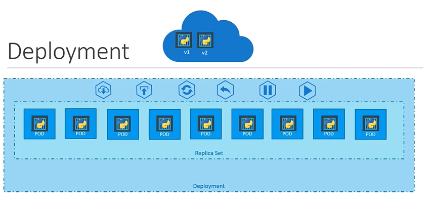

# Deployments

> 💡 This guide explores Kubernetes deployments, simplifying application management with features like rolling updates, rollbacks, and high availability.

In this guide, we dive into Kubernetes deployments—an abstraction that simplifies managing your applications in a production environment. Rather than interacting directly with pods and ReplicaSets, deployments offer advanced features that enable you to:

- Deploy multiple instances of your application (like a web server) to ensure high availability and load balancing.
- Seamlessly perform rolling updates for Docker images so that instances update gradually, reducing downtime.
- Quickly roll back to a previous version if an upgrade fails unexpectedly.
- Pause and resume deployments, allowing you to implement coordinated changes such as scaling, version updates, or resource modifications.
  > For example, you would like to make multiple changes to your environment such as upgrading the underlying web server versions as well as scaling your environment and also modifying the resource allocation etc., you don't want to apply each change immediately after the command is run, instead you would like to apply a pause to your environment , make the changes and then resume so that all changes are rolled out together.

Previously, we discussed how individual pods encapsulate containers and how ReplicaSets maintain multiple pod copies. A deployment, however, sits at a higher level, automatically managing ReplicaSets and pods while providing enhanced features like rolling updates and rollbacks.



## Creating a Deployment

To create a deployment, start by writing a deployment definition file. This file is similar to a ReplicaSet definition, with the key difference being that the kind is set to Deployment instead of ReplicaSet. Below is an example of a correct deployment definition file:

```yaml theme={null}
apiVersion: apps/v1
kind: Deployment
metadata:
  name: myapp-deployment
  labels:
    app: myapp
    type: front-end
spec:
  replicas: 3
  selector:
    matchLabels:
      type: front-end
  template:
    metadata:
      labels:
        app: myapp
        type: front-end
    spec:
      containers:
        - name: nginx-container
          image: nginx
```

Once your deployment definition file (for example, named deployment-definition.yml) is ready, create the deployment with the following command:

```bash theme={null}
kubectl create -f deployment-definition.yml
```

The command output should confirm that the deployment has been created:

```console theme={null}
deployment "myapp-deployment" created
```

To verify the deployment, run:

```bash theme={null}
kubectl get deployments
```

The output will look similar to this:

```console theme={null}
NAME                DESIRED   CURRENT   UP-TO-DATE   AVAILABLE   AGE
myapp-deployment    3         3         3            3           21s
```

## Behind the Scenes: How Deployments Work

When you create a deployment, Kubernetes automatically creates an associated ReplicaSet. To see this in action, run:

```bash theme={null}
kubectl get replicasets
```

You'll notice a new ReplicaSet with a name derived from your deployment. This ReplicaSet oversees the creation and management of pods. To view the pods managed by the ReplicaSet, run:

```bash theme={null}
kubectl get pods
```

While deployments and ReplicaSets work together seamlessly, deployments provide additional functionalities such as rolling updates, rollbacks, and the ability to pause/resume changes.

> 💡 To view all the created Kubernetes objects—deployments, ReplicaSets, pods, and more—use the following command:
>
> ```bash theme={null}
> kubectl get all
> ```
>
> This gives you a comprehensive overview of your deployment's components.

A sample output of the "kubectl get all" command might be:

```console theme={null}
NAME                            DESIRED   CURRENT   UP-TO-DATE   AVAILABLE   AGE
deploy/myapp-deployment         3         3         3            3           9h

NAME                                        DESIRED   CURRENT   READY   AGE
rs/myapp-deployment-6795844b58              3         3         3       9h

NAME                                      READY   STATUS    RESTARTS   AGE
po/myapp-deployment-6795844b58-5rbjl        1/1     Running   0          9h
po/myapp-deployment-6795844b58-h4w55         1/1     Running   0          9h
po/myapp-deployment-6795844b58-1fjhv         1/1     Running   0          9h
```

In this output, you can clearly see the deployment, its associated ReplicaSet, and the managed pods.

## Conclusion

This article has covered the fundamentals of creating a deployment in Kubernetes. By leveraging deployments, you gain powerful capabilities like rolling updates and rollbacks that make managing application updates and maintenance in production more efficient. Whether you are scaling your application or rolling out new features, Kubernetes deployments provide a robust solution for modern application management.

Happy deploying!

K8s Reference Docs:

- https://kubernetes.io/docs/concepts/workloads/controllers/deployment/
- https://kubernetes.io/docs/tutorials/kubernetes-basics/deploy-app/deploy-intro/
- https://kubernetes.io/docs/concepts/cluster-administration/manage-deployment/
- https://kubernetes.io/docs/concepts/overview/working-with-objects/kubernetes-objects/
