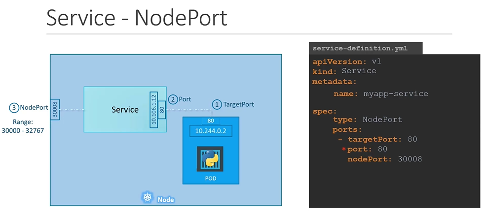
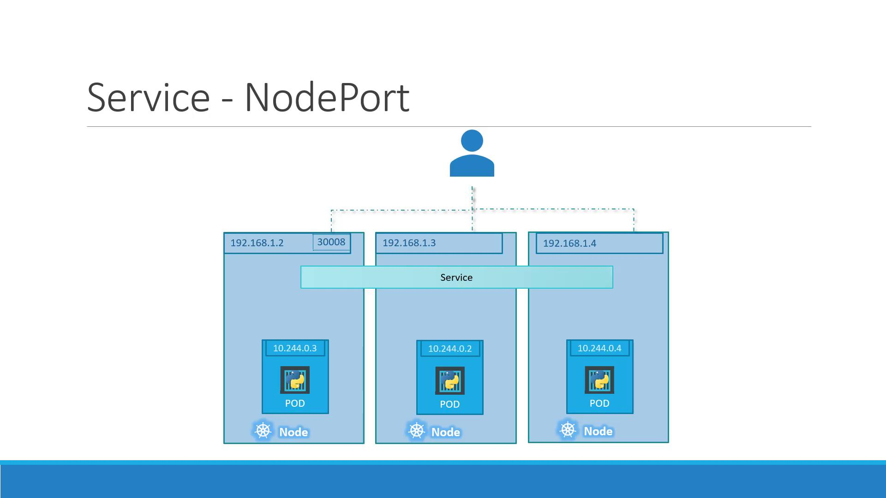

### NodePort Service Breakdown

With a NodePort service, there are three key ports to consider:


1. **Target Port:** The port on the Pod where the application listens (e.g., 80).
2. **Port:** The virtual port on the service within the cluster.
3. **NodePort:** The external port on the Kubernetes node (by default in the range 30000–32767).

## Creating a NodePort Service

The process of creating a NodePort service begins with defining the service in a YAML file. The definition file follows a similar structure to those used for Deployments or ReplicaSets, including API version, kind, metadata, and spec.

Below is an example YAML file that defines a NodePort service:

```yaml theme={null}
apiVersion: v1
kind: Service
metadata:
  name: myapp-service
spec:
  type: NodePort
  ports:
    - targetPort: 80
      port: 80
      nodePort: 30008
```

In this YAML:

- `targetPort` specifies the Pod’s application port.
- `port` is the port on the service that acts as a virtual server port within the cluster.
- `nodePort` maps the external request to the specific port on the node (ensure it’s between 30000 and 32767).

Note that if you omit `targetPort`, it defaults to the same value as `port`. Similarly, if `nodePort` isn’t provided, Kubernetes automatically assigns one.

However, this YAML definition does not link the service to any Pods. To connect the service to specific Pods, a `selector` is used, just as in ReplicaSets or Deployments. Consider the following Pod definition:

```yaml theme={null}
apiVersion: v1
kind: Pod
metadata:
  name: myapp-pod
  labels:
    app: myapp
    type: front-end
spec:
  containers:
    - name: nginx-container
      image: nginx
```

Now, update the service definition to include a selector that matches these labels:

```yaml theme={null}
apiVersion: v1
kind: Service
metadata:
  name: myapp-service
spec:
  type: NodePort
  ports:
    - targetPort: 80
      port: 80
      nodePort: 30008
  selector:
    app: myapp
    type: front-end
```

Save the file as `service-definition.yml` and create the service using:

```bash theme={null}
kubectl create -f service-definition.yml
```

You should see a confirmation message:

```bash theme={null}
service "myapp-service" created
```

Verify the service details with:

```bash theme={null}
kubectl get services
```

An example output might be:

```bash theme={null}
NAME             TYPE        CLUSTER-IP       EXTERNAL-IP   PORT(S)         AGE
kubernetes       ClusterIP   10.96.0.1        <none>        443/TCP         16d
myapp-service    NodePort    10.106.127.123   <none>        80:30008/TCP    5m
```

Access the web service externally by pointing your browser or using `curl` with the node IP and NodePort:

```bash theme={null}
curl http://192.168.1.2:30008
```

A typical response from an Nginx server might be:

```html theme={null}
<html>
  <head>
    <title>Welcome to nginx!</title>
    <style>
      body {
        width: 35em;
        margin: 0 auto;
        font-family: Tahoma, Verdana, Arial, sans-serif;
      }
    </style>
  </head>
  <body>
    ...
  </body>
</html>
```

## Kubernetes Services in Production

In a production environment, your application is likely spread across multiple Pods for high availability and load balancing. When Pods share matching labels, the service automatically detects and routes traffic to all endpoints. Kubernetes employs a round-robin (or random) algorithm to distribute incoming requests, serving as an integrated load balancer.

Furthermore, even if your Pods are spread across multiple nodes, Kubernetes ensures that the target port is mapped on all nodes. This means you can access your web application using the IP of any node along with the designated NodePort, providing reliable external connectivity.



> Regardless of whether your application runs on a single Pod on one node, multiple Pods on a single node, or Pods spread across several nodes, the service creation process remains consistent. Kubernetes automatically updates the service endpoints when Pods are added or removed, ensuring a flexible and scalable infrastructure.

## Summary

This article has provided a comprehensive introduction to Kubernetes NodePort services, covering the following key points:

- A detailed explanation of how NodePort services work and the roles of targetPort, service port, and nodePort.
- Step-by-step instructions on creating a NodePort service and linking it to your Pods via selectors.
- An overview of production scenarios where multiple Pods ensure high availability and load balancing.
