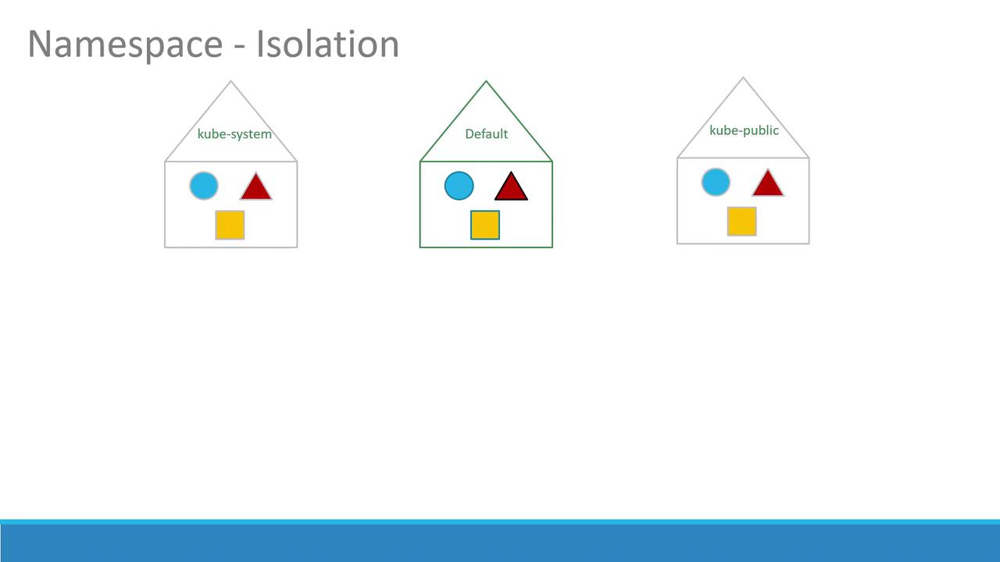
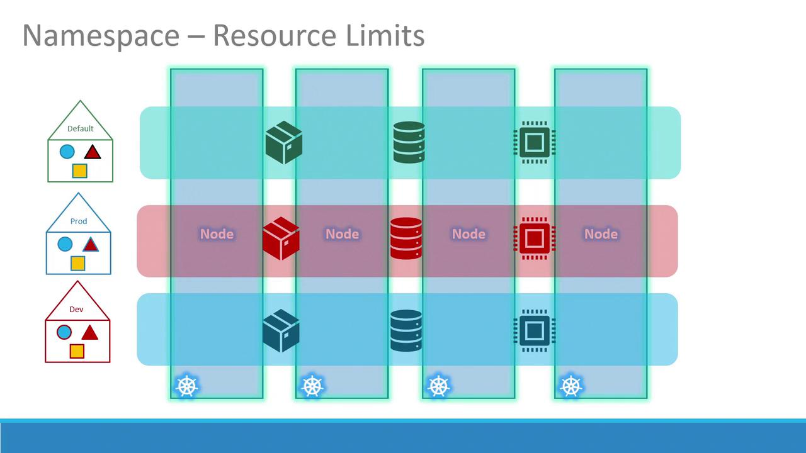
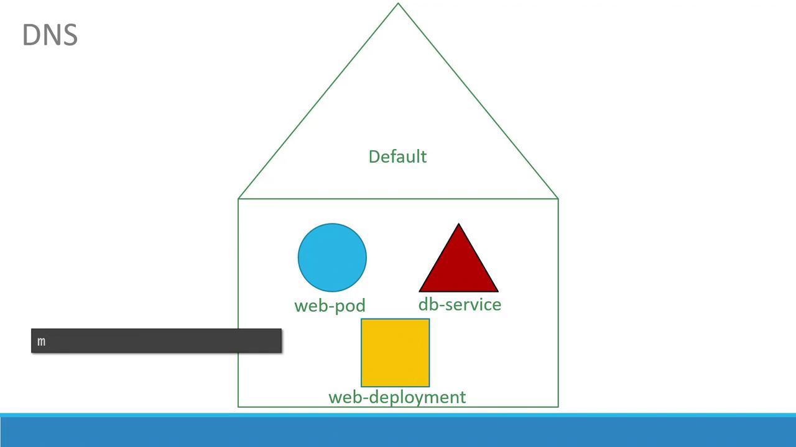
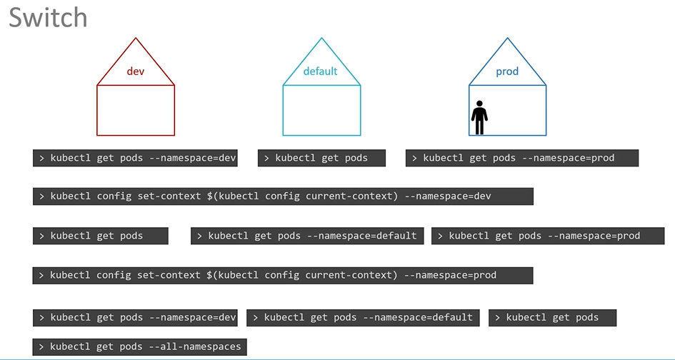

# Namespaces

> 💡 This article explores Kubernetes namespaces, their role in organizing ,isolating resources, and how to manage them effectively within a cluster.

## Understanding Namespaces

In Kubernetes, namespaces allow you to group and manage resources differently based on their context and intended use.

## Default Namespace and System Namespaces

By default, when you create objects such as pods, deployments, and services in your cluster, they are placed within a specific namespace (similar to being "inside a house"). The default namespace is automatically created during the Kubernetes cluster setup. Additionally, several system namespaces are created at startup:

- **kube-system**: Contains core system components like network services and DNS, segregated from user operations to prevent accidental changes.
- **kube-public**: Intended for resources that need to be publicly accessible across users.

> 💡 If you're running a small environment or a personal cluster for learning, you might predominantly use the default namespace. In enterprise or production environments, however, namespaces provide essential isolation and resource management by allowing environments like development and production to coexist on the same cluster.



## Isolating Resources with Namespaces

Namespaces allow you to set distinct policies and resource limits for different environments. This isolation prevents one namespace from interfering with another. For instance, you can apply separate resource quotas for CPU, memory, and the total number of pods to ensure fair usage across environments.



Within a single namespace, resources can refer to each other directly via their simple names. For example, a web application pod in the default namespace can access a database service simply by using its service name:



If the web app pod needs to communicate with a service located in a different namespace, you must use its fully qualified DNS name. For example, connecting to a database service named "db-service" in the "dev" namespace follows this format:

```SQL theme={null}
mysql.connect("db-service.dev.svc.cluster.local")
```

Here, "svc" indicates the service subdomain, followed by the namespace ("dev") and the service name, ending with the default domain "cluster.local".

## Managing Namespaces with kubectl

Using `kubectl`, you can manage resources across different namespaces. Below are some commonly used commands.

### Listing Pods in a Namespace

To list all pods in the default namespace:

```bash theme={null}
> kubectl get pods
NAME      READY   STATUS    RESTARTS   AGE
Pod-1     1/1     Running   0          3d
Pod-2     1/1     Running   0          3d
```

To list pods within the **kube-system** namespace:

```bash theme={null}
> kubectl get pods --namespace=kube-system
NAME                             READY   STATUS    RESTARTS   AGE
coredns-78cdf6894-92d52         1/1     Running   7          3d
coredns-78cdf6894-jx25g         1/1     Running   7          3d
etcd-master                      1/1     Running   7          3d
kube-apiserver-master           1/1     Running   7          3d
kube-controller-manager-master   1/1     Running   7          3d
kube-flannel-ds-amd64-hz4cf       1/1     Running   14         3d
kube-proxy-4b8tn                1/1     Running   7          3d
kube-proxy-98db4                1/1     Running   7          3d
kube-proxy-jjrb5                1/1     Running   7          3d
kube-scheduler-master            1/1     Running   7          3d
```

### Creating Pods in Specific Namespaces

When creating a pod without specifying the namespace, it is placed in the default namespace:

```bash theme={null}
> kubectl create -f pod-definition.yml
pod/myapp-pod created
```

To create the same pod in the "dev" namespace, you can either include the namespace option:

```bash theme={null}
> kubectl create -f pod-definition.yml --namespace=dev
pod/myapp-pod created
```

Or define the namespace within the pod definition file:

#### Without Namespace Specification

```yaml theme={null}
apiVersion: v1
kind: Pod
metadata:
  name: myapp-pod
  labels:
    app: myapp
    type: front-end
spec:
  containers:
    - name: nginx-container
      image: nginx
```

#### With Namespace Specification

```yaml theme={null}
apiVersion: v1
kind: Pod
metadata:
  name: myapp-pod
  namespace: dev
  labels:
    app: myapp
    type: front-end
spec:
  containers:
    - name: nginx-container
      image: nginx
```

### Creating a Namespace

You can create a namespace using a YAML file. For example, create a file named `namespace-dev.yml`:

```yaml theme={null}
apiVersion: v1
kind: Namespace
metadata:
  name: dev
```

Then run:

```bash theme={null}
> kubectl create -f namespace-dev.yml
namespace/dev created
```

Alternatively, create a namespace directly through the command line:

```bash theme={null}
> kubectl create namespace dev
```

### Setting the Default Namespace for Your Context

If you're working across multiple namespaces and want to avoid repeatedly specifying the namespace flag, you can set the default namespace for your current context:

```bash theme={null}
kubectl config set-context $(kubectl config current-context) --namespace=dev
```

After setting this, running:

```bash theme={null}
> kubectl get pods
```

will automatically list pods in the "dev" namespace. To list pods from all namespaces, use:

```bash theme={null}
> kubectl get pods --all-namespaces
```



> 💡 Contexts are used to manage multiple clusters and user environments within a single configuration. While switching namespaces is simple, managing contexts is a broader topic that warrants further exploration.

## Controlling Resource Usage with ResourceQuotas

To ensure that no single namespace overconsumes cluster resources, Kubernetes allows you to define ResourceQuotas. For example, create a file named `compute-quota.yaml` with the following content:

```yaml theme={null}
apiVersion: v1
kind: ResourceQuota
metadata:
  name: compute-quota
  namespace: dev
spec:
  hard:
    pods: "10"
    requests.cpu: "4"
    requests.memory: 5Gi
    limits.cpu: "10"
    limits.memory: 10Gi
```

Apply this configuration with:

```bash theme={null}
> kubectl create -f compute-quota.yaml
```

This configuration guarantees that the "dev" namespace does not exceed the specified resource limits.

## Conclusion

Namespaces are a fundamental component in Kubernetes, enabling you to segment and manage resources effectively. Whether you're isolating system components or separating development and production environments, using namespaces along with appropriate policies and resource quotas leads to a more efficient and organized cluster management.

Practice these concepts and explore additional Kubernetes functionalities to deepen your understanding. Happy clustering!

For further reading, check out these resources:
K8s Reference Docs:

- https://kubernetes.io/docs/concepts/overview/working-with-objects/namespaces/
- https://kubernetes.io/docs/tasks/administer-cluster/namespaces-walkthrough/
- https://kubernetes.io/docs/tasks/administer-cluster/namespaces/
- https://kubernetes.io/docs/tasks/administer-cluster/manage-resources/quota-memory-cpu-namespace/
- https://kubernetes.io/docs/tasks/access-application-cluster/list-all-running-container-images/
