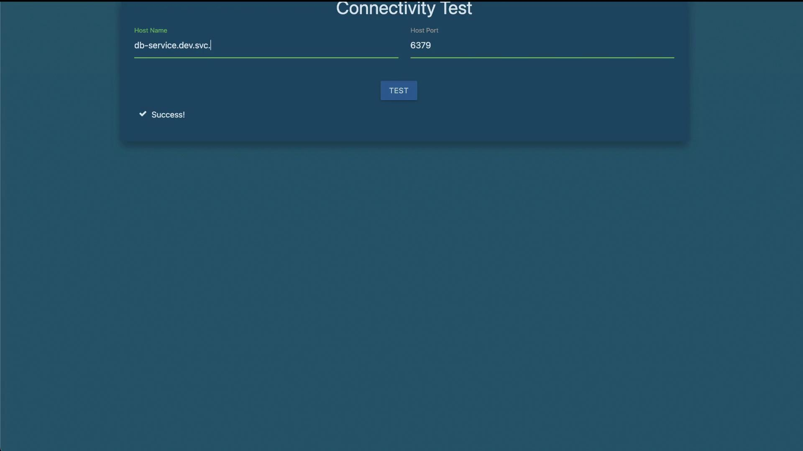

# Practical Namespace Management

> 💡 This article covers tasks ranging from identifying namespaces to configuring inter-namespace communication for applications and services.

## Identifying the Number of Namespaces

To begin, determine how many namespaces exist on the system. Run the following command to list all namespaces:

```bash theme={null}
kubectl get namespaces
```

Alternatively, you can use the shorthand version:

```bash theme={null}
kubectl get ns
```

For example, you might see an output similar to:

```bash theme={null}
NAME                     STATUS    AGE
default                  Active    6m50s
kube-system              Active    6m49s
kube-public              Active    6m49s
kube-node-lease          Active    6m49s
finance                  Active    27s
marketing                Active    27s
dev                      Active    27s
prod                     Active    27s
manufacturing            Active    27s
research                 Active    27s
```

This output indicates that there are 10 namespaces available.

## Listing Pods in a Specific Namespace

Next, check the number of pods running within the research namespace. Use one of the following commands:

```bash theme={null}
kubectl get pods --namespace=research
```

Or with the shorthand option:

```bash theme={null}
kubectl get pods -n research
```

The expected outcome should display that there are two pods in the research namespace.

## Creating a Pod in the Finance Namespace

To create a pod in the finance namespace, you can use the `kubectl run` command with the appropriate namespace flag. For instance, running the following command without specifying a namespace creates the pod in the default namespace:

```bash theme={null}
kubectl run redis --image=redis
```

To instead create the pod in the finance namespace, include the `-n` flag as shown below:

```bash theme={null}
kubectl run redis --image=redis -n finance
```

After executing this command, verify the pod creation by listing pods in the finance namespace:

```bash theme={null}
kubectl get pods -n finance
```

A sample output might resemble:

```bash theme={null}
NAME      READY   STATUS             RESTARTS   AGE
payroll   1/1     Running            0          2m20s
redis     0/1     ContainerCreating  0          8s
```

## Determining the Namespace of the Blue Pod

To identify which namespace contains the blue pod, you can either inspect pods in each namespace individually or use the `--all-namespaces` flag to list every pod cluster-wide.

First, inspect a specific namespace using:

```bash theme={null}
kubectl get pods -n finance
```

And list all namespaces with:

```bash theme={null}
kubectl get ns
```

For a more efficient search, list pods across all namespaces:

```bash theme={null}
kubectl get pods --all-namespaces
```

A sample output might look like this:

```bash theme={null}
NAMESPACE      NAME                                                       READY   STATUS              RESTARTS   AGE
kube-system    local-path-provisioner-6c79684f77-j5qx                      1/1     Running             0          9m5s
kube-system    corends-5788995cd-bkj56                                      1/1     Running             0          9m5s
kube-system    helm-install-traefik-crd-d2f67                               0/1     Completed           0          9m7s
kube-system    metrics-server-7cd5fc6b67-kdgzb                                1/1     Running             0          9m5s
kube-system    helm-install-traefik-c987s                                   1/1     Running             0          9m5s
kube-system    svcvlc-traefik-jptsh                                          2/2     Running             0          8m30s
kube-system    traefik-6bb96f9fbd8-w9zxr                                     1/1     Running             0          3m3s
marketing      redis-db                                                   1/1     Running             0          3m3s
dev            red-app                                                    1/1     Running             0          3m3s
finance        payroll                                                    1/1     Running             0          3m3s
marketing      blue                                                       0/1     CrashLoopBackOff    4 (80s ago) 3m3s
research       dna-1                                                      1/1     Running             0          3m3s
research       dna-2                                                      0/1     CrashLoopBackOff    4 (70s ago) 3m3s
finance        redis                                                      1/1     Running             0          51s
```

From this output, notice that the blue pod is located in the **marketing** namespace.

## Accessing the Blue Application and Its Database Service

The blue application is a simple web-based tool used for connectivity tests. When launched from the terminal interface, it opens up a browser window that displays the application.

The next step is to determine which DNS name the blue application should use to access the database (DB) service within its own namespace. To verify, first list the pods and services in the marketing namespace.

List the pods:

```bash theme={null}
kubectl get pods -n marketing
```

Sample output:

```bash theme={null}
NAME       READY   STATUS    RESTARTS   AGE
redis-db   1/1     Running   0          4m14s
blue       1/1     Running   0          4m14s
```

Then, list the services in the same namespace:

```bash theme={null}
kubectl get svc -n marketing
```

Sample output:

```bash theme={null}
NAME          TYPE       CLUSTER-IP     EXTERNAL-IP   PORT(S)           AGE
blue-service  NodePort   10.43.82.162   <none>        8080:30082/TCP    4m27s
db-service    NodePort   10.43.134.33   <none>        6379:30758/TCP    4m27s
```

> 💡 **Note: DNS Access**
> When connecting to services within the same namespace, referencing the service by its name (e.g., "db-service") is sufficient due to Kubernetes' internal DNS resolution.

After configuring the connection, verify that the connectivity test confirms the correct host name and port settings.



## Accessing the DB Service in a Different Namespace

Now, consider how to access the DB service when it is located in a different namespace from the blue application. Assume that there is a service named "db-service" in both the marketing and dev namespaces. First, verify the services in these namespaces.

In the marketing namespace:

```bash theme={null}
kubectl get svc -n marketing
```

Output example:

```bash theme={null}
NAME         TYPE        CLUSTER-IP     EXTERNAL-IP   PORT(S)         AGE
blue-service NodePort    10.43.82.162   <none>        8080:30082/TCP  4m27s
db-service   NodePort    10.43.134.33   <none>        6379:30758/TCP  4m27s
```

In the dev namespace:

```bash theme={null}
kubectl get svc -n dev
```

Output example:

```bash theme={null}
NAME         TYPE        CLUSTER-IP     EXTERNAL-IP   PORT(S)    AGE
db-service   ClusterIP   10.43.252.9    <none>        6379/TCP   5m22s
```

To access the DB service in the dev namespace from an application situated in another namespace, use the fully qualified domain name (FQDN) that follows this format:

db-service.dev.svc.cluster.local

This format includes the service name, the namespace, and the cluster domain, ensuring accurate DNS resolution across namespaces.

> 💡 **Tip for Inter-Namespace Communication:**
> Using the FQDN is essential when accessing services from a different namespace. This ensures clear resolution, especially in clusters with multiple services sharing the same name.

Testing the connection with this FQDN should confirm that the blue application can successfully communicate with the DB service in the dev namespace.
