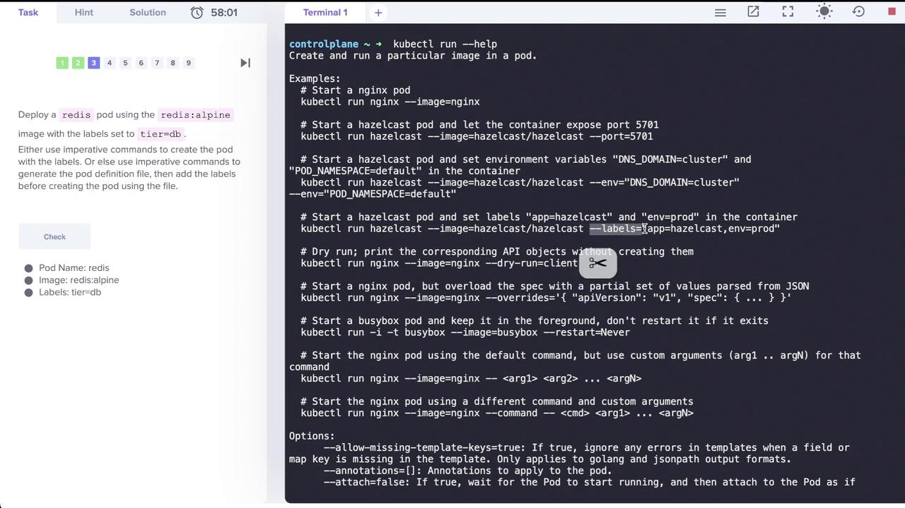
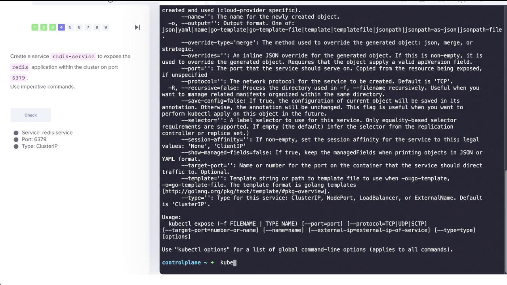
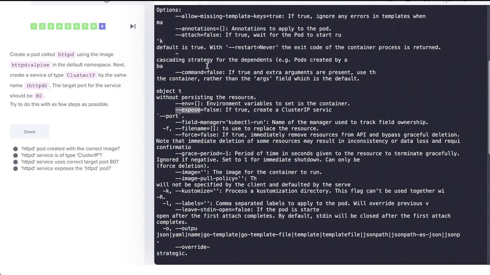

# Demo of Imperative vs Declarative Commands

> 💡 This article provides an overview of imperative commands in Kubernetes for creating and managing pods, services, deployments, and namespaces.Gain practical experience creating pods, services, deployments, and namespaces imperatively—an invaluable exercise for exam preparation and day-to-day operations.

─────────────────────────────

## Deploying Pods Imperatively

### Deploying an Nginx Pod

Start by deploying an Nginx pod named "nginx-pod" using the `nginx:alpine` image. Run the following command:

```bash theme={null}
kubectl run nginx-pod --image=nginx:alpine
```

You should see output similar to:

```bash theme={null}
pod/nginx-pod created
```

─────────────────────────────

### Deploying a Redis Pod with Labels

Next, deploy a Redis pod using the `redis:alpine` image and assign it the label `tier=db`. The `--labels` option accepts key-value pairs and supports multiple labels separated by commas. The image below illustrates deploying a Redis pod with the specified label:

To view available commands , you can run

```bash theme={null}
kubectl run --help
```



Execute this command:

```bash theme={null}
kubectl run redis --image=redis:alpine --labels="tier=db"
```

─────────────────────────────

## Creating Services

### Exposing the Redis Application

To expose the Redis pod on port 6379, create a ClusterIP service named "redis-service". Although the command `kubectl create service clusterip` exists, it does not support specifying selectors. Instead, use the `kubectl expose` command, which automatically uses the pod’s labels as selectors.

For example, run:

```bash theme={null}
kubectl expose pod redis --port=6379 --name=redis-service
```

Afterwards, verify the service with:

```bash theme={null}
kubectl get svc redis-service
```

Expected output:

```text theme={null}
NAME            TYPE        CLUSTER-IP      EXTERNAL-IP   PORT(S)    AGE
redis-service   ClusterIP   10.43.56.187    <none>        6379/TCP   12s
```

Below are additional examples showcasing various usages of the `kubectl expose` command:

```bash theme={null}
kubectl expose rc nginx --port=80 --target-port=8000
kubectl expose -f nginx-controller.yaml --port=80 --target-port=8000
kubectl expose pod valid-pod --port=444 --name=frontend
kubectl expose service nginx --port=443 --target-port=8443 --name=nginx-https
kubectl expose rc streamer --port=4100 --protocol=UDP --name=video-stream
kubectl expose rs nginx --port=80 --target-port=8000
kubectl expose deployment nginx --port=80 --target-port=8000
```

### Understanding `kubectl create service clusterip`

Running the following command without providing a name will result in an error:

```bash theme={null}
kubectl create service clusterip
```

Output:

```bash theme={null}
error: exactly one NAME is required, got 0
See 'kubectl create service clusterip --help' for help and examples
```

To create a ClusterIP service named "my-cs" mapping port 5678 to target port 8080, use:

```bash theme={null}
kubectl create service clusterip my-cs --tcp=5678:8080
```

For a headless service, specify:

```bash theme={null}
kubectl create service clusterip my-cs --clusterip='None'
```

> 💡 Since the `kubectl create service clusterip` command does not allow specifying selectors, using `kubectl expose` is the recommended approach.

For more details on exposing the Redis application, refer to the image below:



─────────────────────────────

## Creating a Deployment

Create a deployment named "webapp" using the `kodekloud/webapp-color` image and then scale it to three replicas. Execute the following commands:

```bash theme={null}
kubectl create deployment webapp --image=kodekloud/webapp-color
kubectl scale deployment webapp --replicas=3
```

You should see:

```bash theme={null}
deployment.apps/webapp created
```

Use the command below to check that all three replicas are running:

```bash theme={null}
kubectl get deployments
```

─────────────────────────────

## Creating a Pod with a Specific Container Port

Next, create a pod called "custom-nginx" using the nginx image and configure it to expose container port 8080:

```bash theme={null}
kubectl run custom-nginx --image=nginx --port=8080
```

This configures the pod so that the container listens on port 8080.

─────────────────────────────

## Managing Namespaces and Deployments

### Creating a Namespace

To organize your resources, create a new namespace called "dev-ns":

```bash theme={null}
kubectl create namespace dev-ns
```

### Deploying in a Specific Namespace

Within the "dev-ns" namespace, deploy a new deployment named "redis-deploy" using the Redis image, scaled to two replicas:

```bash theme={null}
kubectl create deployment redis-deploy --image=redis --replicas=2 -n dev-ns
```

Verify the deployment using:

```bash theme={null}
kubectl get deployment -n dev-ns
```

Expected output:

```text theme={null}
NAME          READY   UP-TO-DATE   AVAILABLE   AGE
redis-deploy  2/2     2            2           12s
```

─────────────────────────────

## Creating a Pod and Exposing It as a Service in One Step

In this task, create a pod named "httpd" using the `httpd:alpine` image in the default namespace and simultaneously expose it as a ClusterIP service on port 80. The `kubectl run` command supports the `--expose` option to automatically create a service.

Run the command below:

```bash theme={null}
kubectl run httpd --image=httpd:alpine --port=80 --expose=true
```

You should see:

```bash theme={null}
pod/httpd created
```

Then, verify that both the pod and its corresponding service have been created:

```bash theme={null}
kubectl get pod httpd
kubectl get svc httpd
```

To view detailed service information, run:

```bash theme={null}
kubectl describe svc httpd
```

This confirms that the service has the correct selector (e.g., `run=httpd`), target port (80/TCP), and that endpoints are automatically discovered.

For a visual outline of the creation process, refer to the diagram below:



─────────────────────────────

## Final Verification

Verify your Kubernetes resources by listing all pods:

```bash theme={null}
kubectl get pod
```

Sample output:

```text theme={null}
NAME                               READY   STATUS    RESTARTS   AGE
nginx-pod                          1/1     Running   0          12m
redis                              1/1     Running   0          10m
webapp-7b59bf687d-n7xxp            1/1     Running   0          5m49s
webapp-7b59bf687d-rds95            1/1     Running   0          5m4s
webapp-7b59bf687d-4gqmt            1/1     Running   0          5m4s
custom-nginx                       1/1     Running   0          3m41s
httpd                              1/1     Running   0          8s
```

Next, verify your services:

```bash theme={null}
kubectl get svc
```

Expected output:

```text theme={null}
NAME            TYPE        CLUSTER-IP      EXTERNAL-IP   PORT(S)    AGE
kubernetes      ClusterIP   10.43.0.1       <none>        443/TCP   20m
redis-service   ClusterIP   10.43.56.187    <none>        6379/TCP  6m35s
httpd           ClusterIP   10.43.112.233   <none>        80/TCP    15s
```

Finally, describe the "httpd" service for full configuration details:

```bash theme={null}
kubectl describe svc httpd
```

This command confirms the service's selector, ClusterIP, exposed ports, and endpoints.

> 💡 Imperative commands are great for quick testing and learning; however, for production deployments, consider using declarative configurations for better maintainability.
