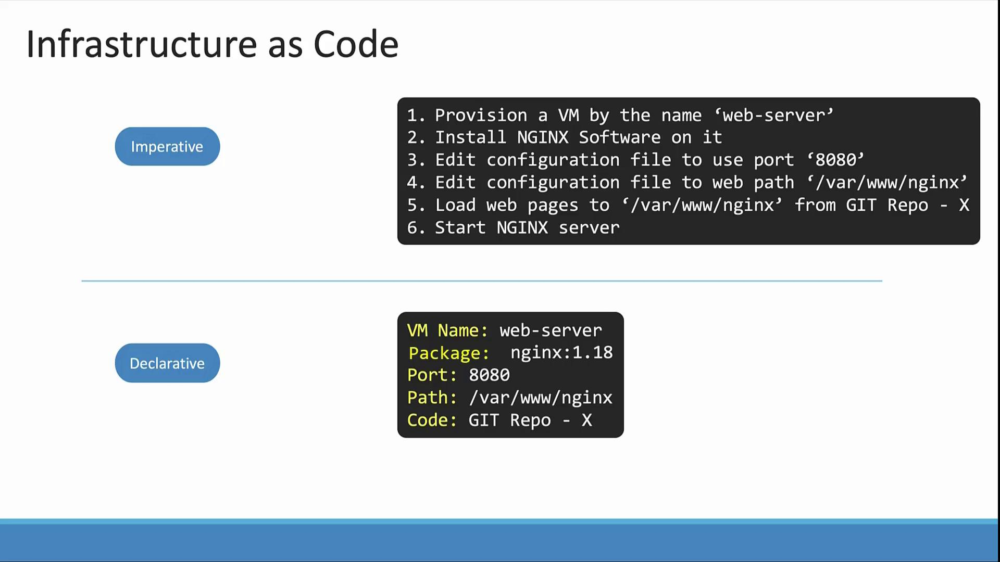

# Imperative vs Declarative

> This article explores imperative and declarative approaches to managing Kubernetes objects, highlighting their differences and providing exam tips.

So far, you have learned that there are two main methods to create and manage Kubernetes objects: directly executing commands or using configuration files. These are respectively known as the imperative and declarative approaches.

## Imperative Approach Explained

The imperative approach involves issuing explicit commands, which include both the desired configuration **and** the detailed steps needed to achieve it. For example, consider a series of commands to provision and configure a server:

- Provision a VM.
- Install and configure NGINX (set the port to 8080 and define the web files' path).
- Download application source code.
- Start the NGINX server.

If any part of these commands is only partly executed, you may need additional checks (e.g., verifying if the VM already exists), which makes the process more error-prone.

In Kubernetes, using the imperative mode typically involves commands such as:

```bash theme={null}
kubectl run --image=nginx nginx
kubectl create deployment --image=nginx nginx
kubectl expose deployment nginx --port=80
kubectl edit deployment nginx
kubectl scale deployment nginx --replicas=5
kubectl set image deployment nginx nginx=nginx:1.18
```

These commands directly instruct Kubernetes to create, update, or delete objects.

### Imperative Methods in Detail

There are two primary methods within the imperative paradigm:

1. **Direct Commands:**\
   Commands like `kubectl run`, `kubectl create`, and `kubectl expose` enable quick object creation or modification without the overhead of editing YAML files. These commands are especially useful during certification exams where speed is critical. However, for complex configurations such as multi-container pods, they have limitations. Additionally, since these commands reside only in your shell history, they may not provide a clear record of how the objects were created.

2. **Transient Changes with Commands:**\
   Commands such as `kubectl edit` allow you to modify a live object directly. However, note that these changes are temporary; they update the running object in the cluster but do not alter your local YAML configuration. This can lead to inconsistencies if local configuration files are used for future modifications.

## Working with Object Configuration Files

Using YAML configuration files (or manifest files) is the foundation of the declarative approach. This method offers several advantages:

- The configuration is fully documented in the YAML file.
- It can be stored in version-controlled repositories such as Git.
- Changes are tracked and reproducible through a controlled change process.

For instance, consider the following YAML file for creating a pod:

```yaml theme={null}
apiVersion: v1
kind: Pod
metadata:
  name: myapp-pod
  labels:
    app: myapp
    type: front-end
spec:
  containers:
    - name: nginx-container
      image: nginx
```

To create the pod, you would run:

```bash theme={null}
kubectl create -f nginx.yaml
```

Later, if you need to update the image version, modify the YAML file and run:

```bash theme={null}
kubectl replace -f nginx.yaml
```

This process ensures that the live configuration matches your declared settings in the file.

When using `kubectl edit`, Kubernetes opens a temporary YAML representation of the live object. This representation may include additional runtime fields such as status conditions:

```yaml theme={null}
apiVersion: v1
kind: Pod
metadata:
  name: myapp-pod
  labels:
    app: myapp
    type: front-end
spec:
  containers:
    - name: nginx-container
      image: nginx:1.18
status:
  conditions:
    - lastProbeTime: null
      status: "True"
      type: Initialized
```

Keep in mind, changes made with `kubectl edit` do not update your local YAML file. A more reliable process is to edit your local YAML file directly:

```yaml theme={null}
apiVersion: v1
kind: Pod
metadata:
  name: myapp-pod
  labels:
    app: myapp
    type: front-end-service
spec:
  containers:
    - name: nginx-container
      image: nginx:1.18
```

Then apply the changes:

```bash theme={null}
kubectl replace -f nginx.yaml
```

If you need to delete and recreate the object, consider using the force option:

```bash theme={null}
kubectl replace --force -f nginx.yaml
```

> 💡 Running `kubectl create -f nginx.yaml` on an object that already exists will produce an error. Always check the object's existence before creation.

## Declarative Approach with kubectl apply

The declarative approach is based on describing the desired state of your cluster in configuration files. When you use `kubectl apply`, Kubernetes:

- Creates the object if it doesn't already exist.
- Compares the current state with the declared desired state, then updates the object to match.

After updating your `nginx.yaml` file, simply run:

```bash theme={null}
kubectl apply -f nginx.yaml
```

To apply multiple configuration files at once, execute:

```bash theme={null}
kubectl apply -f /path/to/config-files
```

This approach is less error-prone and ensures your cluster continuously reflects the declared configuration state.

## Exam Tips for Kubernetes Management

For exam scenarios that require quick operations, the imperative commands can be time saving. For example, to create a pod or deployment with a specific image, you can use commands like:

```bash theme={null}
kubectl run --image=nginx nginx
kubectl create deployment --image=nginx nginx
kubectl expose deployment nginx --port=80
kubectl edit deployment nginx
kubectl scale deployment nginx --replicas=5
kubectl set image deployment nginx nginx=nginx:1.18
```

However, for more complex environments—such as deploying multi-container pods, setting up environment variables, or initializing containers—it is recommended to use YAML configuration files in combination with `kubectl apply`. This method allows you to iterate quickly and safely correct any mistakes directly in your configuration files.

> 💡 While imperative commands are efficient for simple tasks, maintaining configuration files in a version-controlled repository is key for managing larger and more complex clusters.



## Conclusion

Understanding the differences between imperative and declarative approaches in Kubernetes is crucial for efficient cluster management. Use the method that best suits your needs: imperative commands for rapid testing and declarative configuration files for consistency and repeatability.

For more details on Kubernetes management techniques, visit the [Kubernetes Documentation](https://kubernetes.io/docs).
