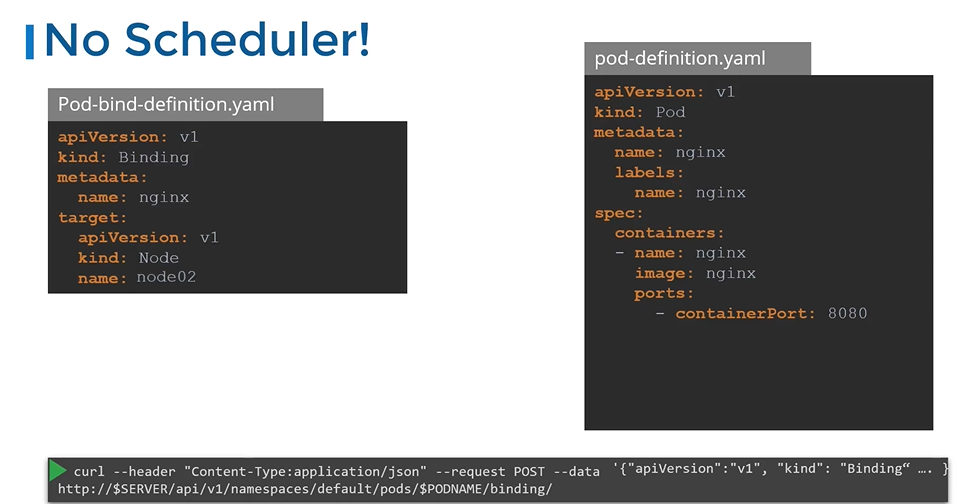

# Manual Scheduling

> 💡 This guide explains how to assign pods to nodes without relying on Kubernetes’ built-in scheduler for tighter control over pod placement. Manual scheduling can be useful in niche scenarios where you need tighter control over pod placement. In this article, we review a basic pod manifest, demonstrate how manual scheduling works, and show you how to use binding objects to reassign pods if necessary.

## Understanding the Default Scheduler Behavior

Every pod definition includes a field called `nodeName`, which is left unset by default. The Kubernetes scheduler automatically scans for pods without a `nodeName` and selects an appropriate node by updating this field and creating a binding object. Consider the basic pod manifest below:

```yaml theme={null}
apiVersion: v1
kind: Pod
metadata:
  name: nginx
  labels:
    name: nginx
spec:
  containers:
    - name: nginx
      image: nginx
      ports:
        - containerPort: 8080
```

Typically, you do not include the `nodeName` field in your manifest. The scheduler uses this field only after selecting a node for the pod.

## Manually Setting the Node Name

> 💡 If there is no scheduler to monitor and schedule pods onto nodes, then the pods can be in pending state. You can manually assign pods to nodes yourself.

To schedule a pod without a scheduler, you have to manually assign a pod to a specific node during creation, by populating the `nodeName` field in the manifest. For example, to schedule the pod on a node called "node02", update your manifest as follows:

```yaml theme={null}
apiVersion: v1
kind: Pod
metadata:
  name: nginx
  labels:
    name: nginx
spec:
  nodeName: node02
  containers:
    - name: nginx
      image: nginx
      ports:
        - containerPort: 8080
```

After creating the pod with this manifest, check its status with:

```bash theme={null}
kubectl get pods
```

Sample output before the scheduler assigns the IP:

```bash theme={null}
NAME    READY   STATUS    RESTARTS   AGE
nginx   0/1     Pending   0          3s
```

And after the pod becomes ready:

```bash theme={null}
kubectl get pods
NAME      READY   STATUS    RESTARTS   AGE   IP         NODE
nginx     1/1     Running   0          9s    10.40.0.4  node02
```

<Callout icon="lightbulb" color="#1CB2FE">
  The `nodeName` must be set during pod creation. Once the pod is running, Kubernetes does not permit modifications to the `nodeName` field.
</Callout>

## Reassigning a Running Pod Using a Binding Object

If a pod is already running and you need to change its node assignment, you cannot modify its `nodeName` directly. In this scenario, you can create a binding object that mimics the scheduler’s behavior.

1. Create a binding object that specifies the target node ("node02"):
   `pod-bind-definition.yaml`

   ```yaml theme={null}
   apiVersion: v1
   kind: Binding
   metadata:
     name: nginx
   target:
     apiVersion: v1
     kind: Node
     name: node02
   ```

2. The original pod definition remains unchanged:

`pod-definition.yaml`

```yaml theme={null}
apiVersion: v1
kind: Pod
metadata:
  name: nginx
  labels:
    name: nginx
spec:
  containers:
    - name: nginx
      image: nginx
      ports:
        - containerPort: 8080
```



3. Convert the YAML binding to JSON (e.g., save it as `binding.json`) and send a POST request to the pod’s binding API using curl:

   ```bash theme={null}
   curl --header "Content-Type: application/json" --request POST --data @binding.json http://$SERVER/api/v1/namespaces/default/pods/nginx/binding
   ```

This binding instructs Kubernetes to assign the existing pod to the specified node without altering its original manifest.

## Quick Reference Table

| Method                 | Use Case                           | Example Snippet Reference            |
| ---------------------- | ---------------------------------- | ------------------------------------ |
| Direct Assignment      | Set `nodeName` during pod creation | See manifest with `nodeName: node02` |
| Using a Binding Object | Reassign a running pod             | See binding object example           |

## You can find demo here

[Manual-Scheduling-Demo](../16-Manual-Scheduling/Demo.md)

### K8s Reference Docs:

- https://kubernetes.io/docs/reference/using-api/api-concepts/
- https://kubernetes.io/docs/concepts/scheduling-eviction/assign-pod-node/#nodename
