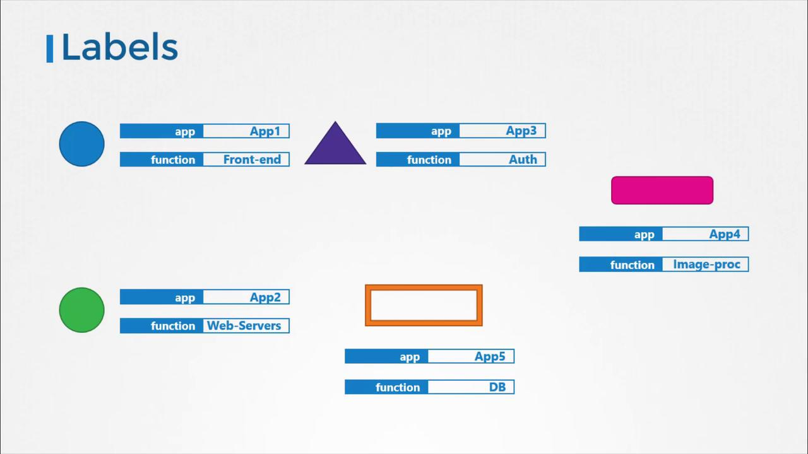

# Labels and Selectors

> 💡 This article explores labels, selectors, and annotations in Kubernetes for effective resource management and organization.In this article, we will explore how labels and selectors help group and filter items effectively, and we will also discuss how annotations are used to store additional metadata. By the end, you'll understand how these key concepts are applied to manage resources in a Kubernetes environment.

## Labels and Selectors in Kubernetes

In Kubernetes, labels and selectors are instrumental in managing an array of objects such as Pods, Services, ReplicaSets, and Deployments. As the number of objects in a cluster grows, these tools become essential for grouping and selecting objects by application, functionality, or type.

For instance, you might attach labels like "app" or "function" to your Kubernetes objects and later use selectors to filter objects based on specific conditions (e.g., app equals "App1").



## Specifying Labels in Kubernetes

To apply labels to a Kubernetes object such as a Pod, include a `labels` section under the `metadata` field in its definition file. Consider the following Pod definition example:

```yaml theme={null}
apiVersion: v1
kind: Pod
metadata:
  name: simple-webapp
  labels:
    app: App1
    function: Front-end
spec:
  containers:
    - name: simple-webapp
      image: simple-webapp
      ports:
        - containerPort: 8080
```

After creating the Pod, you can retrieve it using the `kubectl get pods` command with a selector. For example:

```bash theme={null}
kubectl get pods --selector app=App1
NAME            READY   STATUS      RESTARTS   AGE
simple-webapp   0/1     Completed   0          1d
```

> 💡 Using selectors with `kubectl` commands helps you filter and manage resources in large clusters with ease.

## Using Labels and Selectors with ReplicaSets

In Kubernetes, internal mechanisms utilize labels and selectors to connect different objects. When creating a ReplicaSet to manage three Pods, you first label the Pod definitions and then use a selector in the ReplicaSet definition to ensure the correct Pods are grouped together.

A ReplicaSet definition includes labels in two key areas:

1. Within the ReplicaSet's metadata (allowing other objects to reference the ReplicaSet).
2. Within the `template` of the ReplicaSet's specification (applying the labels to the Pods).

By setting the `selector` field in the ReplicaSet specification to match the labels defined on the Pods, you ensure that the ReplicaSet manages the intended Pods. Below is an example configuration:

```yaml theme={null}
apiVersion: apps/v1
kind: ReplicaSet
metadata:
  name: simple-webapp
  labels:
    app: App1
    function: Front-end
spec:
  replicas: 3
  selector:
    matchLabels:
      app: App1
  template:
    metadata:
      labels:
        app: App1
        function: Front-end
    spec:
      containers:
        - name: simple-webapp
          image: simple-webapp
```

> 💡 If you require more granular control for selecting Pods, you can list multiple labels in the `matchLabels` section.

## Annotations

Annotations differ from labels and selectors in that they are used to store additional metadata that is not intended for selection. This metadata might include details such as tool versions, build information, or contact information. Below is an example of a ReplicaSet configuration that includes an annotation:

```yaml theme={null}
apiVersion: apps/v1
kind: ReplicaSet
metadata:
  name: simple-webapp
  labels:
    app: App1
    function: Front-end
  annotations:
    buildversion: "1.34"
spec:
  replicas: 3
  selector:
    matchLabels:
      app: App1
  template:
    metadata:
      labels:
        app: App1
        function: Front-end
    spec:
      containers:
        - name: simple-webapp
          image: simple-webapp
```

When the ReplicaSet is created, it matches the Pods based on labels, ensuring that only the intended Pods are managed. The same mechanism is used when creating Services, where the Service's selector matches the labels set on the Pods.

## Conclusion

This article has provided an in-depth look at labels, selectors, and annotations in Kubernetes. These concepts are essential for effectively managing and grouping objects within your clusters. For further hands-on practice, navigate to the coding exercises section and start working with labels and selectors today.

## You can refer practical examples of using labels and selectors in kubernetes

- [Demo-Labels-and-Selectors](../17-Labels-and-Selectors/Demo-Labels-and-Selectors.md)

## K8s Reference Docs:

- https://kubernetes.io/docs/concepts/overview/working-with-objects/labels/
