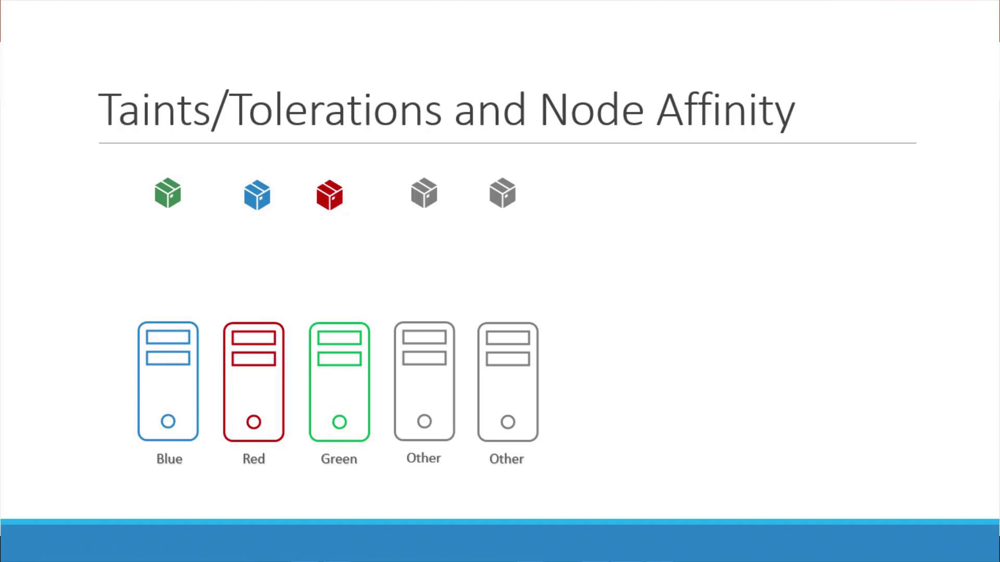

# Taints and Tolerations vs Node Affinity

> 💡 This article explains controlling pod placement in Kubernetes using taints, tolerations, and node affinity for optimal scheduling and exclusive node usage.

In our example, we have three nodes and three pods, each identified by a distinct color—blue, red, and green. Our objective is to ensure that each pod is scheduled on the node with the corresponding color while preventing unwanted workloads from running on these dedicated nodes.

> 💡 In Kubernetes, taints and tolerations are primarily used to repel pods from nodes unless they explicitly tolerate the taint, whereas node affinity is used to attract pods to nodes that satisfy specific label criteria.

## Using Taints and Tolerations

To begin, we apply a taint to each node that marks it with its respective color (blue, red, or green). Then, each pod is configured with a corresponding toleration. With this setup, the Kubernetes scheduler places the pods on nodes that accept their tolerations. For instance, the green pod is placed on the green node and the blue pod on the blue node.

However, while taints and tolerations ensure that pods with matching tolerations are admitted by the nodes, they do not guarantee exclusive scheduling. Consequently, a pod (for example, a red pod) might still be scheduled on an untainted node, leading to undesired placements.

## Using Node Affinity

To overcome the limitation of taints and tolerations, we leverage node affinity. This method involves labeling each node with its specific color and then configuring node selectors or advanced affinity rules in the pod specifications. Node affinity ensures a pod lands only on the node with the matching label.

While node affinity directs pods to the correct nodes, it does not restrict other pods from also being scheduled on these nodes. This means that although our desired pods are correctly placed, the nodes might still host pods not meant for them.

## Combining Taints and Tolerations with Node Affinity

For exclusive node usage, combining both strategies is the optimal solution. The integration works as follows:

1. Apply taints on nodes and specify corresponding tolerations in pod configurations to block any pod without the proper toleration.
2. Use node affinity rules to ensure that each pod is only scheduled on a node with a matching label.

This combined approach dedicates the nodes exclusively to the intended pods, assuring correct pod assignments and preventing interference by other workloads.

> 💡 In summary, leveraging both taints/tolerations and node affinity in Kubernetes ensures precise pod scheduling. This approach is particularly useful in multi-tenant clusters where exclusive node usage is critical.
