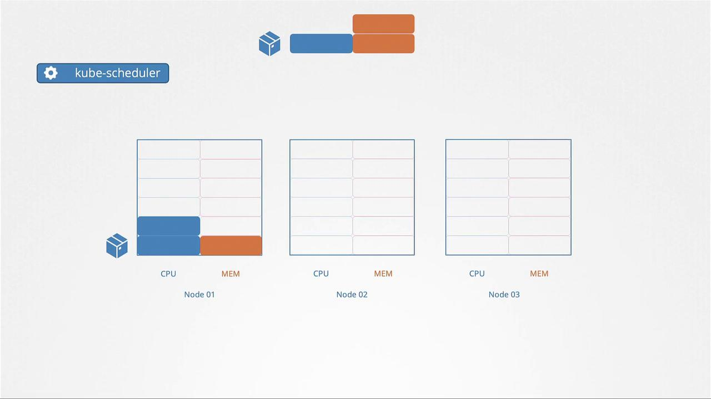
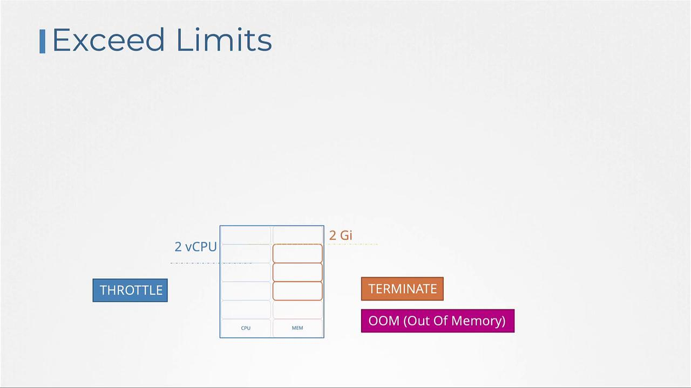
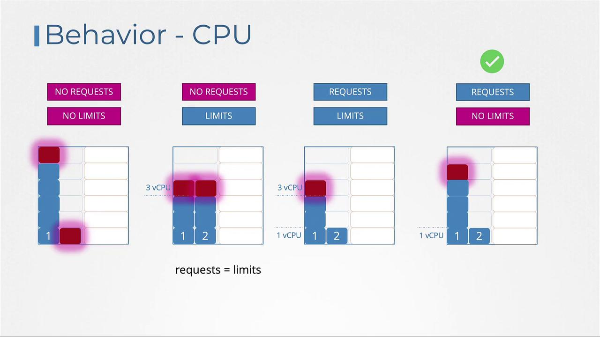
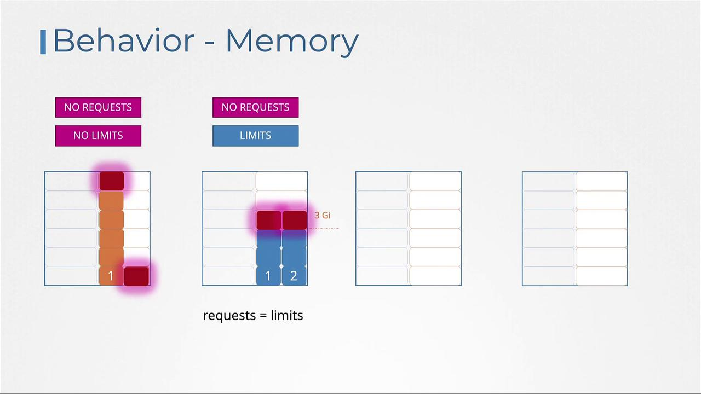

# Resource Limits

> 💡 This article explores resource requirements, requests, limits, and management in Kubernetes clusters to ensure efficient resource allocation and prevent overconsumption.

We explore resource requirements in Kubernetes by examining a scenario with a three-node cluster. Each node has a specific amount of CPU and memory available. When a pod is scheduled, it consumes a portion of its node's resources based on the specifications in its definition—such as needing 2 CPUs and 1 memory unit.

The Kubernetes scheduler decides which node will host the pod by evaluating the requested resources against what each node can offer. If, for example, Node 2 has sufficient capacity, the scheduler assigns the pod there. Otherwise, if no node meets the requirements, the pod remains in a pending state. You can inspect pod events using the command `kubectl describe pod`, which may reveal messages like this when resources (such as CPU) are insufficient:

```plaintext theme={null}
NAME              READY   STATUS    RESTARTS   AGE
Nginx             0/1     Pending   0          7m
Events:
  Reason           Message
  ------           -------
  FailedScheduling  No nodes are available that match all of the following predicates:: Insufficient cpu (3).
```



## Resource Requests

Resource requests define the minimum CPU and memory a container is guaranteed when scheduled. Specifying a request, for instance, of 1 CPU and 1 GB memory in a pod definition ensures that the pod will only be scheduled on a node that can provide these minimum resources. The Kubernetes scheduler searches for a node that meets these requirements, guaranteeing the pod access to the declared resources.

Below is an example snippet of a pod definition with resource requests set to 4 Gi of memory and 2 CPU cores:

```yaml theme={null}
apiVersion: v1
kind: Pod
metadata:
  name: simple-webapp-color
  labels:
    name: simple-webapp-color
spec:
  containers:
    - name: simple-webapp-color
      image: simple-webapp-color
      ports:
        - containerPort: 8080
      resources:
        requests:
          memory: "4Gi"
          cpu: 2
```

Remember, it is possible to use fractional CPU values. For example, 0.1 CPU is equivalent to 100m (where "m" denotes milli, meaning 0.001 of a CPU). One CPU core is typically equivalent to one vCPU in cloud environments like AWS, GCP, or Azure.

## Resource Limits

By default, a container in a pod can consume all the available resources on its node if no limits are set. However, you can restrict its usage by defining resource limits. Setting a limit, such as 1 vCPU, prevents the container from using more than that allocation. Similarly, memory limits restrict its maximum memory usage. Note that while CPU usage is throttled when a pod reaches its limit, memory usage is not. If a pod exceeds its memory limit, it may be terminated due to an Out Of Memory (OOM) error.

Below is an example of a pod definition that includes both resource requests and limits for memory and CPU:

```yaml theme={null}
apiVersion: v1
kind: Pod
metadata:
  name: simple-webapp-color
  labels:
    name: simple-webapp-color
spec:
  containers:
    - name: simple-webapp-color
      image: simple-webapp-color
      ports:
        - containerPort: 8080
      resources:
        requests:
          memory: "1Gi"
          cpu: 1
        limits:
          memory: "2Gi"
          cpu: 2
```

If a container exceeds its CPU limit, Kubernetes throttles its CPU usage. Conversely, if a container uses more memory than allowed, the pod will be terminated and an OOM error will be logged.



## Default Behavior and Scenarios

By default, Kubernetes does not enforce CPU or memory requests and limits. This means a pod without specified limits can consume all available resources on its node, potentially affecting other pods and system processes.

Below are several scenarios for CPU configurations:

1. **No Requests and No Limits:**\
   A container can utilize all available CPU, potentially starving other pods.
2. **Limits Specified Without Requests:**\
   Kubernetes assumes the request value is equal to the limit (e.g., setting a limit of 3 vCPUs results in a request of 3 vCPUs).
3. **Both Requests and Limits Defined:**\
   The container is guaranteed its requested amount (e.g., 1 vCPU) but can use additional CPU up to its defined limit (e.g., 3 vCPUs).
4. **Requests Defined Without Limits:**\
   The container(container1) is guaranteed its requested CPU value, with access to additional CPU cycles if available as limits are not set, which allows for efficient utilization of idle resources. But at any point in time, if another container(container2) require CPU that it has requested, then it will be guranteed its requested CPU cycle.

   

Similar configurations apply for memory:

1. **No Requests and No Limits:**\
   Without any resource configurations, a single pod may monopolize node memory.
2. **Limits Specified Without Requests:**\
   When only limits are specified, Kubernetes sets the memory request equal to the limit.
3. **Both Requests and Limits Defined:**\
   With both requests and limits, the pod is allocated a guaranteed memory amount and can burst up to the limit.
4. **Requests Defined Without Limits:**\
   Only specifying requests guarantees the pod a base amount of memory but might let it consume more, potentially leading to termination if memory usage becomes excessive. If Pod two requests more memory, then to free up pod one, the only option available is to kill it. Because unlike CPU, we cannot throttle memory. Once memory is assigned to a pod, The only way to retrieve it is to kill the pod and free up all the memory that are used by it.



## Limit Ranges

> 💡 By default, Kubernetes does not enforce resource requests or limits on pods. To ensure that every pod in a namespace receives default resource settings, you can define a LimitRange. LimitRanges are namespace-level objects that automatically assign default resource values to containers that do not specify them.

For example, you can create a LimitRange to enforce CPU constraints:

```yaml theme={null}
# limit-range-cpu.yaml
apiVersion: v1
kind: LimitRange
metadata:
  name: cpu-resource-constraint
spec:
  limits:
    - default:
        cpu: 500m
      defaultRequest:
        cpu: 500m
      max:
        cpu: "1"
      min:
        cpu: 100m
      type: Container
```

Likewise, to set memory constraints, use the following configuration:

```yaml theme={null}
# limit-range-memory.yaml
apiVersion: v1
kind: LimitRange
metadata:
  name: memory-resource-constraint
spec:
  limits:
    - default:
        memory: 1Gi
      defaultRequest:
        memory: 1Gi
      max:
        memory: 1Gi
      min:
        memory: 500Mi
      type: Container
```

> 💡 LimitRange limits are enforced when a pod is created. Keep in mind that LimitRange affect only new pods created after the LimitRange is created or applied or updated. If you create or chnage a LimitRange, it does not affect existing pods.

## Resource Quotas

Resource Quotas allow you to restrict the overall resource consumption for all applications within a namespace. By setting a Resource Quota, you can define hard limits on the aggregate consumption—such as restricting total CPU requests to 4 vCPUs and total memory to 4 GB, while also defining maximum limits (for example, 10 vCPUs and 10 GB) across all pods.

This approach helps maintain balanced resource allocation within a namespace even if individual pods lack explicit limits.

## Conclusion

In this lesson, we covered the essential concepts of resource requests and limits in Kubernetes. We learned how to declare resource requests to ensure pods receive the necessary resources and how setting resource limits prevents any single pod from overwhelming its node. Additionally, we discussed the implementation of LimitRanges to provide default values within a namespace and Resource Quotas to control aggregate resource usage.

## You can refer practical examples of using Resource Limits in kubernetes

[Demo-Resource-Limits](../22-Resource-Limits/Demo-Resource-Limits.md)

For more detailed information, refer to the [official Kubernetes documentation](https://kubernetes.io/docs/), and consider practicing these configurations in your own Kubernetes environments.

- https://kubernetes.io/docs/tasks/administer-cluster/manage-resources/
- https://kubernetes.io/docs/tasks/administer-cluster/manage-resources/memory-default-namespace/
- https://kubernetes.io/docs/tasks/administer-cluster/manage-resources/cpu-default-namespace/
