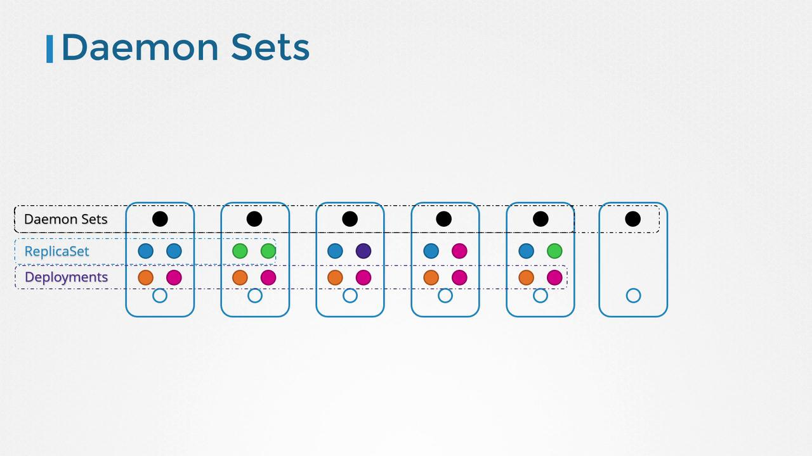
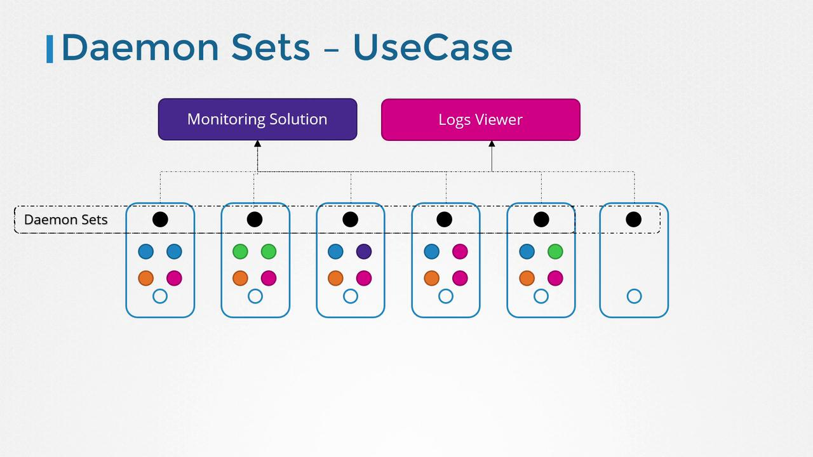
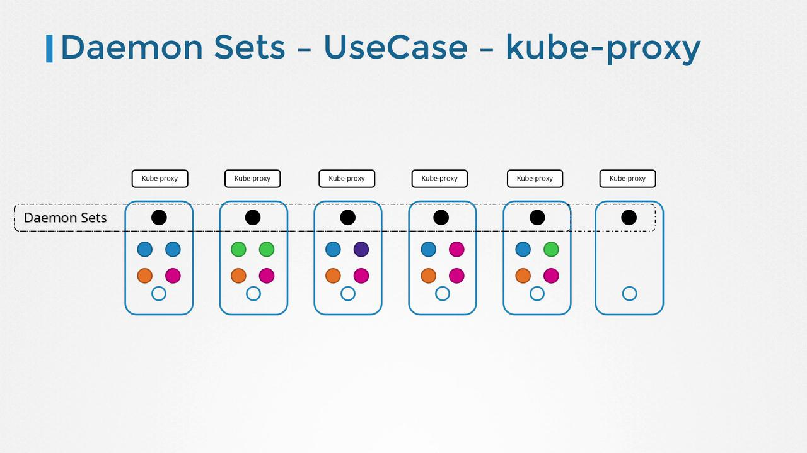
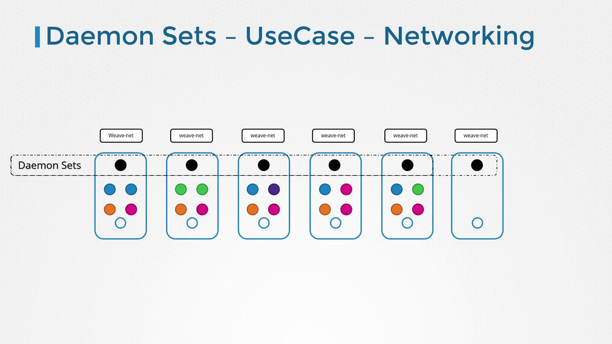
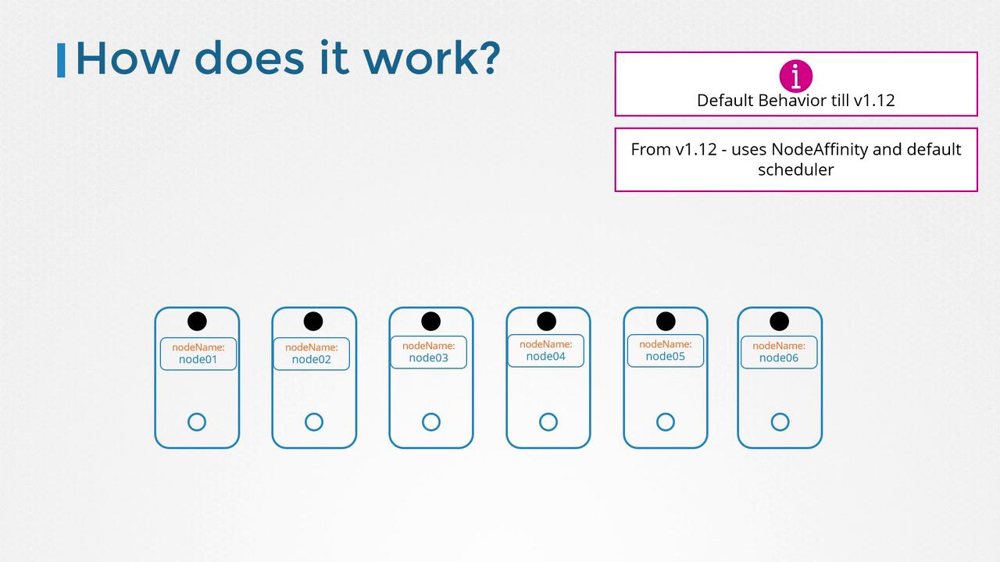

# DaemonSets

> This comprehensive guide explores DaemonSets in Kubernetes, their use cases, and provides a step-by-step example for deployment in your cluster.

DaemonSets ensure that exactly one copy of a pod runs on every node in your Kubernetes cluster. When you add a new node, the DaemonSet automatically deploys the pod on the new node. Likewise, when a node is removed, the corresponding pod is also removed. This guarantees that a single instance of the pod is consistently available on each node.



## Use Cases for DaemonSets

DaemonSets are particularly useful in scenarios where you need to run background services or agents on every node. Some common use cases include:

- **Monitoring agents and log collectors:** Deploy monitoring tools or log collectors across every node to ensure comprehensive cluster-wide visibility without manual intervention.
- **Essential Kubernetes components:** Deploy critical components, such as kube-proxy, which Kubernetes requires on all worker nodes.
- **Networking solutions:** Ensure consistent deployment of networking agents like those used in VNet or weave-net across all nodes.







## Creating a DaemonSet

Creating a DaemonSet is analogous to creating a ReplicaSet. The DaemonSet YAML configuration consists of a pod template under the `template` section and a selector that binds the DaemonSet to its pods. A typical DaemonSet definition includes the API version, kind, metadata, and specifications. Note that the API version is `apps/v1` and the kind is set to `DaemonSet`.

Below is an example DaemonSet definition file that deploys a monitoring agent:

```yaml theme={null}
# daemon-set-definition.yaml
apiVersion: apps/v1
kind: DaemonSet
metadata:
  name: monitoring-daemon
spec:
  selector:
    matchLabels:
      app: monitoring-agent
  template:
    metadata:
      labels:
        app: monitoring-agent
    spec:
      containers:
        - name: monitoring-agent
          image: monitoring-agent
```

:::note Important
Ensure that the labels in the selector match those in the pod template. Consistent labeling is crucial for the proper functioning of your DaemonSet.
:::

Once your YAML file is ready, create the DaemonSet using the following command:

```bash theme={null}
kubectl create -f daemon-set-definition.yaml
```

Verify the DaemonSet's creation by running:

```bash theme={null}
kubectl get daemonsets
```

This command produces output similar to:

```console theme={null}
NAME               DESIRED   CURRENT   READY   UP-TO-DATE   AVAILABLE   AGE
monitoring-daemon  1         1         1       1            1           41
```

For more detailed information on your DaemonSet, use:

```bash theme={null}
kubectl describe daemonset monitoring-daemon
```

## How DaemonSets Schedule Pods

Prior to Kubernetes version 1.12, scheduling a pod on a specific node was often achieved by manually setting the `nodeName` property within the pod specification. However, since version 1.12, DaemonSets leverage the default scheduler in conjunction with node affinity rules. This improvement ensures that a pod is automatically scheduled on every node without manual intervention.



:::note Tip
DaemonSets are an ideal solution for deploying services that must run on every node, such as monitoring agents and essential networking components. Leveraging node affinity simplifies management as your cluster scales.
:::

## Conclusion

DaemonSets provide an efficient mechanism to ensure that key services are uniformly deployed across your Kubernetes cluster. Whether you're running log collectors, monitoring agents, or essential network components like kube-proxy and weave-net, DaemonSets help maintain consistency and reliability in dynamic environments.

## You can refer practical examples of using DaemonSets in kubernetes

[Demo-DaemonSets](../23-DaemonSets/Demo-DaemonSets.md)

For further reading, explore these resources:

- [Kubernetes Documentation](https://kubernetes.io/docs/concepts/workloads/controllers/daemonset/#writing-a-daemonset-spec)
- [DaemonSets Concept](https://kubernetes.io/docs/concepts/workloads/controllers/daemonset/)

Happy clustering!
