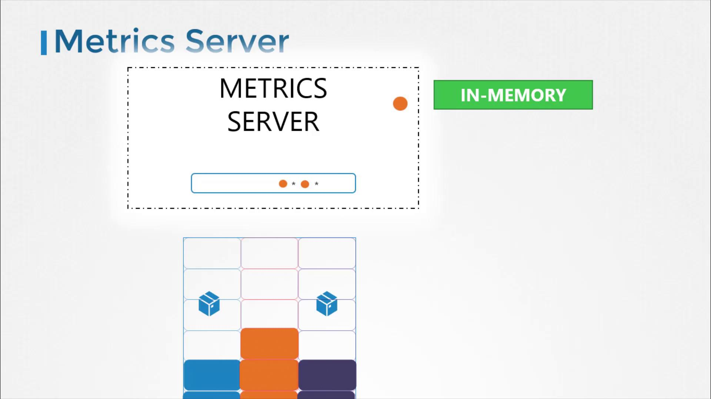
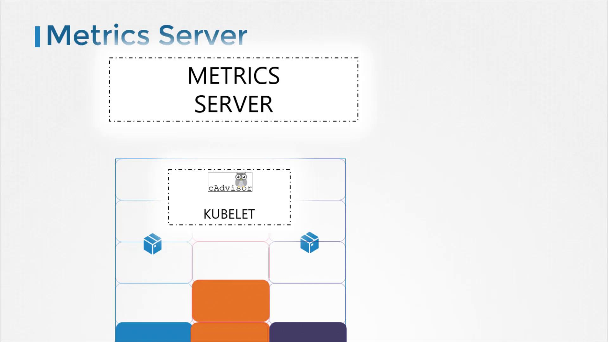

# Monitor Cluster Components

> 💡 This guide explains how to monitor resource consumption in a Kubernetes cluster for optimal performance across nodes and pods.

## What to Monitor

Effectively monitoring a Kubernetes cluster involves tracking metrics at both the node and pod levels.

For nodes, consider monitoring the following:

- Total number of nodes in the cluster
- Health status of each node
- Performance metrics such as CPU, memory, network, and disk utilization

For pods, focus on:

- The number of running pods
- CPU and memory consumption for every pod

Because Kubernetes does not include a comprehensive built-in monitoring solution, you must implement an external tool. Popular open-source monitoring solutions include Metrics Server, Prometheus, and Elastic Stack. In addition, proprietary options like Datadog and Dynatrace are available for more advanced use cases.

## From Heapster to Metrics Server

Historically, Heapster provided monitoring and analysis support for Kubernetes. Although many reference architectures still mention Heapster, it has been deprecated. Its streamlined successor, Metrics Server, is now the standard for monitoring Kubernetes clusters.

Metrics Server is designed to be deployed once per Kubernetes cluster. It collects metrics from nodes and pods, aggregates the data, and retains it in memory. Keep in mind that because Metrics Server stores data only in memory, it does not support historical performance data. For long-term metrics, consider integrating more advanced monitoring solutions.



> 💡 Metrics Server is ideal for short-term monitoring and quick insights but is not meant for prolonged historical data analysis. For in-depth analytics, look into integrating Prometheus or Elastic Stack.

## How Metrics are Collected

Every Kubernetes node runs a service called the Kubelet, which communicates with the Kubernetes API server and manages pod operations. Within the Kubelet, an integrated component called cAdvisor (Container Advisor) is responsible for collecting performance metrics from running pods. These metrics are then exposed via the Kubelet API and retrieved by Metrics Server.



## Deploying Metrics Server

If you are experimenting locally with Minikube, you can enable the Metrics Server add-on using the following command:

```bash theme={null}
minikube addons enable metrics-server
```

For other environments, deploy Metrics Server by cloning the GitHub repository and applying its deployment files:

```bash theme={null}
git clone https://github.com/kubernetes-incubator/metrics-server.git
kubectl create -f deploy/1.8+/
```

After executing these commands, you should see confirmation that various Kubernetes objects (such as ClusterRoleBinding, RoleBinding, APIService, ServiceAccount, Deployment, Service, and ClusterRole) have been created successfully. Allow the Metrics Server a few moments to begin collecting data from the nodes.

## Viewing Metrics

Once Metrics Server is active, you can check resource consumption on nodes with this command:

```bash theme={null}
kubectl top node
```

This will display the CPU and memory usage for each node, for example showing that 8% of the CPU on your master node (approximately 166 milli cores) is in use.

To check performance metrics for pods, run:

```bash theme={null}
kubectl top pod
```

An example output may look like the following:

```plaintext theme={null}
NAME         CPU(cores)   CPU%   MEMORY(bytes)   MEMORY%
kubemaster   166m         8%     1337Mi          70%
kubeno 1     36m          1%     1046Mi          55%
kubeno 2     39m          1%     1048Mi          55%

NAME   CPU(cores)   CPU%   MEMORY(bytes)   MEMORY%
nginx  166m         8%     1337Mi          70%
redis  36m          1%     1046Mi          55%
```

> 💡 Run these commands periodically to monitor resource usage trends and quickly identify potential performance issues.

## Conclusion

This guide has walked you through the fundamentals of monitoring a Kubernetes cluster using Metrics Server. By understanding the key metrics and using the provided commands, you'll be well-equipped to maintain successful and efficient cluster operations. Experiment with these techniques and continue exploring additional monitoring tools for deeper insights.

Happy monitoring!
