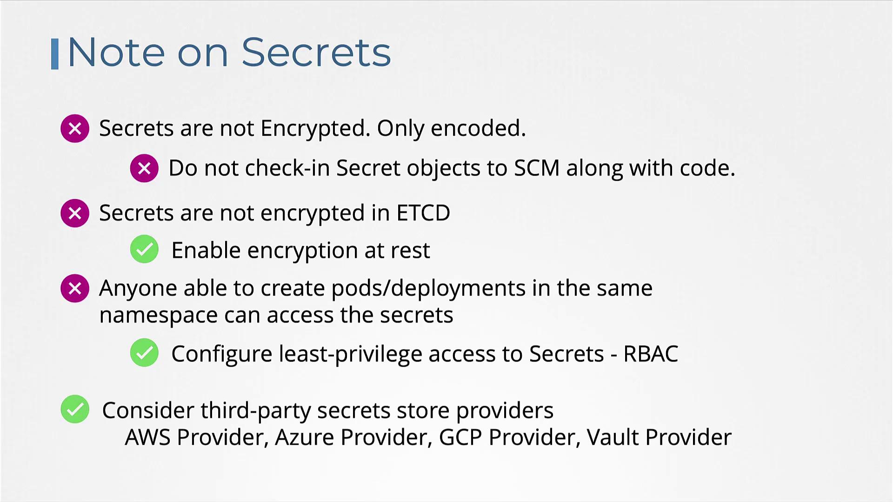

# Secrets

> 💡 Welcome to this comprehensive guide on managing Secrets in Kubernetes. In this article, we explain how to securely handle sensitive data (such as passwords and keys) in your Kubernetes deployments while avoiding common pitfalls like hardcoding credentials in your application.

## Problem with Hardcoding Sensitive Data

Consider a simple Python web application connecting to a MySQL database. When the connection succeeds, the application displays a success message. However, the code includes hardcoded values for hostname, username, and password, which poses a serious security risk.

Previously, configuration data like these values might have been stored in a ConfigMap. For example:

```python theme={null}
import os
from flask import Flask, render_template
import mysql.connector

app = Flask(__name__)

@app.route("/")
def main():
    mysql.connector.connect(host="mysql", database="mysql",
                              user="root", password="paswrd")
    return render_template('hello.html', color=fetchcolor())

if __name__ == "__main__":
    app.run(host="0.0.0.0", port="8080")
```

```yaml theme={null}
apiVersion: v1
kind: ConfigMap
metadata:
  name: app-config
data:
  # Configuration data goes here
```

While storing non-sensitive details like hostnames or usernames in a ConfigMap is acceptable, placing a password in such a resource is not secure. Kubernetes Secrets provide a mechanism to safely store sensitive information by encoding the data (note: this is not encryption by default).

> 💡 Secrets encode data using Base64. Although it provides obfuscation, it is not a substitute for encryption.

## Understanding Kubernetes Secrets

Working with Secrets in Kubernetes involves two main steps:

1. **Create the Secret.**
2. **insert it into a Pod.**

Below is an illustration of Secret data in their encoded and decoded forms:

### Encoded Values

```plaintext theme={null}
DB_Host: bXlzcWw=
DB_User: cm9vdA==
DB_Password: cGFzd3Jk
```

### Decoded Values

```plaintext theme={null}
DB Host: mysql
DB User: root
DB Password: paswrd
```

There are two primary approaches to creating a Secret:

- **Imperative Creation:** Using the command line to create Secrets on the fly.
- **Declarative Creation:** Defining Secrets in YAML files.

## Imperative Creation of a Secret

With the imperative method, you can supply key-value pairs directly via the command line. For example, to create a Secret named "app-secret" with the key-value pair `DB_Host=mysql`:

```bash theme={null}
kubectl create secret generic app-secret --from-literal=DB_Host=mysql
```

To include multiple key-value pairs, use the `--from-literal` option repeatedly:

```bash theme={null}
kubectl create secret generic app-secret \
  --from-literal=DB_Host=mysql \
  --from-literal=DB_User=root \
  --from-literal=DB_Password=paswd
```

Alternatively, create a Secret from a file with the `--from-file` option:

```bash theme={null}
kubectl create secret generic app-secret --from-file=app_secret.properties
```

## Declarative Creation of a Secret

For a more manageable approach, define a Secret in a YAML file. This file should include the API version, kind, metadata, and encoded data. Below is a sample YAML definition for a Secret:

```yaml theme={null}
apiVersion: v1
kind: Secret
metadata:
  name: app-secret
data:
  DB_Host: bXlzcWw=
  DB_User: cm9vdA==
  DB_Password: cGFzd3Jk
```

Apply the definition with the following command:

```bash theme={null}
kubectl create -f secret-data.yaml
```

## Converting Plaintext to Base64

On Linux hosts, you can convert plaintext values to Base64-encoded strings using the `echo -n` command piped to `base64`. For example:

```bash theme={null}
echo -n 'mysql' | base64
echo -n 'root' | base64
echo -n 'paswrd' | base64
# Output: cGFzd3Jk
```

## Viewing and Decoding Secrets

After creating a Secret, you can list and inspect it with the following commands:

- **List Secrets:**

  ```bash theme={null}
  kubectl get secrets
  ```

  Expected output:

  ```plaintext theme={null}
  NAME          TYPE    DATA   AGE
  app-secret    Opaque    3    10m
  ```

- **Describe a Secret (without showing sensitive data):**

  ```bash theme={null}
  kubectl describe secret app-secret
  ```

- **View the encoded data in YAML format:**

  ```bash theme={null}
  kubectl get secret app-secret -o yaml
  ```

If you need to decode an encoded value, use the `base64 --decode` command:

```bash theme={null}
echo -n 'bXlzcWw=' | base64 --decode
echo -n 'cm9vdA==' | base64 --decode
echo -n 'cGFzd3Jk' | base64 --decode
# Output: paswrd
```

## inserting Secrets into a Pod

Once the Secret is created, you can insert it into a Pod using environment variables or by mounting them as files in a volume.

### inserting as Environment Variables

Below is an example Pod definition that inserts the Secret as environment variables:

```yaml theme={null}
# pod-definition.yaml
apiVersion: v1
kind: Pod
metadata:
  name: simple-webapp-color
  labels:
    name: simple-webapp-color
spec:
  containers:
    - name: simple-webapp-color
      image: simple-webapp-color
      ports:
        - containerPort: 8080
      envFrom:
        - secretRef:
            name: app-secret
```

### Mounting Secrets as Files

Alternatively, mount the Secret as files within a volume. Each key in the Secret becomes a separate file:

```yaml theme={null}
volumes:
  - name: app-secret-volume
    secret:
      secretName: app-secret
```

After mounting, listing the directory contents should display each key as a file:

```bash theme={null}
ls /opt/app-secret-volumes
# Output: DB_Host  DB_Password  DB_User
```

To view the content of a specific file, such as the DB password:

```bash theme={null}
cat /opt/app-secret-volumes/DB_Password
# Output: paswrd
```

## Important Considerations When Using Secrets

> 💡 Remember that Kubernetes Secrets are only encoded in Base64, not encrypted by default. Anyone with sufficient access can decode the data. Always handle secret definition files with care and avoid storing them in public repositories.

Here are some key considerations:

- Secrets offer only Base64 encoding. For enhanced security, consider enabling encryption at rest for etcd.
- Limit access to Secrets using Role-Based Access Control (RBAC). Restrict permissions to only those who require it.
- Avoid storing sensitive secret definition files in source control systems that are publicly accessible.
- For even greater security, explore third-party secret management solutions such as AWS Secrets Manager, Azure Key Vault, GCP Secret Manager, or Vault.

## External Secret Providers

External secret providers decouple secret management from etcd and offer advanced encryption, granular access control, and comprehensive auditing capabilities.



## Note

> Also the way kubernetes handles secrets. Such as:
> -> A secret is only sent to a node if a pod on that node requires it.
> -> Kubelet stores the secret into a tmpfs so that the secret is not written to disk storage.
> -> Once the Pod that depends on the secret is deleted, kubelet will delete its local copy of the secret data as well.

## Conclusion

Managing Kubernetes Secrets effectively is crucial for maintaining the security of your applications. By following the best practices outlined above, including using Secrets to handle sensitive data and applying strict RBAC policies, you can mitigate potential security risks associated with managing sensitive configuration data.

For additional resources, consider the following links:

- [Kubernetes Documentation](https://kubernetes.io/docs/)
- [Kubernetes Basics](https://kubernetes.io/docs/concepts/overview/what-is-kubernetes/)
- [Docker Hub](https://hub.docker.com/)
- [Terraform Registry](https://registry.terraform.io/)
