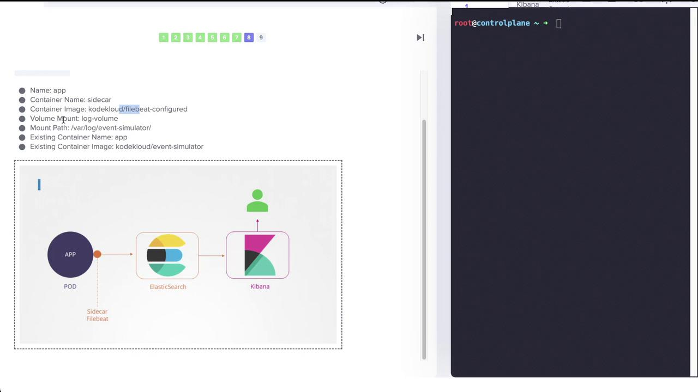
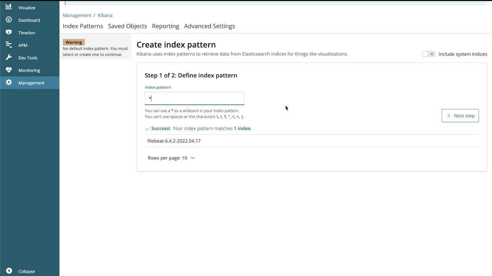
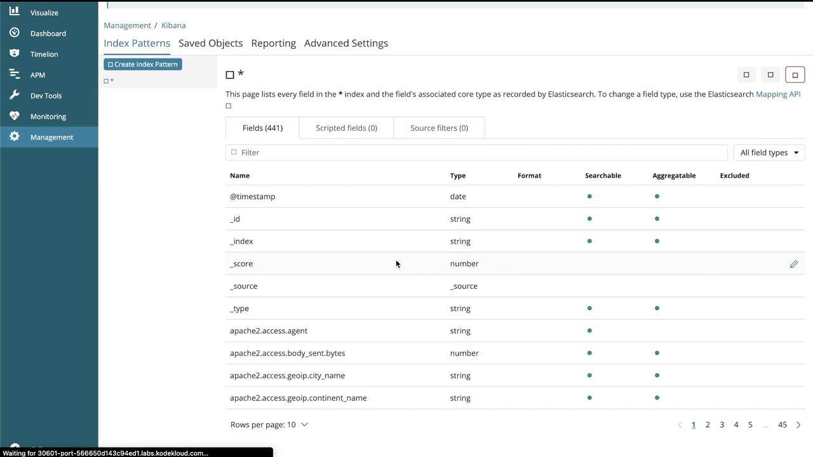
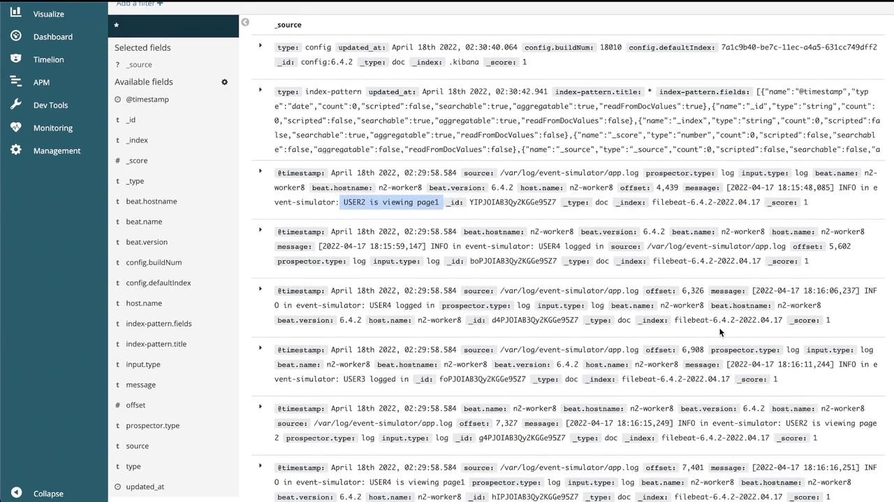
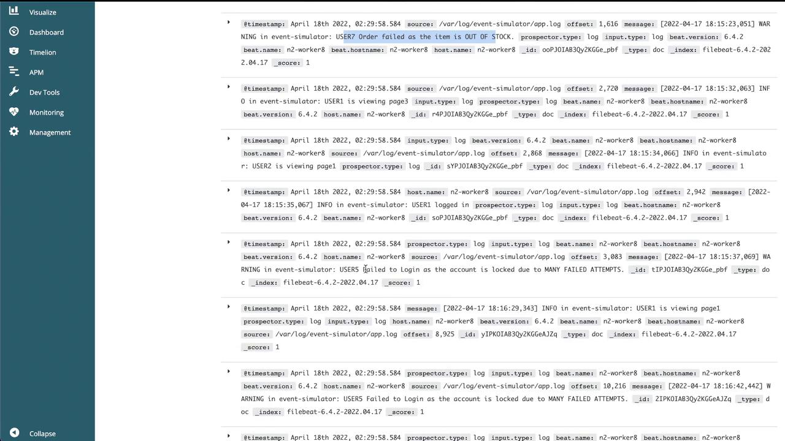

# Demo Multi Container Pods

> 💡 This guide explores creating and managing multi-container pods in Kubernetes, including log shipping to Elasticsearch using a sidecar container.
> We will inspect pods to determine the number of containers contained, create a multi-container pod, and update an existing pod by adding a sidecar container that ships logs to Elasticsearch. All diagrams have been retained in their original placements.

---

## Identifying Containers in Pods

Understanding the container composition within each pod is a critical first step.

### Red Pod

Begin by inspecting the red pod to determine the total number of containers. In the cluster, observe that the "READY" column displays the number of containers versus those that are ready. In this example, there are three containers. You can verify this by running the command:

```bash theme={null}
kubectl describe pod red
```

In the output, under "Containers", you will see entries for "apple", "wine", and "scarlet" that confirm the existence of three distinct containers. Below is an excerpt of the container details for the red pod:

```yaml theme={null}
Containers:
  apple:
    Container ID: busybox
    Image: busybox
    Image ID: <none>
    Port:
    Host Port: <none>
    Command:
      - sleep
      - "4500"
    State: Waiting
    Reason: ContainerCreating
    Ready: False
    Restart Count: 0
    Environment: <none>
    Mounts:
      - /var/run/secrets/kubernetes.io/serviceaccount from kube-api-access-7sggv (ro)
  wine:
    Container ID: busybox
    Image: busybox
    Image ID: <none>
    Port:
    Host Port: <none>
    Command:
      - sleep
      - "4500"
    State: Waiting
    Reason: ContainerCreating
    Ready: False
    Restart Count: 0
    Environment: <none>
    Mounts:
      - /var/run/secrets/kubernetes.io/serviceaccount from kube-api-access-7sggv (ro)
  scarlet:
    Container ID: busybox
    Image: busybox
    Image ID: <none>
    Port:
    Host Port: <none>
    Command: ...
```

### Blue Pod

For the blue pod, inspect the container details similarly. This pod includes two containers, "teal" and "navy". The command below confirms their configuration:

```bash theme={null}
kubectl describe pod blue
```

The output will include details similar to:

```yaml theme={null}
Node: controlplane/10.40.119.6
Start Time: Sun, 17 Apr 2022 18:16:47 +0000
Labels: <none>
Annotations: <none>
Status: Pending
IP:
IPs: <none>
Containers:
  teal:
    Container ID:
    Image: busybox
    Image ID:
    Port: <none>
    Host Port: <none>
    Command:
      - sleep
      - "4500"
    State: Waiting
    Reason: ContainerCreating
    Ready: False
    Restart Count: 0
    Environment: <none>
    Mounts:
      - /var/run/secrets/kubernetes.io/serviceaccount from kube-api-access-6qm72 (ro)
  navy:
    Container ID:
    Image: busybox
    Image ID:
    Port: <none>
    Host Port: <none>
    Command:
      - sleep
      - "4500"
    State: Waiting
    Reason: ContainerCreating
    Ready: False
    Restart Count: 0
    Environment: <none>
    Mounts:
      - /var/run/secrets/kubernetes.io/serviceaccount from kube-api-access-6qm72 (ro)
```

---

## Creating a Multi-Container Pod

The next task involves creating a multi-container pod with two containers that conform to the following specifications:

- **Pod Name:** yellow
- **Container 1:**
  - Uses the BusyBox image
  - Renamed to **lemon** (instead of inheriting the pod name)
  - Optionally runs the command `sleep 1000`
- **Container 2:**
  - Uses the Redis image
  - Named **gold**

### Generating the Pod Manifest

First, generate a YAML manifest for a pod with a single container using a dry-run command:

```bash theme={null}
k run yellow --image=busybox --dry-run=client -o yaml > yellow.yaml
```

The generated YAML will resemble:

```yaml theme={null}
apiVersion: v1
kind: Pod
metadata:
  creationTimestamp: null
  labels:
    run: yellow
  name: yellow
spec:
  containers:
    - image: busybox
      name: yellow
      resources: {}
  dnsPolicy: ClusterFirst
  restartPolicy: Always
status: {}
```

### Editing the Manifest

Modify the YAML file to change the first container's name from **yellow** to **lemon**, add the sleep command, and include a second container named **gold** with the Redis image:

```yaml theme={null}
apiVersion: v1
kind: Pod
metadata:
  creationTimestamp: null
  labels:
    run: yellow
  name: yellow
spec:
  containers:
    - image: busybox
      name: lemon
      resources: {}
      command: ["sleep", "1000"]
    - image: redis
      name: gold
  dnsPolicy: ClusterFirst
  restartPolicy: Always
status: {}
```

Apply the manifest to create the pod. After the pod is created, verify that it contains two containers: one running BusyBox (with the specified sleep command) and the other running Redis.

> 💡 After deploying the pod, use `kubectl get pods` and `kubectl describe pod yellow` to ensure that both containers are correctly configured and running.

---

## Setting Up a Simple Logging Application

Next, we will set up a logging application within the **elastic-stack** namespace. This setup is composed of the following components:

- **Application Pod (app):** Simulates events and outputs logs.
- **Elasticsearch Pod:** Stores logs.
- **Kibana Pod:** Visualizes the logs.

First, list all pods in the `elastic-stack` namespace:

```bash theme={null}
k get pods -n elastic-stack
```

The expected output is:

```plaintext theme={null}
NAME           READY   STATUS    RESTARTS   AGE
app            1/1     Running   0          5m31s
elastic-search 1/1     Running   0          5m31s
kibana         1/1     Running   0          5m30s
```

### Inspecting the Application Pod

Review the details of the application pod to determine where logs are stored. The pod uses the `kodekloud/event-simulator` image, and its logs are written to a file (for example, `/log/app.log`). To inspect the pod, run:

```bash theme={null}
kubectl describe pod app -n elastic-stack
```

```yaml theme={null}
controlplane ~ ➜  kubectl describe pod app -n elastic-stack
Name:             app
Namespace:        elastic-stack
Priority:         0
Service Account:  default
Node:             controlplane/10.244.170.128
Start Time:       Sat, 28 Feb 2026 09:46:08 +0000
Labels:           name=app
Annotations:      <none>
Status:           Running
IP:               172.17.0.4
IPs:
  IP:  172.17.0.4
Containers:
  app:
    Container ID:   containerd://559fc032dfcc621f34ad5ebe1fedc5d21651b513e3565a90a3b90e21a136a0d6
    Image:          kodekloud/event-simulator
    Image ID:       docker.io/kodekloud/event-simulator@sha256:1e3e9c72136bbc76c96dd98f29c04f298c3ae241c7d44e2bf70bcc209b030bf9
    Port:           <none>
    Host Port:      <none>
    State:          Running
      Started:      Sat, 28 Feb 2026 09:50:54 +0000
    Ready:          True
    Restart Count:  0
    Environment:    <none>
    Mounts:
      /log from log-volume (rw)
      /var/run/secrets/kubernetes.io/serviceaccount from kube-api-access-4zrk5 (ro)
Conditions:
  Type                        Status
  PodReadyToStartContainers   True
  Initialized                 True
  Ready                       True
  ContainersReady             True
  PodScheduled                True
Volumes:
  log-volume:
    Type:          HostPath (bare host directory volume)
    Path:          /var/log/webapp
    HostPathType:  DirectoryOrCreate
  kube-api-access-4zrk5:
    Type:                    Projected (a volume that contains inserted data from multiple sources)
    TokenExpirationSeconds:  3607
    ConfigMapName:           kube-root-ca.crt
    Optional:                false
    DownwardAPI:             true
QoS Class:                   BestEffort
Node-Selectors:              <none>
Tolerations:                 node.kubernetes.io/not-ready:NoExecute op=Exists for 300s
                             node.kubernetes.io/unreachable:NoExecute op=Exists for 300s
Events:
  Type    Reason     Age   From               Message
  ----    ------     ----  ----               -------
  Normal  Scheduled  19m   default-scheduler  Successfully assigned elastic-stack/app to controlplane
  Normal  Pulling    19m   kubelet            Pulling image "kodekloud/event-simulator"
  Normal  Pulled     15m   kubelet            Successfully pulled image "kodekloud/event-simulator" in 5.567s (4m43.302s including waiting). Image size: 28855042 bytes.
  Normal  Created    15m   kubelet            Created container: app
  Normal  Started    15m   kubelet            Started container app
```

You can also view the logs directly by using:

```bash theme={null}
kubectl logs app -n elastic-stack
```

Within these logs, search for entries indicating login issues, such as:

```plaintext theme={null}
[2022-04-17 18:21:58,698] WARNING in event-simulator: USER5 Failed to Login as the account is locked due to MANY FAILED ATTEMPTS.
```

This indicates that **USER5** is experiencing login problems.

To further confirm the logs stored on disk within the pod, execute:

```bash theme={null}
kubectl -n elastic-stack exec -it app -- cat /log/app.log
```

---

## Next steps

> The app pod in the elastic-stack namespace currently writes logs to /log/app.log.
> Your task is to add a sidecar container that will ship these logs to Elasticsearch.

#### Requirements:

- Add a sidecar container named sidecar to the existing app pod.
- Use the image: kodekloud/filebeat-configured.
- Mount the log volume: The existing log-volume must be mounted to the sidecar container at /var/log/event-simulator/.
- Implementation: Define the sidecar as a Kubernetes native sidecar container using initContainers, and set the restartPolicy to Always.

#### Important Notes:

- You will need to delete and re-create the pod to add the sidecar container.
- Do not modify the existing app container or volume configuration.
- The sidecar should be defined as an initContainer and must run continuously alongside the main application container
- Refer to the diagram below for your configuration.

## Adding a Sidecar Container for Log Shipping

To enable log shipping to Elasticsearch, update the `app` pod to include a sidecar container. This sidecar, named **sidecar**, uses a custom Filebeat image (`kodekloud/filebeat-configured`) and shares the same log volume as the application container.

An image illustrating the pod configuration with the Filebeat sidecar is shown below:



### Editing the Pod for a Sidecar

Edit the pod manifest in the `elastic-stack` namespace:

```bash theme={null}
kubectl edit pod app -n elastic-stack
```

Then update the YAML to include the sidecar container. Ensure that the volume mounts for logging refer to the same volume:

```yaml theme={null}
apiVersion: v1
kind: Pod
metadata:
  name: app
  namespace: elastic-stack
  labels:
    name: app
spec:
  containers:
    - name: sidecar
      image: kodekloud/filebeat-configured
      volumeMounts:
        - mountPath: /var/log/event-simulator/
          name: log-volume
    - name: app
      image: kodekloud/event-simulator
      imagePullPolicy: Always
      volumeMounts:
        - mountPath: /log
          name: log-volume
        - mountPath: /var/run/secrets/kubernetes.io/serviceaccount
          name: kube-api-access-wnzb6
          readOnly: true
  dnsPolicy: ClusterFirst
  restartPolicy: Always
```

> 💡 Pod updates do not allow adding or removing containers directly. If you encounter an error during the update (e.g., "pods 'app' is invalid"), save your changes and force a replacement with:

```bash theme={null}
kubectl replace --force -f /tmp/kubectl-edit-3922970489.yaml
```

> This command will delete and recreate the pod using the updated manifest.

Once updated, the pod will have two containers:

- **Application Container:** Writes logs to `/log`.
- **Filebeat Sidecar:** Reads the logs and ships them to Elasticsearch.

---

## Verifying Logs in Kibana

After applying the changes, verify that logs are being shipped to and visualized in Kibana. Follow these steps:

1. Open the Kibana UI.
2. When prompted, create an index pattern (e.g., `filebeat-*` or as instructed in your lab).
3. Set the time filter field name if required.
4. Click "Start" or "Create" to finalize the index pattern.

The screenshot below shows the index pattern creation interface:



Then, navigate to the "Discover" section to view the logs:



Additional dashboards will highlight:

- Log entries with timestamps and corresponding messages.
- Detailed event information, including user actions, warnings, and order failures.





With these steps completed, logs from the application are successfully forwarded to Elasticsearch and visualized in Kibana. This configuration can be extended to scale across multiple pods or deployments within your Kubernetes environment.

---

That concludes our guide on multi-container pods and log shipping in Kubernetes. Happy learning!

For further information, consider visiting the following resources:

- [Kubernetes Documentation](https://kubernetes.io/docs/)
- [Kubernetes Basics](https://kubernetes.io/docs/concepts/overview/what-is-kubernetes/)
