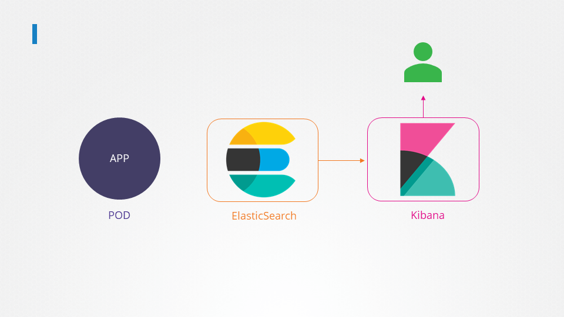

# Multi Container Pods

> 💡 This article explores the design, functionality, and benefits of using multi-container pods in Kubernetes.

Multi-container pods in Kubernetes allow you to run two or more containers together in a single pod. This approach is essential when containerized services must work closely together, such as pairing a web server with a logging agent. In such cases, the containers share the same lifecycle, network namespace, and storage volumes, ensuring smooth communication and synchronized behavior.

## Microservices vs. Tightly Coupled Services

Modern application development increasingly favors microservices, where large monolithic applications are broken down into smaller, independent sub-components. This design paradigm allows developers to build, deploy, and scale individual services independently, streamlining both development and maintenance.

However, there are specific situations when two services must operate side by side. For example, a web server might need a dedicated logging agent running alongside it to capture detailed logs without incorporating supplementary code into the web server container. This setup facilitates independent deployment and scaling while keeping the application code modular.

## Advantages of Multi-Container Pods

Multi-container pods offer several significant advantages:

- **Shared Lifecycle:** All containers in the pod start and stop simultaneously.
- **Unified Network Namespace:** Containers communicate via localhost without extra configuration.
- **Shared Storage Volumes:** Persistent and shared storage is available between containers.


> 💡 To create a multi-container pod, simply list multiple container definitions under the `containers` array in your pod specification file.

## Creating a Multi-Container Pod

Below is an example of a basic pod definition with a single container:

```yaml theme={null}
apiVersion: v1
kind: Pod
metadata:
  name: simple-webapp
  labels:
    name: simple-webapp
spec:
  containers:
    - name: simple-webapp
      image: simple-webapp
      ports:
        - containerPort: 8080
```

To transform this into a multi-container pod, add another container entry to include, for instance, a log agent container alongside the web server:

```yaml theme={null}
apiVersion: v1
kind: Pod
metadata:
  name: simple-webapp
  labels:
    name: simple-webapp
spec:
  containers:
    - name: simple-webapp
      image: simple-webapp
      ports:
        - containerPort: 8080
    - name: log-agent
      image: log-agent
```

## Multi-Container Pod Design Patterns

### 1. Collocated Containers

This is the original and most basic form of multicontainer pod design that we discussed above. It involves running two or more containers that are intended to operate simultaneously throughout the entire lifecycle of the pod.

- Configuration: Containers are defined as elements within a single array in the pod definition file.
- Startup Behavior: There is no mechanism to define a specific startup order. All containers in the array are initiated at the same time, and there is no guarantee that one will start before another.
- Lifecycle: All containers are expected to continue running for as long as the pod is active.
- Primary Use Case: This pattern is utilized when two services are highly dependent on each other but do not require a strict order of operations for initialization.

### 2. Init Containers (Regular Init Containers)

Init Containers are specialized containers that perform specific initialization tasks or prerequisite checks before the main application container is permitted to start.

- Configuration: These are defined under a distinct initContainers property, separate from the main containers array.
- Startup Behavior: They run sequentially. If multiple init containers are defined (e.g., a "DB checker" followed by an "API checker"), the first must complete its task and terminate before the second begins.
- Lifecycle: These containers are transient; they perform their designated job, end their run, and terminate. The main application container only starts once all init containers have successfully finished.
- Primary Use Case: Scenarios where the main application must wait for external dependencies, such as a database or an API, to become ready.

### 3. Sidecar Pattern

The sidecar pattern involves deploying a supplemental container, such as a logging agent, alongside your primary container. This design pattern enables services to extend or enhance the capabilities of the main application without altering its code. It is particularly useful when the application produces logs in various formats across different services.


#### Practical Application: The Elastic Search and Kibana Stack

A realistic implementation of the Sidecar pattern is found in log collection and aggregation frameworks, such as the Elastic Search and Kibana (ELK) stack.



- The Components: Elastic Search captures logs from various endpoints, while Kibana serves as the visualization dashboard for administrators.
- The Sidecar Role: A sidecar container, such as Filebeat, is deployed within the application pod.
- Operational Flow:
  1. The Filebeat sidecar starts first to prepare the logging stream.
  2. The main application starts, and Filebeat captures all startup logs.
  3. Both run concurrently during normal operations.
  4. If the application ends—potentially due to a bug—Filebeat captures the termination logs before it shuts down itself, providing vital diagnostic data for developers.

Sidecar Containers combine the ordered startup of an init container with the persistent lifecycle of a collocated container.

- Configuration: Like regular init containers, they are defined using the initContainers approach. However, they are configured with a restartPolicy set to Always.
- Startup Behavior: The sidecar starts before the main application. This ensures the sidecar is active and ready to support the main app from its first moment of execution.
- Lifecycle: Unlike regular init containers, the sidecar does not terminate once the main app starts. It continues to run alongside the main application. It is specifically designed to terminate only after the main application has stopped.
- Primary Use Case: Log shipping and aggregation. By starting before the main app and ending after it, the sidecar can capture critical startup logs and termination logs (useful for diagnosing bugs or crashes).

Refer this documentation https://kubernetes.io/docs/concepts/workloads/pods/sidecar-containers/

### 4. Adapter Pattern

The adapter pattern is useful when you need to standardize data formats. For example, when logs from multiple sources need to be unified before they are processed by a central logging service. Log messages might vary as follows:

```plaintext theme={null}
12-JULY-2018 16:05:49 "GET /index1.html" 200
12/JUL/2018:16:05:49 -0800 "GET /index2.html" 200
GET 1531411549 "/index3.html" 200
```

An adapter container can normalize these formats, ensuring consistency before the logs reach the centralized system.

### 5. Ambassador Pattern

The ambassador pattern is applied when an application needs to communicate with different database environments. For example, the application might require a local database for development, another for testing, and a production database in live deployment. Instead of incorporating logic to handle multiple environments in the application code, an ambassador container acts as a proxy. The application always sends requests to localhost, while the ambassador routes traffic to the appropriate database backend.


## Comparative Analysis: Collocated vs. Sidecar Containers

A common point of confusion exists between Collocated and Sidecar containers because both remain active throughout the pod's life. The table below outlines the functional differences:

Feature Collocated Containers Sidecar Containers
Startup Order No defined order; starts simultaneously. Strict order; starts before the main application.
Implementation Standard containers array. initContainers with restartPolicy: Always.
Lifecycle Dependency Independent startup. Sidecar captures both startup and termination events.
Use Case Suitability General dependent services. Log collection, monitoring, and diagnostics.

> Each of these patterns leverages the flexible design of multi-container pods by including multiple containers within a single pod specification.
