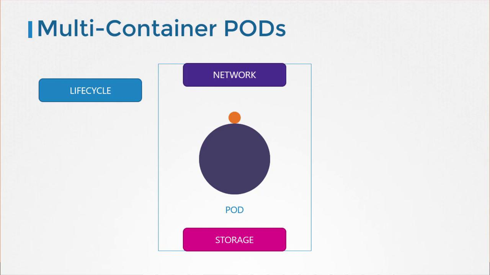

# Multi Container Pods

> 💡 This article explores multi-container pods in Kubernetes, highlighting their benefits for deploying and managing closely linked services together.

By breaking down a monolithic application into smaller, independent microservices, you can deploy, manage, and scale each service individually. However, certain scenarios require two closely linked services to run together. For example, a web server might need to be paired with a dedicated logging agent. In this configuration, each web server instance is automatically associated with its own logging service, allowing both services to scale concurrently while keeping their codebases distinct.

Multi-container pods are designed to group containers that share the same lifecycle. This means they are created and terminated together, share a common network namespace (allowing seamless communication via localhost), and have access to shared storage volumes. This design simplifies configurations by eliminating the complexities of volume sharing and networking between separate pods.



To create a multi-container pod, add the configuration for the new container under the `containers` array in your pod definition file. For instance, you can incorporate a container named "log-agent" alongside an existing web application container. The following YAML snippet demonstrates how to configure a pod that contains both a web application and its corresponding logging agent:

```yaml theme={null}
apiVersion: v1
kind: Pod
metadata:
  name: simple-webapp
  labels:
    name: simple-webapp
spec:
  containers:
    - name: simple-webapp
      image: simple-webapp
      ports:
        - containerPort: 8080
    - name: log-agent
      image: log-agent
```

This configuration ensures that both containers share the same lifecycle, network, and storage resources, allowing them to work together seamlessly.

> 💡 Remember that the `containers` field is an array in the pod specification, which enables you to define and manage multiple containers under a single pod.

That concludes our discussion on multi-container pods. Next, proceed to the coding exercises section to practice configuring multi-container pods and reinforce your understanding of the concepts discussed here. Happy coding, and see you in the next article!
