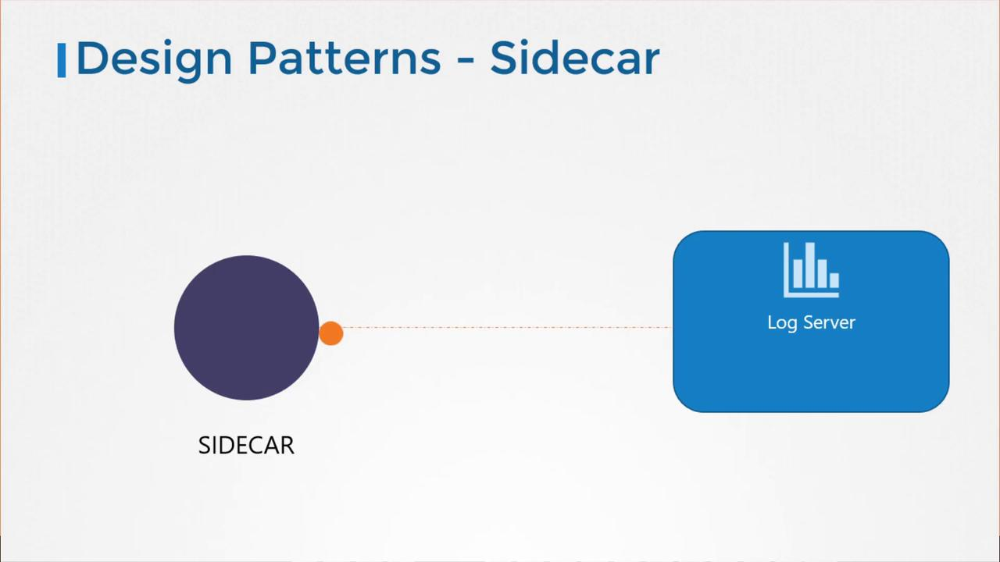
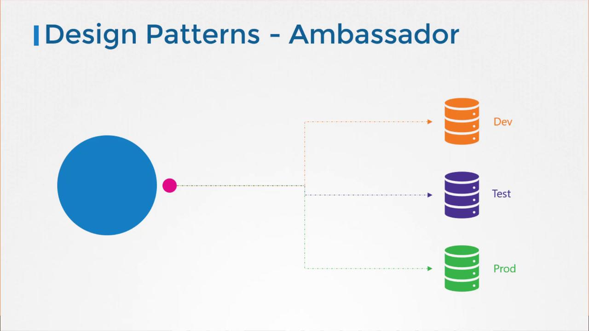

# Multi Container Pods

> 💡 This article explores the design, functionality, and benefits of using multi-container pods in Kubernetes.

Multi-container pods in Kubernetes allow you to run two or more containers together in a single pod. This approach is essential when containerized services must work closely together, such as pairing a web server with a logging agent. In such cases, the containers share the same lifecycle, network namespace, and storage volumes, ensuring smooth communication and synchronized behavior.

## Microservices vs. Tightly Coupled Services

Modern application development increasingly favors microservices, where large monolithic applications are broken down into smaller, independent sub-components. This design paradigm allows developers to build, deploy, and scale individual services independently, streamlining both development and maintenance.

However, there are specific situations when two services must operate side by side. For example, a web server might need a dedicated logging agent running alongside it to capture detailed logs without incorporating supplementary code into the web server container. This setup facilitates independent deployment and scaling while keeping the application code modular.

## Advantages of Multi-Container Pods

Multi-container pods offer several significant advantages:

- **Shared Lifecycle:** All containers in the pod start and stop simultaneously.
- **Unified Network Namespace:** Containers communicate via localhost without extra configuration.
- **Shared Storage Volumes:** Persistent and shared storage is available between containers.


> 💡 To create a multi-container pod, simply list multiple container definitions under the `containers` array in your pod specification file.

## Creating a Multi-Container Pod

Below is an example of a basic pod definition with a single container:

```yaml theme={null}
apiVersion: v1
kind: Pod
metadata:
  name: simple-webapp
  labels:
    name: simple-webapp
spec:
  containers:
    - name: simple-webapp
      image: simple-webapp
      ports:
        - containerPort: 8080
```

To transform this into a multi-container pod, add another container entry to include, for instance, a log agent container alongside the web server:

```yaml theme={null}
apiVersion: v1
kind: Pod
metadata:
  name: simple-webapp
  labels:
    name: simple-webapp
spec:
  containers:
    - name: simple-webapp
      image: simple-webapp
      ports:
        - containerPort: 8080
    - name: log-agent
      image: log-agent
```

## Multi-Container Pod Design Patterns

There are three common patterns for designing multi-container pods:

1. **Sidecar Pattern**
2. **Adapter Pattern**
3. **Ambassador Pattern**

### Sidecar Pattern

The sidecar pattern involves deploying a supplemental container, such as a logging agent, alongside your primary container. This design pattern enables services to extend or enhance the capabilities of the main application without altering its code. It is particularly useful when the application produces logs in various formats across different services.



Refer this documentation https://kubernetes.io/docs/concepts/workloads/pods/sidecar-containers/

### Adapter Pattern

The adapter pattern is useful when you need to standardize data formats. For example, when logs from multiple sources need to be unified before they are processed by a central logging service. Log messages might vary as follows:

```plaintext theme={null}
12-JULY-2018 16:05:49 "GET /index1.html" 200
12/JUL/2018:16:05:49 -0800 "GET /index2.html" 200
GET 1531411549 "/index3.html" 200
```

An adapter container can normalize these formats, ensuring consistency before the logs reach the centralized system.

### Ambassador Pattern

The ambassador pattern is applied when an application needs to communicate with different database environments. For example, the application might require a local database for development, another for testing, and a production database in live deployment. Instead of incorporating logic to handle multiple environments in the application code, an ambassador container acts as a proxy. The application always sends requests to localhost, while the ambassador routes traffic to the appropriate database backend.



Each of these patterns leverages the flexible design of multi-container pods by including multiple containers within a single pod specification.

> 💡 Head over to the coding exercises section to practice configuring multi-container pods. Real-world practice will solidify your understanding of these patterns and their implementation in Kubernetes.

That concludes this lesson on multi-container pods in Kubernetes. Thank you for reading, and see you in the next lesson!
