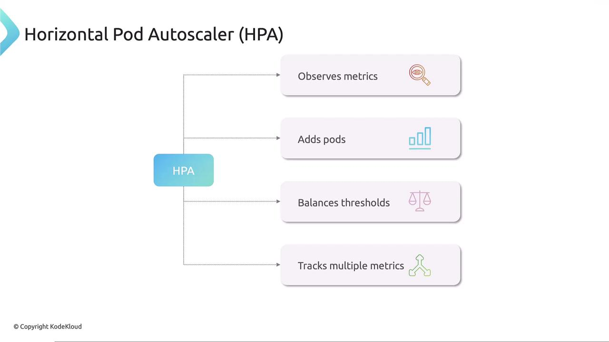
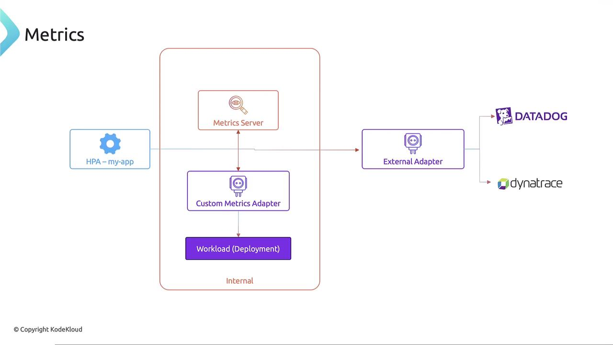

# Horizontal Pod Autoscaler HPA

> 💡 In this article, we explore the Horizontal Pod Autoscaler (HPA) in Kubernetes. HPA is a key feature that automates scaling of workloads based on resource usage, reducing the manual monitoring overhead for administrators.

## Manual Horizontal Scaling

Imagine you are managing a Kubernetes cluster and need to ensure your application can handle traffic spikes. Consider an application where each pod requests 250 millicores (mCPU) and has a limit of 500 mCPU. Even under heavy load, a single pod will never exceed 500 mCPU.

To monitor the pod’s resource consumption manually, you might run:

```bash theme={null}
$ kubectl top pod my-app-pod
NAME         CPU(cores)   MEMORY(bytes)
my-app-pod   450m         350Mi
```

When resource usage reaches a predefined threshold (e.g., 450 mCPU), you must manually scale the deployment:

```bash theme={null}
$ kubectl scale deployment my-app --replicas=3
```

Below is a sample deployment configuration for this scenario:

```yaml theme={null}
apiVersion: apps/v1
kind: Deployment
metadata:
  name: my-app
spec:
  replicas: 1
  selector:
    matchLabels:
      app: my-app
  template:
    metadata:
      labels:
        app: my-app
    spec:
      containers:
        - name: my-app
          image: nginx
          resources:
            requests:
              cpu: "250m"
            limits:
              cpu: "500m"
```

> 💡 Manually scaling pods requires continuous monitoring, which can be resource-intensive and error-prone during traffic surges.

## Automated Scaling with Horizontal Pod Autoscaler

Kubernetes simplifies scaling with the Horizontal Pod Autoscaler. HPA monitors resource metrics—including CPU, memory, and custom metrics—using the metrics server. When usage exceeds a defined threshold, it automatically adjusts the number of pod replicas in deployments, stateful sets, or replica sets.

When CPU or memory usage is high, HPA scales up the number of pods; when usage drops, it scales them down to conserve system resources. HPA can even track multiple metrics concurrently.



### Imperative Creation of an HPA

For an existing Nginx deployment, you can configure an HPA with the following command. This command sets the autoscaler to maintain CPU utilization at 50% with a replica count that can vary between 1 and 10:

```bash theme={null}
$ kubectl autoscale deployment my-app --cpu-percent=50 --min=1 --max=10
```

Once executed, Kubernetes creates an HPA that continuously polls the metrics server based on the pod’s CPU limit (500 mCPU in this case). If CPU usage exceeds 50% of this limit, HPA automatically scales the deployment up or down. To check the status of your HPA, run:

```bash theme={null}
$ kubectl get hpa
```

This command displays details such as current CPU utilization against the threshold and the current number of running pods. If you need to remove the autoscaler later, simply run:

```bash theme={null}
$ kubectl delete hpa my-app
```

### Declarative HPA Configuration

Alternatively, you can define the HPA using a declarative configuration file. The example below uses the autoscaling/v2 API:

```yaml theme={null}
apiVersion: autoscaling/v2
kind: HorizontalPodAutoscaler
metadata:
  name: my-app-hpa
spec:
  scaleTargetRef:
    apiVersion: apps/v1
    kind: Deployment
    name: my-app
  minReplicas: 1
  maxReplicas: 10
  metrics:
    - type: Resource
      resource:
        name: cpu
        target:
          type: Utilization
          averageUtilization: 50
```

In this configuration:

- The `scaleTargetRef` links the HPA to the "my-app" deployment.
- `minReplicas` and `maxReplicas` specify the allowed replica count range.
- The metrics section ensures that the average CPU utilization is maintained at 50%.

> 💡 HPA has been integrated into Kubernetes since version 1.23 and uses the metrics-server to deliver real-time resource data.

## Metrics Server and Custom/External Metrics

The HPA relies on the internal metrics server for real-time CPU and memory usage data. Kubernetes also supports custom metrics adapters, which allow HPA to fetch metrics from internal cluster workloads. Additionally, external metrics adapters can integrate with tools like Datadog or Dynatrace to supply metrics from outside the cluster.



## Conclusion

In this article, we examined both manual and automated scaling approaches in Kubernetes. The Horizontal Pod Autoscaler provides an efficient way to manage pod replicas based on real-time resource usage, significantly improving operational efficiency and reducing the need for manual intervention.
