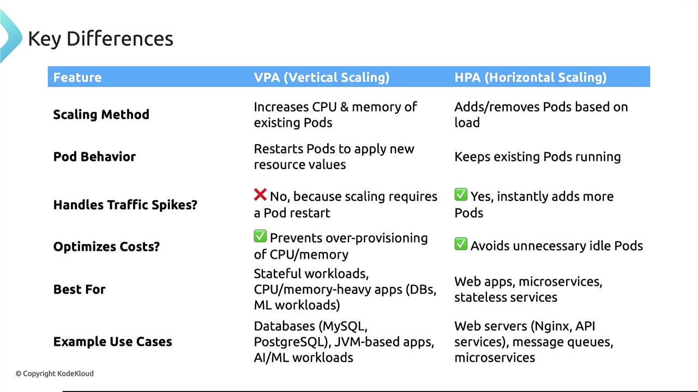

# 2025 Updates Vertical Pod Autoscaling VPA

> 💡 In this article, we explore the workings of the Vertical Pod Autoscaler (VPA) in Kubernetes and how it automatically manages resource allocation. We begin by reviewing manual vertical scaling and then compare it with the VPA’s automated approach.

## Manual Vertical Scaling

Consider a Kubernetes administrator managing a cluster where a deployment configuration specifies a pod with a CPU request of 250 millicores and a CPU limit of 500 millicores. This configuration allows the pod to use up to 500 millicores of CPU. You can monitor the pod's resource consumption using the `kubectl top pod` command, as shown below:

```yaml theme={null}
apiVersion: apps/v1
kind: Deployment
metadata:
  name: my-app
spec:
  replicas: 1
  selector:
    matchLabels:
      app: my-app
  template:
    metadata:
      labels:
        app: my-app
    spec:
      containers:
        - name: my-app
          image: nginx
          resources:
            requests:
              cpu: "250m"
            limits:
              cpu: "500m"
```

```bash theme={null}
$ kubectl top pod my-app-pod
NAME        CPU(cores)   MEMORY(bytes)
my-app-pod  450m         350Mi
```

> 💡 Ensure that your cluster has the metrics server running to collect these metrics. When resource usage reaches a set threshold, you must manually update the deployment (e.g., using `kubectl edit deployment`) to adjust CPU requests and limits. This update replaces the running pod with a new one using the new configuration.

## Introducing the Vertical Pod Autoscaler (VPA)

Manually updating resources can be error-prone and time-consuming. The VPA automates this process, continuously monitoring metrics and adjusting CPU and memory allocations for pods. Unlike the Horizontal Pod Autoscaler (HPA), which scales the number of pods based on demand, the VPA fine-tunes resource specifications for existing pods.

Note that the VPA is not included by default in Kubernetes clusters. You must deploy it separately from its GitHub repository. After deployment, verify its three components—the recommender, updater, and admission controller—using the commands below:

```bash theme={null}
$ kubectl apply -f https://github.com/kubernetes/autoscaler/releases/latest/download/vertical-pod-autoscaler.yaml

$ kubectl get pods -n kube-system | grep vpa
vpa-admission-controller-xxxx   Running
vpa-recommender-xxxx            Running
vpa-updater-xxxx                Running
```

The components work as follows:

- **VPA Recommender:** Continuously monitors resource usage via the Kubernetes metrics API, aggregates historical and live data, and provides recommendations for optimal CPU and memory allocations.
- **VPA Updater:** Evaluates running pods against recommendations, evicting those with suboptimal resource requests.
- **VPA Admission Controller:** Intercepts the pod creation process and mutates pod specifications based on the recommender's suggestions, ensuring new pods start with proper resource allocations.

## Configuring the VPA

To create a VPA for your deployment, use a YAML configuration file rather than running imperative commands. Below is an example configuration for a VPA targeting the `my-app` deployment. In this configuration, the VPA monitors CPU usage for the container named `my-app` and operates in "Auto" update mode:

```yaml theme={null}
apiVersion: autoscaling.k8s.io/v1
kind: VerticalPodAutoscaler
metadata:
  name: my-app-vpa
spec:
  targetRef:
    apiVersion: apps/v1
    kind: Deployment
    name: my-app
  updatePolicy:
    updateMode: "Auto"
  resourcePolicy:
    containerPolicies:
      - containerName: "my-app"
        minAllowed:
          cpu: "250m"
        maxAllowed:
          cpu: "2"
        controlledResources: ["cpu"]
```

The VPA supports multiple update modes:

- **Off:** Only provides recommendations without any modifications.
- **Initial:** Applies recommendations only to newly created pods.
- **Recreate:** Evicts pods running with suboptimal resource allocations, leading to pod restarts.
- **Auto:** Currently behaves like "recreate" by evicting pods to apply updated values. In the future, auto mode may support in-place updates without restarting pods.

To view the VPA recommendations, run:

```bash theme={null}
$ kubectl describe vpa my-app-vpa
Recommendations:
  Target:
    Cpu: 1.5
```

In this example, the VPA recommends increasing the CPU allocation to 1.5 cores.

## VPA vs HPA

VPA and HPA both aim to optimize resource utilization, but they address different aspects of scaling:

| Feature           | Vertical Pod Autoscaler (VPA)                                                                                    | Horizontal Pod Autoscaler (HPA)                                                                     |
| ----------------- | ---------------------------------------------------------------------------------------------------------------- | --------------------------------------------------------------------------------------------------- |
| Scaling Method    | Adjusts CPU and memory configurations for individual pods (may require pod restarts)                             | Scales the number of pods based on demand                                                           |
| Pod Behavior      | Might cause downtime due to pod restarts during resource updates                                                 | Typically maintains availability by adding or removing pods on the fly                              |
| Traffic Spikes    | Less effective during sudden spikes, as pod restarts are needed                                                  | More responsive to rapid traffic changes by dynamically adjusting pod count                         |
| Cost Optimization | Prevents over-provisioning by matching resource allocations with actual usage                                    | Reduces costs by eliminating the overhead of running idle pods                                      |
| Ideal Use Cases   | Best suited for stateful workloads and resource-intensive applications (e.g., databases, JVM apps, AI workloads) | Ideal for stateless services like web applications and microservices where quick scaling is crucial |

> 💡 For in-depth comparisons and use-case analysis, refer to the [Kubernetes Documentation](https://kubernetes.io/docs/). Understanding both autoscalers will help you choose the most suitable strategy for optimizing resource allocation and cost efficiency in your cluster.

Below is an image that visually compares VPA and HPA regarding scaling methods, pod behavior, traffic handling, cost optimization, and use cases:



## Conclusion

The Vertical Pod Autoscaler streamlines resource management by automatically adjusting CPU and memory allocations for individual pods based on observed usage, whereas the Horizontal Pod Autoscaler scales the number of pods to handle traffic load. Your choice of autoscaler depends on your application's specific needs—whether you require finely tuned resource adjustments or rapid scaling to meet demand.
