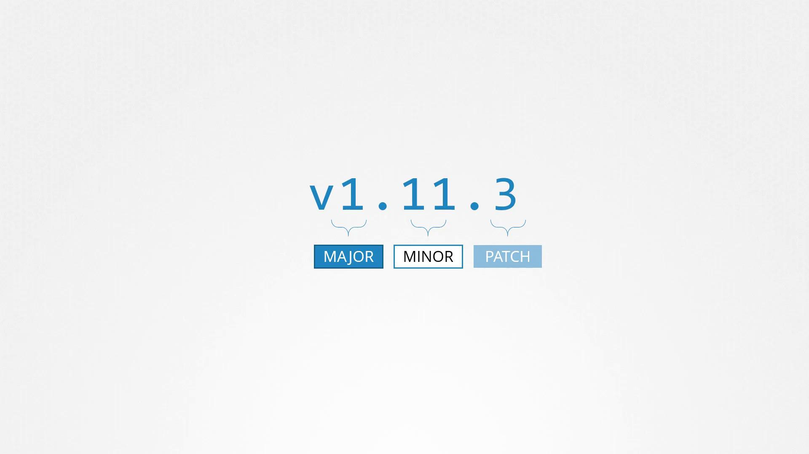
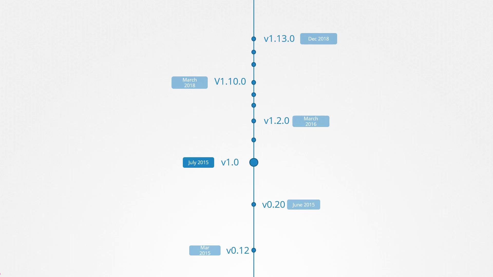
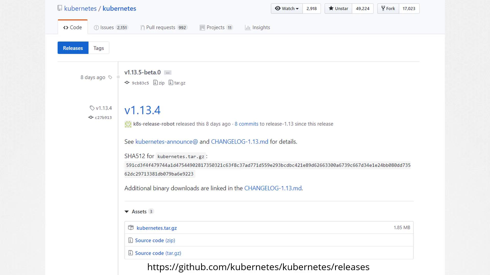

# Kubernetes Software Versions

> This article explores Kubernetes releases, versioning schemes, and software release management to help understand version nuances and upgrade processes.

## Viewing Your Cluster Version

When you install a Kubernetes cluster, you install a specific version of Kubernetes. To check which version is running on your cluster, execute the following command:

```bash theme={null}
kubectl get nodes
```

For example, the output might resemble:

```bash theme={null}
kubectl get nodes
NAME     STATUS   ROLES    AGE    VERSION
master   Ready    master   1d     v1.11.3
node-1   Ready    <none>   1d     v1.11.3
node-2   Ready    <none>   1d     v1.11.3
```

## Understanding Semantic Versioning

Kubernetes release versions follow a three-part semantic versioning scheme: major, minor, and patch.

- **Major versions** indicate significant changes.
- **Minor versions** are released every few months and introduce new features and functionalities.
- **Patch versions** are released more frequently to address critical bug fixes.



> 💡 Semantic versioning helps ensure backward compatibility while introducing new features incrementally.

## The Evolution of Kubernetes

The first major release, version 1.0, was introduced in July 2015. At the time of recording, the latest stable version is 1.13.0. Kubernetes releases follow a lifecycle that includes alpha, beta, and stable phases:

- **Alpha releases:** Features are disabled by default and may be unstable.
- **Beta releases:** Features are enabled by default and undergo thorough testing.
- **Stable releases:** Fully tested and ready for production use.



> 💡 Always review the release notes before upgrading to ensure compatibility with your existing Kubernetes environment.

## Accessing Release Artifacts

You can find all Kubernetes releases on the [Kubernetes GitHub releases page](https://github.com/kubernetes/kubernetes/releases). After downloading the kubernetes.tar.gz file and extracting it, you will see executables for all Kubernetes components. Note that while the control plane components share the same version, additional components like the ETCD cluster and CoreDNS servers may have their own version numbers because they are maintained as separate projects. Each release's notes detail the supported versions of these external dependencies.



## What's Next?

This overview provides insight into the versioning and lifecycle of Kubernetes releases. In our next lesson, we will cover the upgrade process, detailing how to transition safely from one Kubernetes version to another.

For more information on Kubernetes version management and upgrade strategies, please refer to the [Kubernetes Documentation](https://kubernetes.io/docs/).
