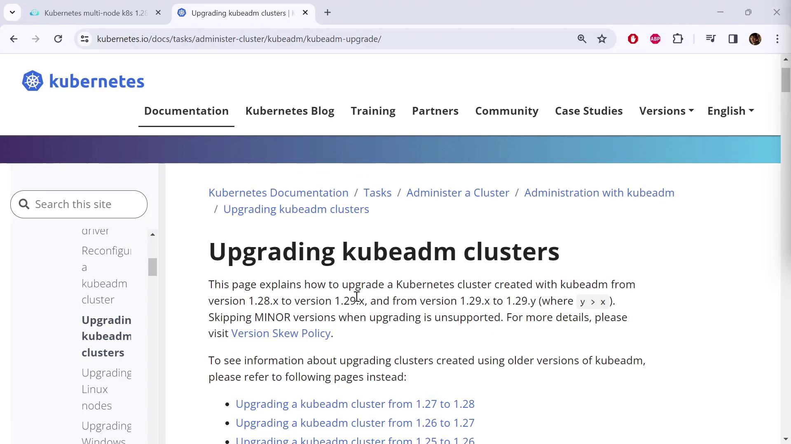
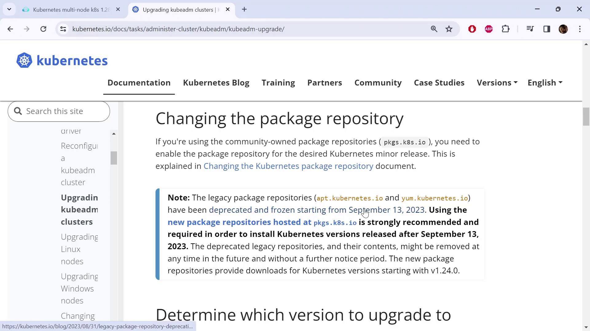

# Demo Cluster upgrade

> 💡 This guide demonstrates upgrading a Kubernetes cluster from version 1.28 to 1.29 using kubeadm following official instructions.

In this guide, we demonstrate how to upgrade a Kubernetes cluster from version 1.28 to 1.29 using kubeadm. We follow the official "Upgrading a Kubeadm Cluster" instructions from the Kubernetes documentation. For further details, refer to the "Upgrading a Kubeadm Cluster" section in the [Kubernetes Documentation](https://kubernetes.io/docs/setup/production-environment/tools/kubeadm/upgrade-cluster/).



The documentation provides dedicated instructions for each upgrade path. In this case, we are upgrading from 1.28 to 1.29 (the latest release). Similar procedures exist for other upgrade paths (e.g., 1.27 to 1.28, 1.26 to 1.27, etc.). Simply select the correct upgrade path and follow the detailed steps accordingly.

---

## Updating Package Repositories

Before beginning the upgrade, review the updated package repository information. The legacy repositories (app.kubernetes.io and yum.kubernetes.io) have been deprecated. Moving forward, packages are available at [packages.k8s.io](https://pkgs.k8s.io). This repository now hosts the latest versions of essential tools such as kubectl and kubeadm.



> 💡 Before proceeding, confirm that you are using the new package repositories. Check the documentation and click the provided link for the latest instructions.

### Verify Your Node OS and Repository Setup

First, determine your node distribution because the commands differ slightly by operating system. For example, on a two-node cluster, run:

```bash theme={null}
kubectl get nodes
```

An example output may be:

```plaintext theme={null}
NAME           STATUS        ROLES          AGE   VERSION
controlplane   Ready         control-plane  98m   v1.28.0
node01         Ready         <none>         98m   v1.28.0
```

To check your OS distribution, use:

```bash theme={null}
cat /etc/*release*
```

Example output for Ubuntu 20.04.6 LTS (Debian-based):

```plaintext theme={null}
DISTRIB_ID=Ubuntu
DISTRIB_RELEASE=20.04
DISTRIB_CODENAME=focal
DISTRIB_DESCRIPTION="Ubuntu 20.04.6 LTS"
NAME="Ubuntu"
VERSION="20.04.6 LTS (Focal Fossa)"
ID=ubuntu
ID_LIKE=debian
PRETTY_NAME="Ubuntu 20.04"
VERSION_ID="20.04"
...
```

For Debian/Ubuntu systems, update the repository to the new endpoint. First, switch to the new URL for your version upgrade. For version 1.29, execute:

```bash theme={null}
echo "deb [signed-by=/etc/apt/keyrings/kubernetes-apt-keyring.gpg] https://pkgs.k8s.io/core:/stable:/v1.29/deb/ /" | sudo tee /etc/apt/sources.list.d/kubernetes.list
```

Next, download the public signing key:

```bash theme={null}
curl -fsSL https://pkgs.k8s.io/core/stable/v1.28/deb/Release.key | sudo gpg --dearmor -o /etc/apt/keyrings/kubernetes-apt-keyring.gpg
```

> 💡 Remember to adjust the version numbers (e.g., change to 1.29) in both commands as needed during the upgrade process.

After making these updates on the control plane and worker nodes, run:

```bash theme={null}
sudo apt-get update
```

---

## Upgrading the Control Plane

### Step 1: Upgrade kubeadm

On the control plane node, list the available kubeadm versions:

```bash theme={null}
sudo apt update
sudo apt-cache madison kubeadm
```

A typical output may appear as follows:

```plaintext theme={null}
kubeadm | 1.29.3-1.1 | https://pkgs.k8s.io/core/stable/v1.29/deb Packages
kubeadm | 1.29.2-1.1 | https://pkgs.k8s.io/core/stable/v1.29/deb Packages
kubeadm | 1.29.1-1.1 | https://pkgs.k8s.io/core/stable/v1.29/deb Packages
kubeadm | 1.29.0-1.1 | https://pkgs.k8s.io/core/stable/v1.29/deb Packages
```

Select the latest version (in this example, 1.29.3-1.1) and upgrade kubeadm with:

```bash theme={null}
sudo apt-mark unhold kubeadm && \
sudo apt-get update && \
sudo apt-get install -y kubeadm='1.29.3-1.1' && \
sudo apt-mark hold kubeadm
```

Verify that the kubeadm upgrade is successful by checking the version:

```bash theme={null}
kubeadm version
```

Expected output:

```plaintext theme={null}
kubeadm version: &version.Info{Major:"1", Minor:"29", GitVersion:"v1.29.3", ...}
```

### Step 2: Run the Upgrade Plan

Before applying the upgrade, conduct a dry run to ensure compatibility:

```bash theme={null}
sudo kubeadm upgrade plan
```

This command displays the upgrade details, including the components automatically upgraded and those requiring manual intervention (e.g., kubelet). A sample output might look like:

```plaintext theme={null}
[upgrade/versions] Cluster version: v1.28.0
[upgrade/versions] kubeadm version: v1.29.3
[upgrade/versions] Target version: v1.29.3
...
Components that must be upgraded manually after you upgrade the control plane:
COMPONENT            CURRENT     TARGET
kubelet              2 x v1.28.0 v1.28.8
...
```

Kubeadm upgrades most of the control plane components automatically but leaves the kubelet for manual upgrade.

### Step 3: Apply the Control Plane Upgrade

Upgrade your control plane with:

```bash theme={null}
sudo kubeadm upgrade apply v1.29.3
```

Monitor the process as it renews certificates, updates static Pod manifests, and applies configuration changes. Once complete, you should see a success message such as:

```plaintext theme={null}
[upgrade/successful] SUCCESS! Your cluster was upgraded to "v1.29.3". Enjoy!
[upgrade/kubelet] Now that your control plane is upgraded, please proceed with upgrading your kubelets.
```

Note: Until kubelet is upgraded, `kubectl get nodes` will still display version v1.28.0 for the kubelet.

---

## Upgrading kubelet and kubectl on the Control Plane

### Step 1: Drain the Control Plane Node

Before updating kubelet and kubectl, drain the control plane node:

```bash theme={null}
kubectl drain controlplane --ignore-daemonsets
```

### Step 2: Upgrade Packages

Next, upgrade kubelet and kubectl to version 1.29.3-1.1:

```bash theme={null}
sudo apt-mark unhold kubelet kubectl && \
sudo apt-get update && \
sudo apt-get install -y kubelet='1.29.3-1.1' kubectl='1.29.3-1.1' && \
sudo apt-mark hold kubelet kubectl
```

Reload the systemd configuration and restart the kubelet service:

```bash theme={null}
sudo systemctl daemon-reload
sudo systemctl restart kubelet
```

Finally, uncordon the control plane node to allow pods to be scheduled:

```bash theme={null}
kubectl uncordon controlplane
```

Verify the upgrade by checking the node versions:

```bash theme={null}
kubectl get nodes
```

The control plane should now reflect version v1.29.3.

---

## Upgrading Worker Nodes

For each worker node, perform the following steps:

1. **Upgrade kubeadm:**

   ```bash theme={null}
   sudo apt-mark unhold kubeadm && \
   sudo apt-get update && \
   sudo apt-get install -y kubeadm='1.29.3-1.1' && \
   sudo apt-mark hold kubeadm
   ```

2. **Update Node Configuration:**

   Run the command on the control plane to update the node configuration:

   ```bash theme={null}
   sudo kubeadm upgrade node
   ```

   This command refreshes the node configuration without upgrading the kubelet package.

3. **Drain the Worker Node:**

   Use the node name (e.g., node01) to drain it:

   ```bash theme={null}
   kubectl drain node01 --ignore-daemonsets
   ```

4. **Upgrade kubelet and kubectl:**

   Execute the following commands on the worker node:

   ```bash theme={null}
   sudo apt-mark unhold kubelet kubectl && \
   sudo apt-get update && \
   sudo apt-get install -y kubelet='1.29.3-1.1' kubectl='1.29.3-1.1' && \
   sudo apt-mark hold kubelet kubectl
   ```

   Reload and restart kubelet:

   ```bash theme={null}
   sudo systemctl daemon-reload
   sudo systemctl restart kubelet
   ```

5. **Uncordon the Worker Node:**

   ```bash theme={null}
   kubectl uncordon node01
   ```

After upgrading all worker nodes, verify that every node in the cluster is running version v1.29.3:

```bash theme={null}
kubectl get nodes
```

---

## Summary

This guide detailed the process of upgrading a Kubernetes cluster using kubeadm by:

1. Updating package repositories to the new [packages.k8s.io](https://pkgs.k8s.io).
2. Upgrading kubeadm on the control plane and verifying the available versions.
3. Running a dry-run upgrade plan to check compatibility.
4. Applying the control plane upgrade.
5. Upgrading kubelet and kubectl on both the control plane and worker nodes while minimizing downtime by draining and uncordoning nodes.

Following these steps will ensure that your cluster components run on v1.29.3 securely and efficiently.

Happy upgrading!
