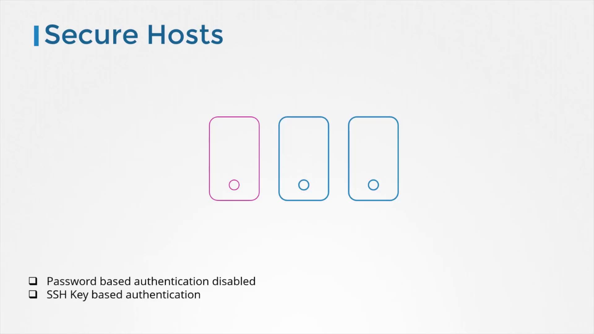
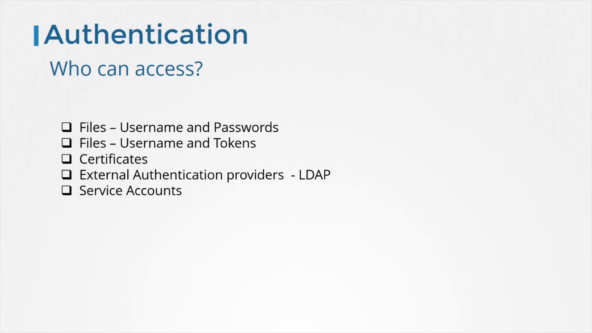
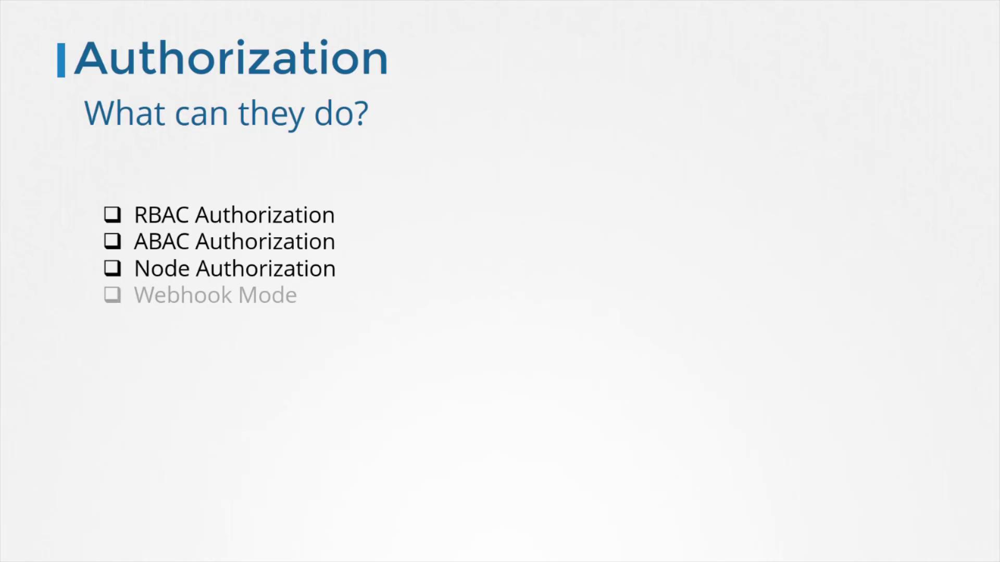
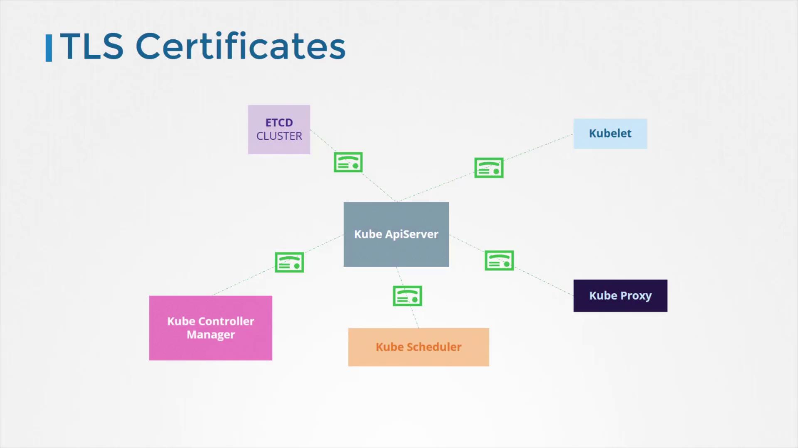
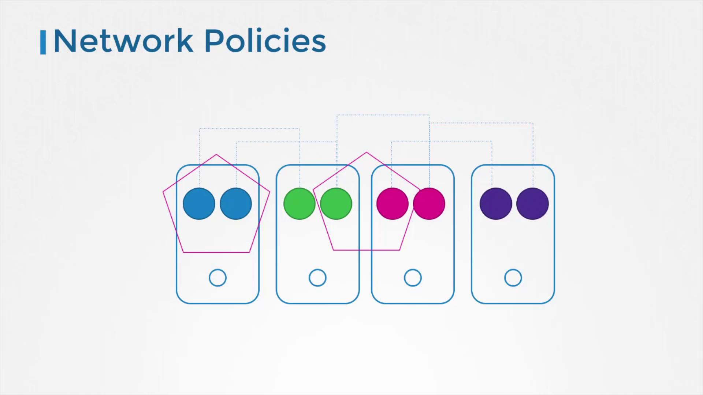

# Kubernetes Security Primitives

> This article explores core security features essential for protecting production-grade Kubernetes clusters, including securing hosts, API server access control, and network policies.

## Securing Cluster Hosts

The security of your Kubernetes cluster begins with the hosts themselves. Protect your underlying infrastructure by following these practices:

- Disable root access.
- Turn off password-based authentication.
- Enforce SSH key-based authentication.
- Implement additional measures to secure your physical or virtual systems.

A compromised host can expose your entire cluster, so securing these systems is a critical first step.

## API Server Access Control

The Kube API server is at the heart of Kubernetes operations because all cluster interactions—whether via the kubectl command-line tool or directly through API calls—pass through it. Effective access control is essential, focusing on two key questions:

1. Who can access the cluster?
2. What actions are they permitted to perform?

### Authentication

Authentication verifies the identity of a user or service before granting access to the API server. Kubernetes offers various authentication mechanisms to suit different security needs:

- Static user IDs and passwords
- Tokens
- Client certificates
- Integration with external authentication providers (e.g., LDAP)

Additionally, service accounts support non-human processes. Detailed guidance on these methods is available in dedicated sections of our documentation.

### Authorization

After authentication, authorization determines what actions a user or service is allowed to perform. The default mechanism, Role-Based Access Control (RBAC), associates identities with specific permissions. Kubernetes also supports:

- Attribute-Based Access Control (ABAC)
- Node Authorization
- Webhook-based authorization

These mechanisms enforce granular access control policies, ensuring that authenticated entities can perform only the operations they are permitted to execute.

## Securing Component Communications

Secure communications between Kubernetes components are enabled via TLS encryption. This ensures that data transmitted between key components remains confidential and tamper-proof. Encryption protects:

- Communication within the etcd cluster
- Interactions between the Kube Controller Manager and Kube Scheduler
- Links between worker node components such as the Kubelet and Kube Proxy

For more detailed instructions on setting up and managing TLS certificates, refer to our comprehensive certificate management guides.

## Network Policies

By default, pods in a Kubernetes cluster communicate freely with one another. To restrict unwanted interactions and enhance security, Kubernetes provides network policies. These policies allow you to:

- Control traffic flow between specific pods
- Enforce security rules at the network level

For an in-depth discussion on implementing network policies with practical examples, please see the related documentation.

> 💡 For a secure Kubernetes environment, consider combining these security primitives with additional best practices and tools to counter evolving threats.

This high-level overview has introduced the critical security primitives in Kubernetes. For more detailed procedures and practical examples to further enhance the security of your clusters, please refer to the extended documentation.

Happy securing!
