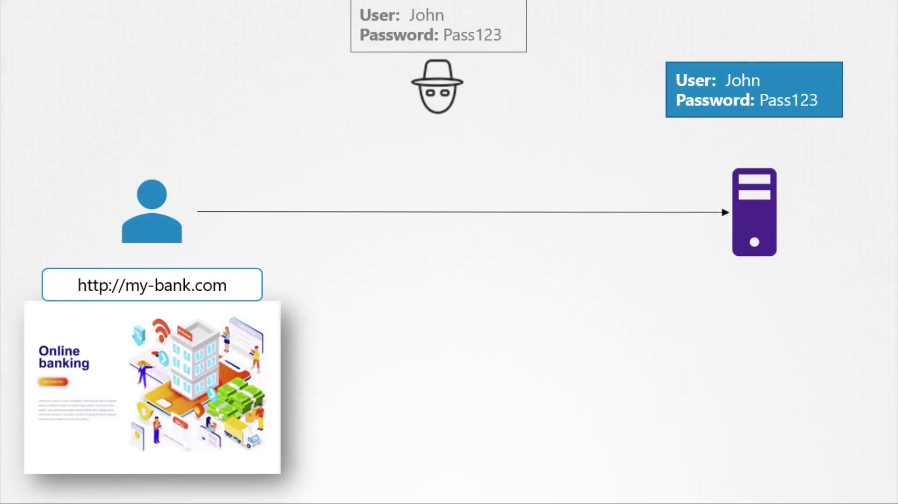
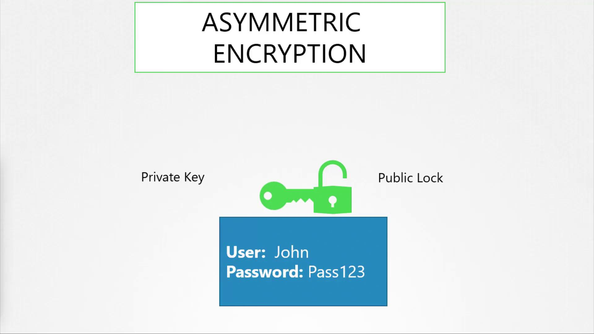
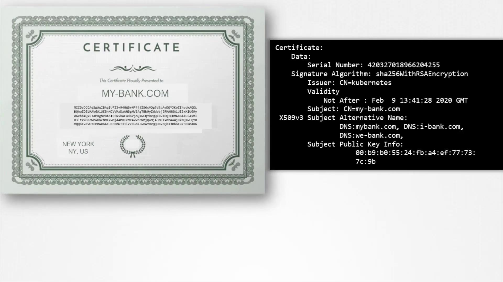
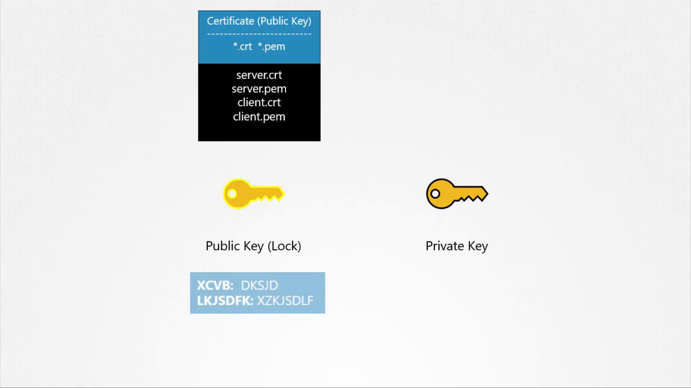

# TLS Basics

> This article covers the fundamentals of TLS certificates, their importance for secure communications, and configuration for SSH and web servers.

A TLS certificate establishes trust during a transaction by ensuring that communications are encrypted and that the server is indeed who it claims to be.

Imagine a scenario where a user accesses their online banking application over an unsecured connection. The credentials entered would be transmitted in plain text, making it easy for a hacker spying on the network to intercept and misuse the sensitive data.



To prevent such risks, data is encrypted using encryption keys—a set of random numbers and characters. Initially, symmetric encryption was used, where the same key is responsible for both encrypting and decrypting data. However, transmitting this key over the network to initiate a secure session introduces vulnerabilities, as an attacker intercepting the key could decrypt the data.

This is where asymmetric encryption becomes valuable. Asymmetric encryption uses a pair of keys: a private key and a public key. You can think of these as a private key and a public lock. The private key remains securely with the owner, while the public lock can be shared openly. Data encrypted with the public key can only be decrypted using its corresponding private key, ensuring that intercepted data remains secure.

Before delving into the web server example, let’s explore a simpler use case: securing SSH access using key pairs.



Imagine you need to access a server but want to avoid the security risks associated with passwords. By using key pairs, you can generate a private key (id_rsa) and a public key (id_rsa.pub). The private key stays secure on your device, while the public key is added to the server's SSH authorized keys file. When you initiate an SSH connection, you specify your private key to authenticate.

:::note SSH Key Pair Generation
Generate your SSH key pair with the following command:
:::

```bash theme={null}
# Generate SSH key pair
ssh-keygen

# Files generated: id_rsa (private key) and id_rsa.pub (public key)
```

You can review the authorized keys on the server as follows:

```bash theme={null}
cat ~/.ssh/authorized_keys
```

An example output might appear like:

```plaintext theme={null}
ssh-rsa AAAAB3NzaC1yc...KhtUBfoTz1BqRV1NThvO0apzEwRQo1mWx user1
```

To connect securely to the server using your key pair, use:

```bash theme={null}
ssh -i id_rsa user1@server1
```

If you have multiple servers, simply copy your public key to each server’s authorized keys file so you can authenticate using the same private key on all servers. For additional users who require access, they can generate their own key pairs and have their public keys added to the servers.

Now, let’s return to the web server scenario. With symmetric encryption, the key used for encryption must be sent along with the ciphertext, which introduces risk if intercepted. Asymmetric encryption addresses this by securely transferring the symmetric key. Here’s how the process works for a web server using HTTPS:

1. The server generates a key pair (private and public keys).
2. Upon a user's initial HTTPS request, the server sends its public key embedded within a certificate.
3. The client's browser encrypts a newly generated symmetric key using the server’s public key.
4. The encrypted symmetric key is sent back to the server.
5. The server decrypts the symmetric key using its private key.
6. All subsequent communications are encrypted with this symmetric key.

> 💡 Symmetric key is a temporary, randomly created secret (often called a "session key") that the client's browser produces during the TLS/HTTPS handshake. It is used exclusively for encrypting and decrypting all subsequent data exchanged in that single browsing session between the browser and web server.

### Ongoing Data Flow

- Browser wants to load a page: Encrypts the request with the session key, sends ciphertext.
- Server decrypts with the same key, processes, encrypts response similarly, sends back.
- This repeats for the entire session—efficient, secure, and no key resending needed.
  ​
- This hybrid design balances security (asymmetric for key exchange) with speed (symmetric for everything else).

For example, to generate a key pair with OpenSSL for encrypting the symmetric key, you can use:

```bash theme={null}
# Generate a private key
openssl genrsa -out my-bank.key 1024

# Extract the public key
openssl rsa -in my-bank.key -pubout > mybank.pem
```

The above commands demonstrate how to create the necessary keys. Although the original content repeated the process multiple times, we present a single, clear version for simplicity.

Imagine a hacker trying to intercept your bank communications by setting up a counterfeit website. The attacker might generate their own key pair and a self-signed or invalid certificate, tricking your browser into thinking it’s connected to your bank. Modern browsers, however, will alert users if the certificate is untrustworthy.

A certificate contains essential details that help verify its authenticity:

- Identity of the issuing authority
- The server’s public key
- Domain and other related information

Below is an example excerpt from a certificate:

```plaintext theme={null}
Certificate:
Data:
  Serial Number: 420327018966204255
  Signature Algorithm: sha256WithRSAEncryption
  Issuer: CN=kubernetes
  Validity
    Not After : Feb  9 13:41:28 2020 GMT
  Subject: CN=my-bank.com
  X509v3 Subject Alternative Name:
    DNS:mybank.com, DNS:i-bank.com,
    DNS:we-bank.com,
  Subject Public Key Info:
    00:b9:b0:55:24:fb:a4:ef:77:73:7c:9b
```



Browsers rely on Certificate Authorities (CAs) to sign and validate certificates. Renowned CAs, such as Symantec, DigiCert, Komodo, and GlobalSign, use their private keys to sign certificate signing requests (CSRs). When you generate a CSR for your web server, it is sent to a CA for signing:

```bash theme={null}
openssl req -new -key my-bank.key -out my-bank.csr -subj "/C=US/ST=CA/O=MyOrg, Inc./CN=my-bank.com"
```

Once your details are validated, the CA signs the certificate and sends it back to be installed on your web server. When a user accesses your website, the process is as follows:

1. The server presents the certificate.
2. The browser validates it using pre-installed CA public keys.
3. Upon successful validation, the browser and server establish a secure session using a symmetric key exchanged via asymmetric encryption.

For internal systems, such as corporate payroll applications, organizations may deploy their own private CA and distribute its public key to employee devices.

### Note Key Points Summary

- Asymmetric encryption uses a pair of keys (public and private) to securely exchange symmetric keys.
- SSH access is secured using key pairs.
- Web servers use CA-signed certificates to establish HTTPS connections.
- A Certificate Signing Request (CSR) is generated and sent to a CA for signing.
- Signed certificates, combined with the server’s key pair, secure the communication session.

It is important to note that although both keys in an asymmetric pair can encrypt data, only the complementary key can decrypt it. For instance, data encrypted with your private key can be decrypted by anyone with your public key; therefore, it’s crucial to use the correct key for each operation.

Regarding file naming conventions, certificates containing public keys typically have extensions such as .crt or .pem (e.g., server.crt, server.pem or client.crt, client.pem), and private key files usually include "key" in the filename or extension (e.g., server.key or server-key.pem).



## Additional Resources

- [Kubernetes Documentation](https://kubernetes.io/docs/)
- [SSL/TLS Basics](https://www.openssl.org/docs/)
- [Understanding Cryptography](https://en.wikipedia.org/wiki/Public-key_cryptography)
