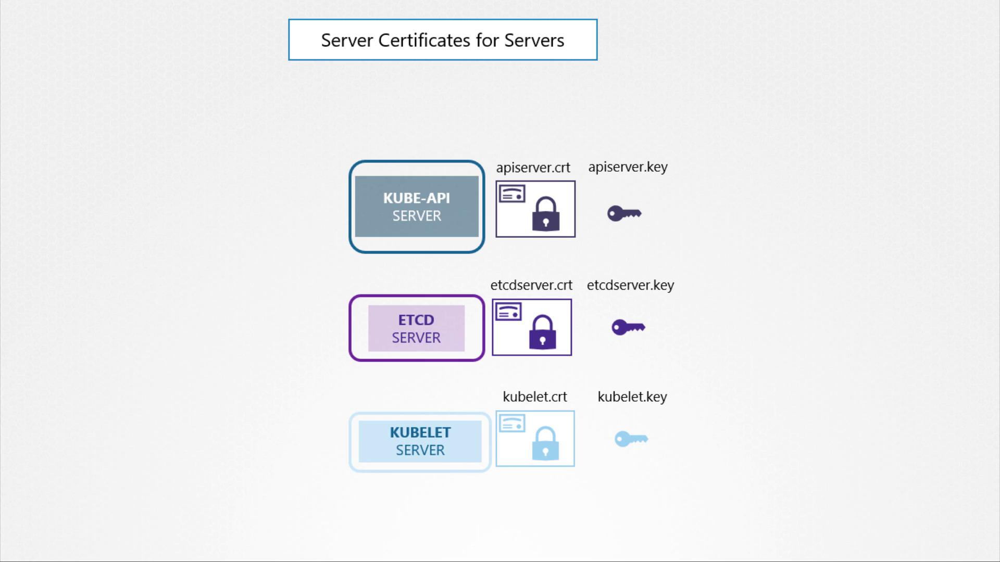
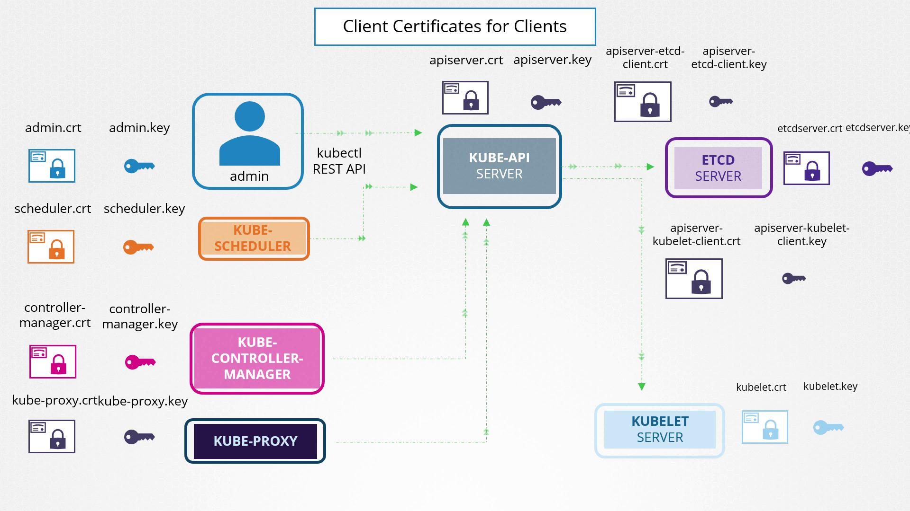
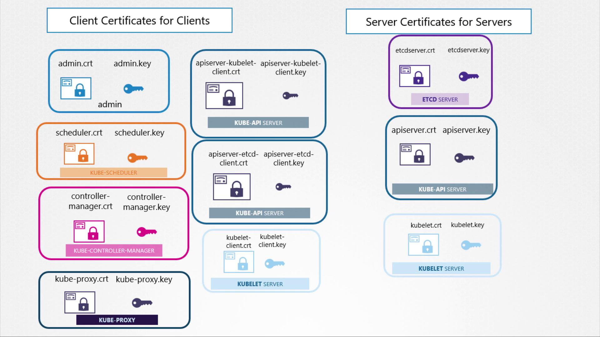

# TLS in Kubernetes

> 💡 This article provides a guide on securing Kubernetes clusters using TLS certificates, covering key concepts, components, and management practices.

We cover the fundamentals of public and private keys, the role of certificate authorities (CA), and how both server and client certificates are employed to safeguard connections within your cluster.

> 💡 Certificate files follow specific naming conventions. Public key certificates typically have a .crt or .pem extension (e.g., server.crt, server.pem, client.crt, client.pem). In contrast, private keys usually include the word "key" in their file name or extension (e.g., server.key or server-key.pem). If a file name lacks "key," it is almost certainly a public key certificate.

## TLS Certificates in the Kubernetes Cluster

A Kubernetes cluster consists of master and worker nodes that require secure, encrypted communication. Whether the connection is being made by an administrator using the kubectl utility or directly interacting with the Kubernetes API, a secure TLS connection is essential. Additionally, services within the cluster use server certificates to secure their communications, while client certificates authenticate users or other cluster components.

# Certificate Type Comparison

| Feature          | Server Certificate           | Client Certificate           | Root Certificate                 |
| :--------------- | :--------------------------- | :--------------------------- | :------------------------------- |
| **Who owns it?** | The Website/Service          | The User/Device              | The Certificate Authority (CA)   |
| **Purpose**      | Proves site identity to user | Proves user identity to site | Validates all other certificates |
| **Commonality**  | Everywhere (HTTPS)           | Rare (High-security)         | Pre-installed on every device    |

### Kubernetes Server Components and Their Certificates

Below is an overview of the main Kubernetes Server components and the associated certificate configurations:

1. **Kube API Server**\
   The API server exposes an HTTPS service for managing the cluster. It acts as a server and requires its own certificate and key pair (e.g., `api-server.crt` and `api-server.key`).\
   _Note: Certificate names may vary based on your cluster setup._

2. **ETCD Server**\
   Serving as the datastore for all cluster information, ETCD requires a unique pair of certificates and keys (e.g., `etcd-server.crt` and `etcd-server.key`).

3. **Kubelet on Worker Nodes**\
   On each worker node, the kubelet service exposes an HTTPS endpoint that communicates with the API server for monitoring and management. This service uses its own certificate and key pair (typically named `kubelet.cert` and `kubelet.key`).

### Client Components and Their Certificates

Several components operate as clients and require authentication when connecting to the Kube API Server:

1. **Administrator (kubectl/REST API)**\
   The admin user employs a client certificate and key pair (e.g., `admin.crt` and `admin.key`) to establish a secure connection to the API server.

2. **Scheduler**\
   Managing pod scheduling, the scheduler requires its own client certificate (e.g., `scheduler.crt` and `scheduler.key`) to interact with the API server.

3. **Kube Controller Manager**\
   This component also utilizes a dedicated certificate pair for authenticating its requests to the API server.

4. **Kube Proxy**\
   Handling network routing within the cluster, the kube proxy uses a client certificate (generally named `kube-proxy.crt` and `kube-proxy.key`) for secure communications with the API server.
5. **Kube API Server**\
   The Kube API Server facilitates secure communications with both the ETCD server and the kubelets. For instance, when connecting to the ETCD server, the API server can either reuse its HTTPS service certificates or use a dedicated certificate pair. Likewise, interactions with kubelets can leverage either the API server’s default certificate pair or a separately generated set of certificates.
   

### Grouping Certificates for Enhanced Management

For easier certificate management, you can group TLS certificates into two main categories:

| Category            | Usage                                                                                                            |
| ------------------- | ---------------------------------------------------------------------------------------------------------------- |
| Client Certificates | Used by components (e.g., admin, scheduler, controller manager, kube-proxy) to authenticate with the API server. |
| Server Certificates | Used by server components (e.g., Kube API Server, ETCD Server, kubelet) to secure their services.                |

### Utilizing a Certificate Authority (CA)

All certificates must be signed by a Certificate Authority. Kubernetes clusters require at least one CA, though multiple CAs may be used for additional segregation (for example, one CA for general cluster services and another exclusively for ETCD). In this guide, we use a single CA for simplicity. The CA itself has a certificate and key pair, typically named `CA.crt` and `CA.key`.

This overview on TLS certificates in Kubernetes sets the foundation for generating and managing these certificates to secure your cluster communications effectively. Happy securing!
