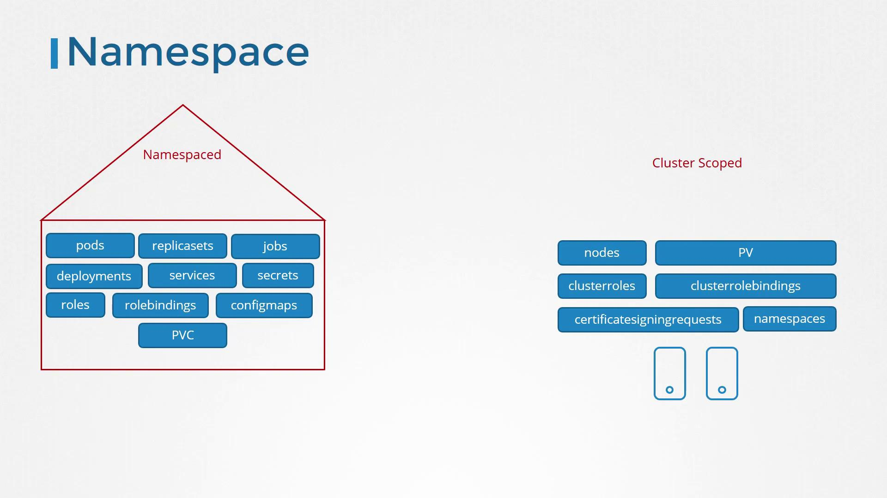

# Cluster Roles

> 💡 In our previous discussion, we covered roles and role bindings, which are namespace-specific. In this article, we extend that concept by introducing cluster roles and cluster role bindings, allowing you to manage permissions across your entire Kubernetes cluster.

When you create roles and role bindings without specifying a namespace, they are added to the default namespace and only authorize access within that scope. This works well for namespaced resources—such as pods, deployments, and services—but not for cluster-scoped resources. For example, nodes cannot be assigned to a specific namespace (e.g., "node01" cannot belong to the "dev" namespace). Cluster-scoped resources like nodes and persistent volumes are managed at the cluster level, so they require a different approach.

Most resources (such as pods, replica sets, jobs, deployments, services, and secrets) are namespaced. In contrast, cluster-scoped resources, including nodes and persistent volumes, do not belong to any namespace. The following image clearly illustrates the difference between namespaced resources (e.g., pods, services) and cluster-scoped resources (e.g., nodes, cluster roles):



To list namespaced and non-namespaced resources, you can use these commands:

```bash theme={null}
kubectl api-resources --namespaced=true
kubectl api-resources --namespaced=false
```

> 💡 Remember: Roles and role bindings are ideal for namespace-level access, while cluster roles and cluster role bindings extend permissions across the cluster.

## Cluster Roles and Cluster Role Bindings

To authorize cluster-scoped resources, such as nodes and persistent volumes, you need to create cluster roles and cluster role bindings. Cluster roles function similarly to roles, but they are tailored for actions that span the entire cluster.

For example, you can define a cluster administrator role that grants the ability to list, retrieve, create, and delete nodes. Alternatively, you might establish a storage administrator role to manage persistent volumes and persistent volume claims.

Below is an example of a cluster role definition file named `cluster-admin-role.yaml`. This YAML file defines a ClusterRole that grants administrative permissions on nodes:

```yaml theme={null}
apiVersion: rbac.authorization.k8s.io/v1
kind: ClusterRole
metadata:
  name: cluster-administrator
rules:
  - apiGroups: [""]
    resources: ["nodes"]
    verbs: ["list", "get", "create", "delete"]
```

Once the ClusterRole is created, you bind it to a user through a ClusterRoleBinding object. The following example binds the `cluster-administrator` ClusterRole to a user named `cluster-admin`:

```yaml theme={null}
apiVersion: rbac.authorization.k8s.io/v1
kind: ClusterRoleBinding
metadata:
  name: cluster-admin-role-binding
subjects:
  - kind: User
    name: cluster-admin
    apiGroup: rbac.authorization.k8s.io
roleRef:
  kind: ClusterRole
  name: cluster-administrator
  apiGroup: rbac.authorization.k8s.io
```

Apply these configurations using the `kubectl create` command.

It's important to note that while cluster roles and role bindings are primarily used for cluster-scoped resources, they can also manage access to namespace-scoped resources. When you bind a cluster role that grants permissions on pods, for instance, the user will have access to pods in every namespace—unlike a namespaced role which restricts access to a single namespace.

> 💡 Kubernetes provides several default cluster roles when the cluster is initially set up. Be sure to review these defaults to understand the baseline permissions before creating custom roles.
