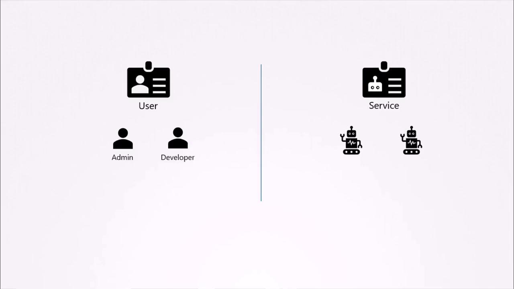
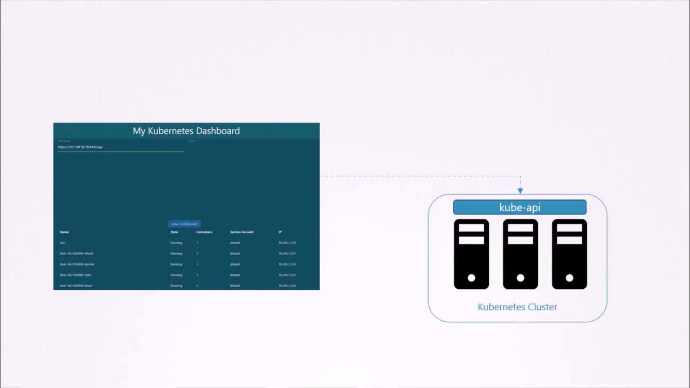

# Service Accounts

> 💡 In Kubernetes, a ServiceAccount is a namespaced resource that provides an identity for processes running inside a Pod.

There are two main types of accounts in Kubernetes:

- **User Accounts:** Designed for human users like administrators or developers.
- **Service Accounts:** Intended for machine-to-machine interactions or application-specific tasks.These provide an identity for processes running in Pods so they can communicate with the Kubernetes API server.
  **Example:** For instance, monitoring tools like Prometheus use a service account to query the Kubernetes API for performance metrics, while Jenkins uses one for deploying applications.



## Example: A Kubernetes Dashboard Application

Consider an example: "my Kubernetes dashboard," a basic dashboard application built with Python. This application retrieves a list of Pods from a Kubernetes cluster by sending API requests and subsequently displays the results on a web page. To authenticate its API requests, the application uses a dedicated service account.



### Creating a Service Account

By default, Pods use the `default` service account. To assign a different service account—like the previously created `dashboard-sa`— add or update in your Pod definition to include the `serviceAccountName` field:

#### Step A: Create the ServiceAccount

```yaml theme={null}
apiVersion: v1
kind: ServiceAccount
metadata:
name: dashboard-sa
```

#### Step B: Reference it in the Pod

```yaml theme={null}
apiVersion: v1
kind: Pod
metadata:
name: internal-tool
spec:
serviceAccountName: dashboard-sa # This links the Pod to the SA
containers:
  - name: main-container
    image: alpine:latest
    command: ["sleep", "3600"]
```

#### What Happens Behind the Scenes?

Once Pod is assigned to a worker node, The Kubelet on that node performs the following:

- **Token Generation:** The TokenRequest API generates a unique, time-bound JSON Web Token (JWT) for that specific Pod.

- **Automated Volume Mount:** Kubelet automatically mounts a projected volume into the container at
  `/var/run/secrets/kubernetes.io/serviceaccount/`

- **Credential Insertion:** Three files are placed in that directory:
  - **token:** The JWT used for authentication.
  - **ca.crt:** The certificate to verify the API server.
  - **namespace:** A text file identifying the Pod's namespace.

- **API Identity:** When your application (using a client library like client-go) calls the Kubernetes API, it automatically reads this token. The API server then sees the request as coming from system:serviceaccount:<namespace>:<sa-name>.

#### Pod Creation Lifecycle: Service Account Integration

| Phase           | Component            | Action                                                     |
| :-------------- | :------------------- | :--------------------------------------------------------- |
| **Submission**  | API Server           | Validates that the named SA exists in the namespace.       |
| **Mutation**    | Admission Controller | Inserts the volume and `volumeMounts` into the Pod spec.   |
| **Scheduling**  | Kube-Scheduler       | Places the Pod on a healthy Node.                          |
| **Execution**   | Kubelet              | Requests a time-bound token and mounts it as a file.       |
| **Interaction** | RBAC                 | Determines what the application is actually allowed to do. |

> Note:
>
> - **Bound ServiceAccount Tokens:** In current Kubernetes versions, tokens are no longer stored as "permanent" Secrets.Tokens are now "projected" into volumes. They are audience-bound (intended for a specific user), time-bound (they expire), and object-bound (invalidated if the Pod is deleted). They tied to the Pod's lifetime. If the Pod dies, the token expires. This prevents attackers from stealing a token and using it indefinitely.
> - **RBAC is Mandatory:** Simply attaching a ServiceAccount doesn't give the Pod power. You must also create a Role (defining what can be done) and a RoleBinding (linking the Role to your ServiceAccount). Without this, the Pod will receive a 403 Forbidden error when trying to talk to the API
> - **Warning:** If your Pod doesn't need to talk to the Kubernetes API at all, it is a security best practice to set `automountServiceAccountToken: false` in your Pod spec to prevent the token from being mounted unnecessarily.
> - **No Automatic Secrets (v1.24+):** Kubernetes stopped auto-generating Secrets for Service Accounts. This prevents long-lived credentials from sitting unencrypted in the etcd database indefinitely.

### Creating a pod without `serviceAccountName` :

In Kubernetes, every Pod must have an identity to interact with the cluster. Whether you specify a Service Account (SA) or not, Kubernetes ensures the Pod is governed by an identity through a process called Admission Control.

- **Assignment:** The Service Account Admission Controller automatically assigns the default Service Account of that specific namespace to the Pod.
- **Token Insertion**: By default, Kubernetes mounts a projected volume containing a temporary, time-bound authentication token into the container at /var/run/secrets/kubernetes.io/serviceaccount/.
- **Permissions:** In a standard cluster, the default Service Account has no permissions beyond basic discovery. If your application tries to list Pods or create resources using this identity, the API server will return a 403 Forbidden error unless you have manually added RBAC (Role-Based Access Control) rules to the default account.

  For example, consider the following simple Pod manifest using a custom dashboard image:

```yaml theme={null}
apiVersion: v1
kind: Pod
metadata:
  name: my-kubernetes-dashboard
spec:
  containers:
    - name: my-kubernetes-dashboard
      image: my-kubernetes-dashboard
```

After creating this Pod, running:

```bash theme={null}
kubectl describe pod my-kubernetes-dashboard
```

will reveal a volume mounted from a Secret (usually named something like `default-token-xxxx`). You might see an excerpt similar to:

```bash theme={null}
Name:           my-kubernetes-dashboard
Namespace:      default
Status:         Running
IP:             10.244.0.15
Containers:
  nginx:
    Image:        my-kubernetes-dashboard
    Mounts:
      /var/run/secrets/kubernetes.io/serviceaccount from kube-api-access-s67mr (ro)
Volumes:
  kube-api-access-s67mr:
    Type:                    Projected (a volume that contains  data from multiple sources)
    TokenExpirationSeconds:  3607
    ConfigMapName:           kube-root-ca.crt
    Optional:                false
    DownwardAPI:             true
```

Inside the Pod, listing the contents of the service account directory shows files such as the `token` file containing the bearer token:

```bash theme={null}
kubectl exec -it my-kubernetes-dashboard -- ls /var/run/secrets/kubernetes.io/serviceaccount

ca.crt     namespace  token
```

```bash theme={null}
kubectl exec -it my-kubernetes-dashboard -- cat /var/run/secrets/kubernetes.io/serviceaccount/token
```

> 💡 Remember you cannot change the Service Account of a running Pod.
>
> - If you used a standalone Pod: You would have to manually run `kubectl delete pod` and then `kubectl apply -f` again.
> - If you use a Deployment: You simply update the serviceAccountName in the Deployment YAML and run kubectl apply. The Deployment controller handles the deletion of the old Pods (with the old SA) and the creation of new Pods (with the new SA) automatically.

If you wish to disable the automatic mounting of the service account token, set `automountServiceAccountToken` to `false` in the Pod specification:

```yaml theme={null}
apiVersion: v1
kind: Pod
metadata:
  name: my-kubernetes-dashboard
spec:
  automountServiceAccountToken: false
  containers:
    - name: my-kubernetes-dashboard
      image: my-kubernetes-dashboard
```

## Automatic Token Renewal by kubelet

#### 1. Token Update

The Kubelet on the worker node is responsible for managing the lifecycle of that token. It doesn't wait for the token to actually expire and break your app.

- **The 80% Rule:** The Kubelet proactively requests a new token from the API server once the current token reaches 80% of its total TTL (Time To Live) or if the token is older than 24 hours.

- **Atomic Update:** Once the Kubelet receives the new JWT from the API server, it overwrites the token file inside the Pod's projected volume (/var/run/secrets/kubernetes.io/serviceaccount/token).

#### 2. What the Application Sees

From the perspective of your application running inside the container:

File Update: The file on disk is updated "in-place." The file path remains the same, but the content (the string inside the file) changes to the new JWT.

No Restart Required: Kubernetes does not restart the Pod or the container when the token rotates. It is a live update to the mounted file system.

#### 3. The "Catch": Application Caching

This is where most developers run into trouble.

The Problem: If your application (e.g., a Python or Go script) reads the token from the file once when it starts and stores it in a variable, it will eventually be using an expired token.

The Result: The Kubernetes API will start returning 401 Unauthorized errors because the token stored in your app's memory is no longer valid, even though the file on "disk" has been updated.

Note:
Use Official Client Libraries: Most official Kubernetes client libraries (Python, Go, Java) are "rotation-aware." They automatically re-read the token from the disk if they encounter a 401 error or check the file periodically.

## Token creation for external cluster usage(eg., CI/CD)

For external use, You can use below command for token creation

```bash theme={null}
kubectl create token dashboard-sa
```

After running the command. it displays the token in the output.
This token is not stored in any secret. By default, all tokens are valid for one hour. To extend validity add duration flag to the command.

```bash theme={null}
kubectl create token dashboard-sa --duration 2h
```

You can verify and decode this token using tools like jq

```bash theme={null}
jq -R 'split(".") | select(length > 0) | .[0] | @base64 | fromjson' <<< <TOKEN>
```

You can use this token for RESTAPI call using curl command

> 💡 It is highly recommended to use the TokenRequest API to generate tokens, as API-generated tokens provide additional security features such as expiry, audience restrictions, and improved manageability.

## Summary

- Service accounts are used by other applications or services to interact with kubernetes.
- Tokens are created for service accounts to prove identity
- To create a new service account. You can run `kubectl create service account dashboard-sa`
- To use the service account from an external application (CI/CD,monitoring tools) create a token.
  `kubectl create token dashboard-sa`
- Every namespace has a default service account
- The default service account is automatically attached to the pod on creation
- To attach a service account to pod use `servicAccountName` field,
- When a service account is attached to pod, kubernetes
  1. Automatically creates a token and mounts as a projected volume
  2. Automatically rotate token
  3. Automatically expire the token when the poad is deleted.
