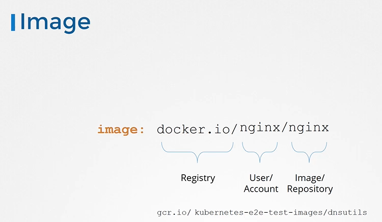

# Image Security

> 💡In this article, we explore best practices for securing container images throughout the deployment process, image naming conventions, securing image repositories, and configuring your pods to pull images from trusted sources.

## Understanding Container Image Naming

Let’s start by examining a simple pod definition file that deploys an Nginx container:

```yaml theme={null}
apiVersion: v1
kind: Pod
metadata:
  name: nginx-pod
spec:
  containers:
    - name: nginx
      image: nginx
```

Notice the image name "nginx". This follows Docker’s image naming convention. When a repository name is provided without a user or account, Docker defaults to the "library" account. "library" is the name of the default account where dockers official images are stored and these images are maintained by a dedicated team that follows industry best practices.. In this example, "nginx" is interpreted as "library/nginx".

If you create your own account and build custom images, you should update the image name accordingly. For instance:

```yaml theme={null}
image: your-account/nginx
```

By default, Docker pulls images from Docker Hub (with the DNS name docker.io) if no other registry is specified. The registry is a centralized storage where images are pushed during creation or updates, and subsequently pulled during deployment.

## Private Registry Usage

For projects that require enhanced security and privacy, you might opt for private registries. Many popular cloud service providers—such as AWS, Azure, and GCP—offer private registries built into their platforms. Alternatively, tools like [Google Container Registry](https://cloud.google.com/container-registry) (gcr.io) are frequently used for Kubernetes-related images and testing purposes.

When referencing an image from a private registry, the full image path should be specified. For example:

```yaml theme={null}
image: docker.io/library/nginx
```



### Authentication for Private Registries

Accessing private repositories requires prior authentication. Start by logging into your private registry using the Docker CLI:

```bash theme={null}
docker login private-registry.io
```

After you provide your credentials, you should see a confirmation similar to this:

```plaintext theme={null}
Login with your Docker ID to push and pull images from Docker Hub. If you don't have a Docker ID, head over to https://hub.docker.com to create one.
Username: registry-user
Password:
WARNING! Your password will be stored unencrypted in /home/vagrant/.docker/config.json.
Login Succeeded
```

## Configuring Kubernetes Pods for Private Registries

To pull an image from a private registry within a pod, specify the full image path in your pod definition. For example:

```yaml theme={null}
apiVersion: v1
kind: Pod
metadata:
  name: nginx-pod
spec:
  containers:
    - name: nginx
      image: private-registry.io/apps/internal-app
```

Images are pulled and run by the Docker runtime on the worker nodes. Docker runtime must be provided with the appropriate credentials. This is achieved by creating a Kubernetes secret of type Docker registry. Execute the following command to create the secret:

```bash theme={null}
kubectl create secret docker-registry regcred \
  --docker-server=private-registry.io \
  --docker-username=registry-user \
  --docker-password=registry-password \
  --docker-email=registry-user@org.com
```

> 💡 Docker Registry is a built in secret type that was built for storing Docker credentials.

Once the secret is created, reference it in your pod specification using the `imagePullSecrets` section:

```yaml theme={null}
apiVersion: v1
kind: Pod
metadata:
  name: nginx-pod
spec:
  containers:
    - name: nginx
      image: private-registry.io/apps/internal-app
  imagePullSecrets:
    - name: regcred
```

> 💡 When the pod is created, the Kubelet on the worker node will use the credentials stored in the secret to authenticate and pull the image from your private registry.

## Summary

We have covered key aspects of container image security by demonstrating:

- The importance of proper image naming conventions.
- How to designate public and private repositories.
- Steps for authenticating with private registries.
- Configuring Kubernetes pods with image pull secrets.

By following these practices, you ensure that your applications are deployed using secure and trusted container images.

---

# Practical Examples Image Security

## Choosing the Right Secret Type for a Docker Registry

Kubernetes supports three types of secrets: Docker registry, generic, and TLS. For our use case, as we need to authenticate with a Docker registry, we will be using the Docker registry secret.

Below is the help output for the secret creation command:

```bash theme={null}
root@controlplane:/# kubectl create secret
Create a secret using specified subcommand.

Available Commands:
  docker-registry   Create a secret for use with a Docker registry
  generic           Create a secret from a local file, directory or literal value
  tls               Create a TLS secret

Usage:
  kubectl create secret [flags] [options]

Use "kubectl <command> --help" for more information about a given command.
Use "kubectl options" for a list of global command-line options (applies to all commands).
root@controlplane:/#
```

## Checking the Current Deployment

We begin by examining our cluster’s web application deployment. Running the following command shows that the deployment named `web` is running two replicas with the `nginx:alpine` image:

```bash theme={null}
root@controlplane:/# kubectl get deploy
NAME   READY   UP-TO-DATE   AVAILABLE   AGE
web    2/2     2            2           48s
```

Since our goal is to pull the image from an internal private registry, we need to update the deployment to use an image hosted at `myprivateregistry.com:5000` instead of the default Docker Hub image.

## Inspecting the Deployment Configuration

To understand the current state of the deployment, inspect its detailed configuration with:

```bash theme={null}
root@controlplane:/# k describe deploy web
Name:                   web
Namespace:              default
CreationTimestamp:      Mon, 18 Apr 2022 01:22:13 +0000
Labels:                 app=web
Annotations:            deployment.kubernetes.io/revision: 1
Selector:               app=web
Replicas:               2 desired | 2 updated | 2 total | 2 available | 0 unavailable
StrategyType:          RollingUpdate
MinReadySeconds:       0
RollingUpdateStrategy: 25% max unavailable, 25% max surge
Pod Template:
  Labels:  app=web
  Containers:
   nginx:
    Image:         nginx:alpine
    Port:          <none>
    Host Port:     <none>
    Environment:   <none>
    Mounts:        <none>
  Volumes:        <none>
Conditions:
  Type           Status  Reason
  Available      True    MinimumReplicasAvailable
  Progressing    True    NewReplicaSetAvailable
OldReplicaSets:  <none>
NewReplicaSet:   web-bd975bd87 (2/2 replicas created)
Events:
  Type    Reason                  Age   From                     Message
  ----    ------                  ----  ----                     -------
  Normal  ScalingReplicaSet       47s   deployment-controller    Scaled up replica set web-bd975bd87 to 2
root@controlplane:/#
```

## Updating the Deployment to Use a Private Registry Image

Edit the deployment configuration to specify the new image and prepare to add the required image pull secret. Below is an excerpt of the updated configuration (parts that remain unchanged have been omitted for brevity):

```yaml theme={null}
annotations:
  deployment.kubernetes.io/revision: "1"
creationTimestamp: "2022-04-18T01:22:13Z"
generation: 1
labels:
  app: web
name: web
namespace: default
spec:
  replicas: 2
  selector:
    matchLabels:
      app: web
  strategy:
    rollingUpdate:
      maxSurge: 25%
      maxUnavailable: 25%
    type: RollingUpdate
  template:
    metadata:
      labels:
        app: web
    spec:
      containers:
        - name: nginx
          image: nginx:alpine
          imagePullPolicy: IfNotPresent
          resources: {}
          terminationMessagePath: /dev/termination-log
      restartPolicy: Always
      dnsPolicy: ClusterFirst
      schedulerName: default-scheduler
```

After saving the updated deployment, verify that the new image name is set. As part of the rolling update process, a new replica set is created:

```bash theme={null}
root@controlplane:/# k describe deploy web
Name:               web
Namespace:          default
Labels:             app=web
Annotations:        deployment.kubernetes.io/revision: 2
Selector:           app: web
Replicas:           2 desired | 1 updated | 3 total | 2 available | 1 unavailable
StrategyType:       RollingUpdate
MinReadySeconds:    0
RollingUpdateStrategy: 25% max unavailable, 25% max surge
Pod Template:
  Labels:           app: web
  Containers:
   nginx:
    Image:        myprivateregistry.com:5000/nginx:alpine
    Port:         <none>
    Host Port:    <none>
    Environment:   <none>
    Mounts:       <none>
  Volumes:        <none>
Conditions:
  Type           Status  Reason
  Available      True    MinimumReplicasAvailable
  Progressing    True    ReplicaSetUpdated
OldReplicaSets:  web-bd975bd87 (2/2 replicas created)
NewReplicaSet:   web-85fcf65896 (1/1 replicas created)
Events:
  Type    Reason             Age   From                           Message
  Normal  ScalingReplicaSet  1065s deployment-controller          Scaled up replica set web-bd975bd87 to 2
  Normal  ScalingReplicaSet  6s    deployment-controller          Scaled up replica set web-85fcf65896 to 1
```

## Troubleshooting: ImagePullBackOff Error

When checking the pods, you may notice that while the old pods remain active, the new pod reports an ImagePullBackOff error:

```bash theme={null}
root@controlplane:/# k get pods
NAME                          READY   STATUS              RESTARTS   AGE
web-85fcf65896-rbsmq         0/1     ImagePullBackOff    0          20s
web-bd975bd87-jjbnx          1/1     Running             0          2m
web-bd975bd87-mf9vg          1/1     Running             0          2m
root@controlplane:/#
```

Inspect the pod details to reveal an error message indicating an authentication failure when pulling the image:

```text theme={null}
State:                Waiting
Reason:               ErrImagePull
...
Warning Failed:       Failed to pull image "myprivateregistry.com:5000/nginx:alpine": rpc error: code = Unknown desc = Error response from daemon: Get http://myprivateregistry.com:5000/v2/: net/http: HTTP/1.1 transport connection broken: malformed HTTP response “\x15\x03\x01”
```

> 💡 The error indicates that the credentials for accessing your private registry are missing. Without valid credentials, Kubernetes will not be able to pull the image.

## Creating the Docker Registry Secret

To resolve this issue, create a secret containing the necessary credentials. Replace the placeholders with your actual registry information:

```bash theme={null}
kubectl create secret docker-registry my-secret --docker-server=DOCKER_REGISTRY_SERVER --docker-username=DOCKER_USER --docker-password=DOCKER_PASSWORD --docker-email=DOCKER_EMAIL
```

For example, to create the secret for our private registry, run:

```bash theme={null}
kubectl create secret docker-registry private-reg-cred --docker-server=myprivateregistry.com --docker-username=dock_user --docker-password=dock_password --docker-email=dock_user@myprivateregistry.com
```

## Updating the Pod Template for Image Pull Secrets

After successfully creating the secret, update the deployment’s pod template to include the image pull secret. According to the [Kubernetes Documentation](https://kubernetes.io/docs/concepts/containers/images/), add the following block under the pod specification:

```yaml theme={null}
imagePullSecrets:
  - name: private-reg-cred
```

Below is a complete example of a pod configuration that pulls an image from a private registry:

```yaml theme={null}
apiVersion: v1
kind: Pod
metadata:
  name: private-reg
spec:
  containers:
    - name: private-reg-container
      image: <your-private-image>
  imagePullSecrets:
    - name: regcred
```

Edit the deployment with the following command to include the image pull secret:

```bash theme={null}
k edit deploy web
```

After saving your changes, Kubernetes will update the deployment by terminating old pods and creating new ones that use the private registry image along with the correct authentication.

## Final Verification

Ensure that all pods are updated and running with the new image and the secret is applied correctly. Use the following command to verify:

```bash theme={null}
root@controlplane:/# kubectl get pods
```

Once you confirm that all pods have successfully pulled the image and are running, the lab is complete. Enjoy the enhanced security and efficiency of your Kubernetes deployments!

> 💡 For more information on securing Kubernetes deployments and managing Docker registry secrets, refer to the [Kubernetes Documentation](https://kubernetes.io/docs/concepts/containers/images/).
