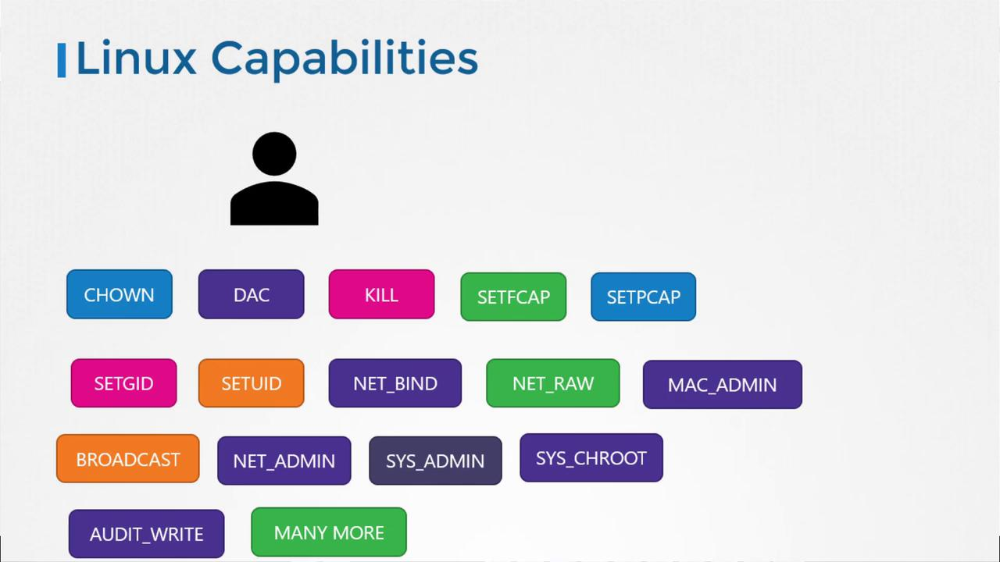

# Pre requisite Security in Docker

> 💡 This article reviews essential Docker security concepts, including process isolation, user context, and privilege management.
> we explore key Docker security concepts that form the basis for understanding security contexts in Kubernetes.

## Overview of Docker Process Isolation

Imagine a host machine running Docker with multiple processes such as OS services, the Docker daemon, and an SSH server. When you launch an Ubuntu container that executes a sleep command for one hour, you run:

```bash theme={null}
docker run ubuntu sleep 3600
```

**Shared Kernel Architecture:** Containers are not completely isolated like virtual machines; they share the same kernel as the host system.

**Linux Namespaces:** They achieve isolation through Linux namespaces. In Linux, the host has a namespace and the containers have their own namespace.Each container gets its own isolated namespace, so checking processes within the container might show the sleep process with a PID of 1. However, on the host, the process appears with a different PID.

**Visibility Constraints:** A container can only see processes within its own namespace. To the container, its primary process is viewed as Process ID 1 (PID 1).

**Host Perspective:** The host system can see all processes running within child namespaces. These appear as standard processes on the host but are assigned different PIDs than those seen inside the container. This mapping allows the host to manage container processes as native system tasks while maintaining isolation for the container.

For example, running:

```bash theme={null}
ps aux
```

might yield:

```bash theme={null}
USER       PID %CPU %MEM    VSZ   RSS TTY      STAT START   TIME COMMAND
root         1  0.0  0.0   4528   828 ?        Ss   03:06   0:00 sleep 3600
```

Here, even though the sleep process is isolated within the container, it is visible on the host but with a different PID.

A more detailed host process listing could look like:

```bash theme={null}
ps aux
USER       PID %CPU %MEM    VSZ   RSS TTY      STAT START   TIME COMMAND
project   3720  0.1  0.1  95500  4916 ?        R     06:06   0:00 sshd: project@pts/0
project   3725  0.0  0.1  95196  4132 ?        S     06:06   0:00 sshd: project@notty
project   3727  0.2  0.1  21352  5340 pts/0    Ss    06:06   0:00 -bash
root      3802  0.0  0.0  8924  3616 ?        Sl    06:06   0:00 docker-containerd-shim --namespace m
root      3816  1.0  0.0  4528  828 ?        Ss    06:06   0:00 sleep 3600
```

> 💡 The difference in PID values between the container and the host is due to the isolation provided by Linux namespaces.

## User Context and Privilege Management

> User identity is a critical component of container security, governing what a process can execute within its isolated environment.

By default, Docker runs container processes as the root user. If a process is checked both inside the container and on the host, it will report as being executed by the root user unless otherwise configured. For example:

```bash theme={null}
ps aux
USER       PID %CPU %MEM    VSZ   RSS TTY      STAT START   TIME COMMAND
root          1  0.0  0.0   4528   828 ?        Ss    03:06   0:00 sleep 3600
```

If you prefer a non-root execution within a container, specify a user ID using the --user flag. To run as user ID 1000, execute:

```bash theme={null}
docker run --user=1000 ubuntu sleep 3600
```

After running this command, checking the process list on the host will show the container process running as user 1000:

```bash theme={null}
ps aux
USER       PID %CPU %MEM    VSZ   RSS TTY      STAT START   TIME COMMAND
1000          1  0.0  0.0  4528   828 ?        Ss    03:06   0:00 sleep 3600
```

Alternatively, you can set a default non-root user within your Docker image. For instance, create a Dockerfile for a custom Ubuntu image:

```dockerfile theme={null}
FROM ubuntu
USER 1000
```

Build and run your custom image:

```bash theme={null}
docker build -t my-ubuntu-image .
docker run my-ubuntu-image sleep 3600
```

Verifying the process confirms that it runs under user 1000:

```bash theme={null}
ps aux
USER         PID %CPU %MEM     VSZ   RSS TTY      STAT START   TIME COMMAND
1000          1  0.0  0.0   4528    828 ?        Ss   03:06   0:00 sleep 3600
```

> 💡 Defining the default user in the Dockerfile removes the need to specify the user each time the container runs.

## Docker Root User and Linux Capabilities

A common question concerns whether the root user inside a container has the same privileges as the host's root user.

**Restricting Privileges** : By default, Docker restricts the capabilities available to a container.This prevents a containerized process from performing operations that could disrupt the host or other containers (e.g., rebooting the host).

On a standard Linux system, the root user can modify file permissions, control network ports, manage processes, reboot the system, and perform various critical tasks. In contrast, Docker limits these actions within containers. This means that a container's root user cannot, for example, reboot the host or impact other containers.

The diagram below illustrates some of the key Linux capabilities (like CHOWN, KILL, and NET_ADMIN) available to a process:



**Manual Overrides**

Administrators can modify the default security profile using specific flags at runtime:

Docker provides runtime flags to customize these capabilities. You can add a capability with the --cap-add option:

```bash theme={null}
docker run --cap-add MAC_ADMIN ubuntu
```

To remove specific capabilities, use --cap-drop. If you need to run a container with full privileges, the --privileged flag is available, though it should be used with caution.

> 💡 Avoid using the --privileged flag in production environments unless absolutely necessary, as it elevates container privileges significantly.

| **Option**     | **Function**                                                                                      |
| -------------- | ------------------------------------------------------------------------------------------------- |
| `--cap-add`    | Grants additional Linux capabilities to the container.                                            |
| `--cap-drop`   | Removes specific capabilities that are normally granted by default.                               |
| `--privileged` | Runs the container with all host privileges enabled, effectively bypassing standard restrictions. |

## Conclusion

This article reviewed essential Docker security concepts, including:

- Process isolation using Linux namespaces
- User context and privilege management
- Limiting root user actions through Linux capabilities

These principles are crucial for understanding similar security mechanisms in Kubernetes. For further reading, explore [Kubernetes Basics](https://kubernetes.io/docs/concepts/overview/what-is-kubernetes/).
