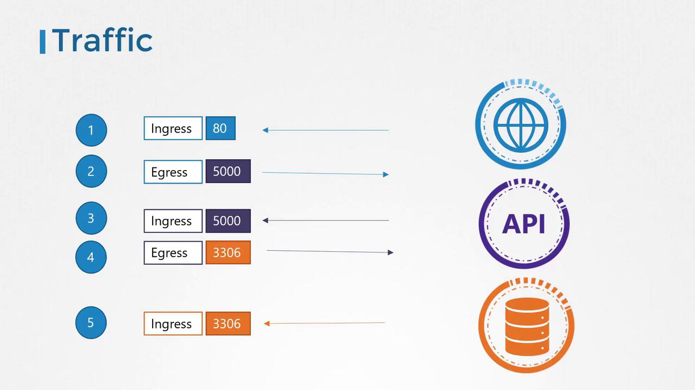
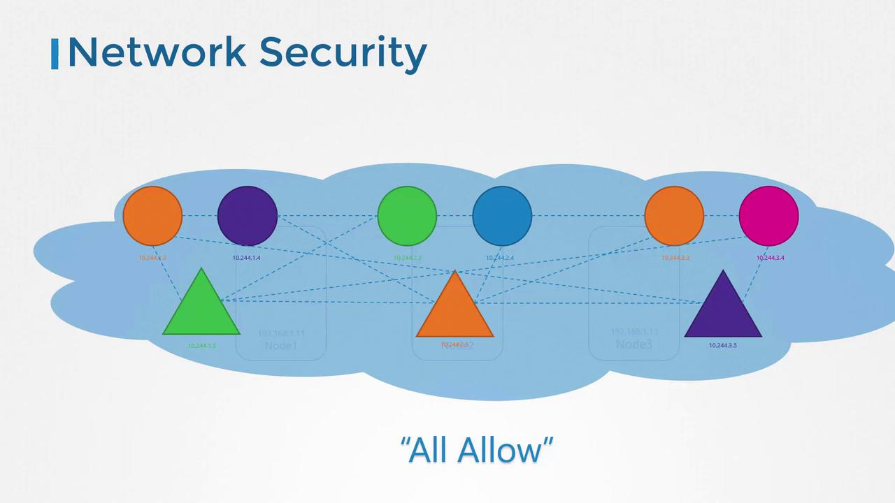
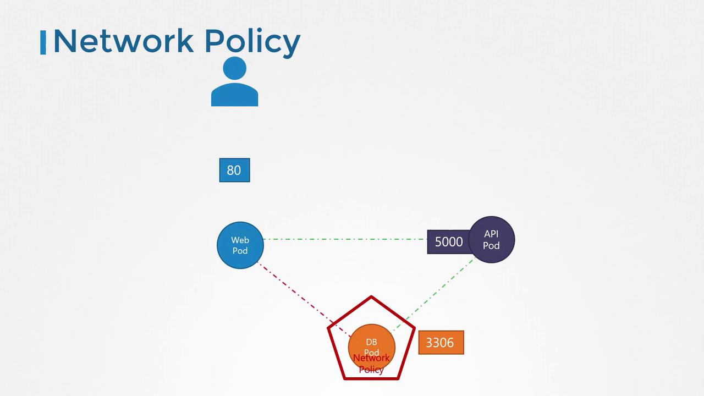
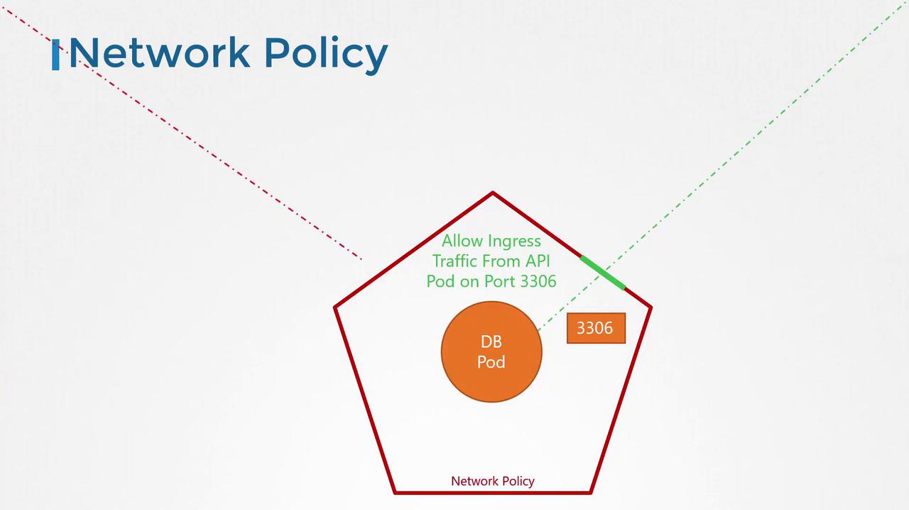

# Network Policies

## Traffic Flow Example

Consider a simple application configuration consisting of a web server, an API server, and a database server. The traffic flow is as follows:

1. A user sends a request to the web server on port 80.
2. The web server forwards this request to the API server on port 5000.
3. The API server retrieves data from the database server on port 3306, then sends the response back to the user.

There are two main types of network traffic involved:

- **Ingress traffic:** Incoming traffic. For example, user requests arriving at the web server on port 80.
- **Egress traffic:** Outgoing traffic. For example, requests sent from the web server to the API server.

In our diagrams, a solid arrow indicates the direction of the originating traffic (either ingress or egress), while a dotted arrow represents the response flow, which is typically not controlled by network policies.

For clarity:

- The **API server** receives ingress traffic from the web server (port 5000) and sends out egress traffic to the database server (port 3306).
- The **database server** receives ingress traffic on port 3306 from the API server.

To support this traffic flow, the following rules must be established:

- An ingress rule for the web server to allow HTTP traffic on port 80.
- An egress rule for the web server to permit traffic to port 5000 on the API server.
- An ingress rule for the API server to accept traffic on port 5000.
- An egress rule for the API server to allow traffic to port 3306 on the database server.
- An ingress rule for the database server to allow traffic on port 3306.



## Network Security in Kubernetes

In a Kubernetes cluster, nodes host pods and services, each assigned a unique IP address. A crucial capability of Kubernetes is that pods can communicate with one another without extra configuration—such as setting up custom routes. Typically, all pods reside in a virtual private network (VPN) that spans the entire cluster, allowing them to interact using pod IPs, pod names, or configured services.

By default, Kubernetes employs an "all-allow" rule permitting any pod to communicate with every other pod or service within the cluster.



Now, consider the earlier scenario with three pods: one for the front-end web server, one for the API server, and one for the database server. Services facilitate communication between these pods and external users, while the default configuration allows free communication across the cluster.

### Restricting Communication with Network Policies

> 💡 Kubernetes NetworkPolicy, which acts as a virtual firewall for your pods. By default, pods in Kubernetes are "non-isolated" and accept traffic from anywhere. Once you apply this policy, the targeted pods become isolated, only allowing the specific traffic you've defined.

If your security requirements dictate that the front-end web server should not communicate directly with the database server, you can enforce this by implementing a network policy. For example, you might create a policy that only permits the API server to interact with the database server.

A network policy in Kubernetes is defined as an object, which you attach to one or more pods using labels and selectors. In this scenario, the policy would only allow ingress traffic from the API pod on port 3306 while blocking all other sources from accessing the database pod.



### Implementing a Network Policy

To apply a network policy, you assign labels to pods and define matching selectors in the network policy object. For example, consider this snippet used to select the database pod:

```yaml theme={null}
podSelector:
  matchLabels:
    role: db
```

This configuration ensures the network policy only applies to pods labeled with `role: db`. Next, you define policy rules to allow only ingress traffic from the API pod on port 3306.


Below is the complete network policy configuration:

```yaml theme={null}
apiVersion: networking.k8s.io/v1
kind: NetworkPolicy
metadata:
  name: db-policy
spec:
  podSelector:
    matchLabels:
      role: db
  policyTypes:
    - Ingress
  ingress:
    - from:
        - podSelector:
            matchLabels:
              name: api-pod
      ports:
        - protocol: TCP
          port: 3306
```

> In this configuration:
>
> - The `podSelector` targets the database pod through its label.
> - The `policyTypes` field specifies that only ingress traffic is affected.
> - The ingress rule allows traffic specifically from pods with the label `name: api-pod` on TCP port 3306.

Keep in mind that isolation only applies to the traffic explicitly defined under `policyTypes`. Unspecified traffic is automatically allowed by default.

## Enabling Network Policies in Kubernetes

To enforce the network policy, execute the following command:

```bash theme={null}
kubectl create -f db-policy.yaml
```

> 💡 Network policies are enforced by the cluster's networking solution. While solutions like Kube-router, Calico, Romana, and Weave Net support network policies, Flannel does not enforce them. Creating policies with Flannel will not produce an error, but they won’t be applied. Always consult your network solution’s documentation to verify its support for network policies.

## Conclusion

This article provided an overview of network policies by demonstrating a basic application setup and illustrating how to restrict pod communication within a Kubernetes cluster.

## Additional Resources

- [Kubernetes Documentation](https://kubernetes.io/docs/)
- [Kubernetes Basics](https://kubernetes.io/docs/concepts/overview/what-is-kubernetes/)
- [Docker Hub](https://hub.docker.com/)
- [Terraform Registry](https://registry.terraform.io/)
