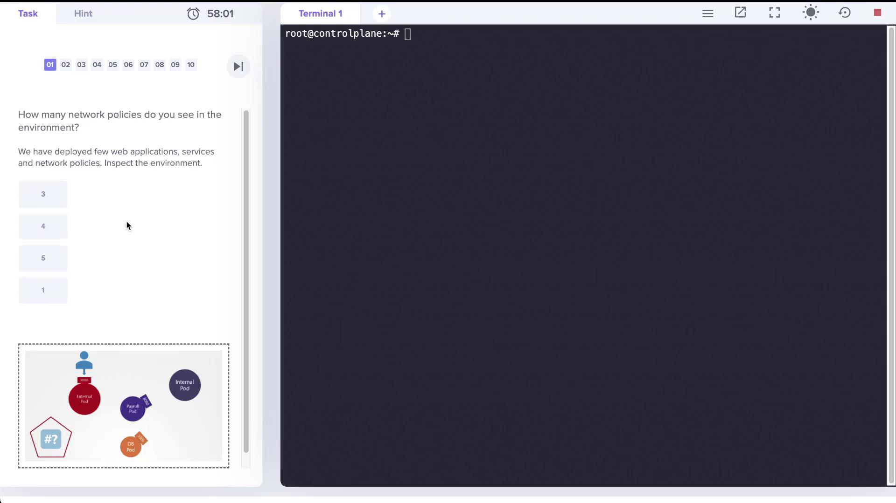
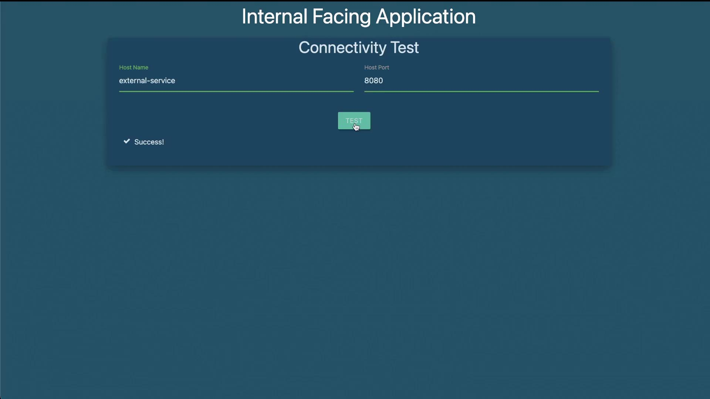

# Demo Network Policies

> We explored Scenarios that involves inspecting deployed web applications, services, and network policies to understand how traffic is controlled within the environment.



The exercise begins with the question: “How many network policies do you see in the environment?” In our setup, several web applications and services have been deployed, and a specific network policy is defined to control traffic to one of the pods. Let's walk through the environment.

## Inspecting the Pods and Services

Start by checking the list of running pods with:

```bash theme={null}
root@controlplane:~# k get pods
NAME       READY   STATUS    RESTARTS   AGE
external   1/1     Running   0          2m20s
internal   1/1     Running   0          2m19s
mysql      1/1     Running   0          2m19s
payroll    1/1     Running   0          2m19s
```

Next, view the services available in the cluster:

```bash theme={null}
root@controlplane:~# k get service
NAME                TYPE        CLUSTER-IP      EXTERNAL-IP   PORT(S)          AGE
db-service          ClusterIP   10.109.89.42    <none>        3306/TCP         2m42s
external-service    NodePort    10.108.170.44   <none>        8080:30080/TCP   2m42s
internal-service    NodePort    10.98.11.243    <none>        8080:30082/TCP   2m42s
kubernetes          ClusterIP   10.96.0.1       <none>        443/TCP          39m
payroll-service     NodePort    10.110.165.31   <none>        8080:30083/TCP   2m42s
```

> Here, notice that the payroll service is exposed on port 8080, the database service on port 3306, and both the external and internal services are available on port 8080.

## Checking the Network Policies

When you list network policies using the following command:

```bash theme={null}
root@controlplane:~# k get networkpolicies
error: the server doesn't have a resource type "networkpolicies"
```

You see an error because the short alias is not recognized. Using the short form, however, produces the expected result:

```bash theme={null}
root@controlplane:~# k get netpol
NAME            POD-SELECTOR   AGE
payroll-policy  name=payroll   3m31s
```

This output confirms that there is one network policy named _payroll-policy_, which applies to pods with the label `name=payroll`.

### Reviewing the Network Policy Details

Examine the details of the network policy with:

```bash theme={null}
root@controlplane:~# k describe netpol payroll-policy
Name:         payroll-policy
Namespace:    default
Created on:   2022-04-18 20:35:54 +0000 UTC
Labels:       <none>
Annotations:  <none>
Spec:
  PodSelector:     name=payroll
  Allowing ingress traffic:
    To Port: 8080/TCP
    From:
      PodSelector: name=internal
  Not affecting egress traffic
  Policy Types: Ingress
```

> 💡 This policy allows ingress traffic on TCP port 8080 to the payroll pod only if the traffic originates from pods with the label `name=internal`. Since no egress rules are defined, the payroll pod continues to allow all outgoing traffic.

## Understanding the Impact of the Network Policy

By default, all pods allow both ingress and egress traffic. Once a network policy is applied, only the traffic permitted by the policy is allowed. In this scenario:

- Only ingress traffic from the internal pod on TCP port 8080 is allowed to reach the payroll pod.
- All egress traffic from the payroll pod remains unrestricted.
- Pods or sources without the label `name=internal` cannot access the payroll pod on port 8080.

Connectivity tests revealed that:

- The internal-facing application successfully connected to the payroll service on port 8080.
- The external-facing application timed out when attempting to access the payroll service, confirming that the policy is working as intended.



## Creating a Custom Network Policy

The lab exercise also requires creating a new network policy to allow traffic exclusively from the internal application to both the payroll and database (MySQL) services. This policy will restrict egress traffic from the internal pod so that it only communicates with the payroll pod on TCP port 8080 and the MySQL pod on TCP port 3306.

Below is a sample YAML specification for this custom network policy. Save it as `internal-policy.yaml`:

```yaml theme={null}
apiVersion: networking.k8s.io/v1
kind: NetworkPolicy
metadata:
  name: internal-policy
  namespace: default
spec:
  podSelector:
    matchLabels:
      name: internal
  policyTypes:
    - Egress
  egress:
    - to:
        podSelector:
          matchLabels:
            name: payroll
      ports:
        - protocol: TCP
          port: 8080
    - to:
        podSelector:
          matchLabels:
            name: mysql
      ports:
        - protocol: TCP
          port: 3306
```

> This policy selects the internal pod (using the label `name: internal`) and applies an egress rule that allows traffic:
>
> - To the payroll pod on TCP port 8080.
> - To the MySQL pod on TCP port 3306.

To create the policy, run:

```bash theme={null}
root@controlplane:~# k create -f internal-policy.yaml
networkpolicy.networking.k8s.io/internal-policy created
```

Verify the new policy details with:

```bash theme={null}
root@controlplane:~# k describe netpol internal-policy
Name:          internal-policy
Namespace:     default
Created on:    2022-04-18 20:53:13 +0000 UTC
Labels:        <none>
Annotations:   <none>
Spec:
  PodSelector:     name=internal
  Not affecting ingress traffic
  Allowing egress traffic:
    To:
      PodSelector: name=payroll
      Ports: 8080/TCP
    To:
      PodSelector: name=mysql
      Ports: 3306/TCP
  Policy Types: Egress
```

This confirms that the internal pod is now restricted to sending traffic only to the payroll service on port 8080 and the MySQL service on port 3306.

## Final Connectivity Testing

After applying these policies:

- The internal-facing application should be able to access both the payroll and database services.
- The external-facing application or any other source will be unable to access the payroll pod on port 8080.
