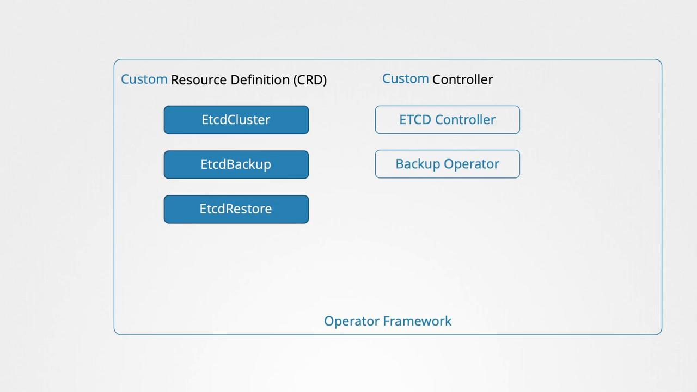

# Operator Framework

Think of a **Kubernetes Operator** as an automated, digital Site Reliability Engineer (SRE) packed inside your cluster.

- Out of the box, Kubernetes is fantastic at managing _stateless_ applications (like web servers or APIs) because if one crashes, Kubernetes just kills it and spins up a fresh replacement. But for _stateful_ applications—like databases (PostgreSQL, MongoDB) or messaging queues (RabbitMQ)—things are much more complicated. You can't just reboot a database node without worrying about data replication, master/slave elections, clustering, or schema upgrades.

- An Operator encodes human, domain-specific operational knowledge into software code so that Kubernetes can manage complex, stateful applications automatically.

- Previously, we discussed creating a Custom Resource Definition (CRD) and a custom controller to handle resource-specific logic. Traditionally, these components are deployed separately: you first create the CRD and its related resources, and then deploy the controller as a pod or as part of a deployment. With the operator framework, you can package both components into a single deployable entity.

- For instance, When you deploy the flight operator, it automatically creates the Custom Resource Definition, provisions the required resources, and deploys the custom controller as a Deployment.

---

## How an Operator Works: The Anatomy

An Operator functions by combining two fundamental Kubernetes building blocks:

### 1\. Custom Resource Definitions (CRDs)

A CRD is essentially an extension of the Kubernetes API. It allows you to define your own custom objects using YAML, just like you would define a built-in Pod or Deployment.

- For example, instead of manually setting up 5 Pods, 3 Services, and 2 Persistent Volumes for a database, a CRD lets you define a brand new resource called MyDatabase.

### 2\. The Custom Controller (The Control Loop)

The controller is the active software component running inside the cluster. It continuously executes what is known as a **Reconciliation Loop**. This loop follows three straightforward steps over and over again:

```plaintext
  +---------> [ 1. OBSERVE ] ---------+
  |           Watches the cluster     |
  |           for changes/events.     |
  |                                   |
[ 3. ACT ]                         [ 2. ANALYZE ]
Executes the code needed           Compares Actual State
to fix the drift.                  with Desired State.
  ^                                   |
  +-----------------------------------+

```

If you modify your MyDatabase YAML manifest to change the version from v14 to v15, the Controller notices this drift, plans the database migration strategy safely without data loss, and executes the upgrade automatically.

---

## What Can an Operator Automate?

Because Operators use custom code (often written in Go or Python), they can automate almost any runbook task a human engineer would typically perform:

- **Managed Upgrades:** Upgrading application versions while handling schema migrations and keeping data intact.
- **Failure Recovery:** If a primary database node dies, the operator can elect a new master, reconfigure the replicas, and restore data continuity.
- **Backup and Restore:** Taking scheduled snapshots of application states and storing them securely off-site.
- **Auto-Scaling:** Monitoring application-specific metrics (like queue length instead of just basic CPU usage) to scale up or down.

---

## Real-World Examples

You rarely have to write an operator from scratch. The cloud-native ecosystem relies heavily on pre-built operators available on platforms like **OperatorHub.io**:

- **Prometheus Operator:** Simplifies monitoring setup, dynamically scraping logs and configuring alert systems as new apps deploy.
- **Strimzi Operator:** Automates deploying, running, and managing Apache Kafka clusters on Kubernetes.
- **Cert-Manager:** Acts as an operator to provision and renew SSL certificates automatically from Let's Encrypt.

---

> 💡 The operator framework not only streamlines resource deployment but also simplifies ongoing management tasks such as application updates, backups, and recovery.

## Examples:

One of the most popular examples is the etcd operator. It deploys and manages an etcd cluster within Kubernetes using a dedicated CRD and a custom controller that observes changes in the etcd cluster resource. Additionally, it supports extended functionalities such as taking backups and executing restores, simply by creating supplementary CRDs. Backup and Restore operators enhance these capabilities further.



> 💡 Kubernetes operators handle tasks that would typically require manual intervention by system administrators. These tasks include application installation, routine maintenance, backup operations, disaster recovery through data restoration, and troubleshooting.

For a comprehensive list of available operators, visit the [Operator Hub](https://operatorhub.io/). Many popular applications—such as etcd, MySQL, Prometheus, Grafana, Argo CD, and Istio—have dedicated operators with detailed installation instructions accessible via an install button.

## How to Deploy an Application Using an Operator

Deploying an application with an operator is an easy process that typically involves:

1. Installing the Operator Lifecycle Manager.
2. Deploying the operator.
3. Enjoying streamlined application management.

The following commands show you how to install the Operator Lifecycle Manager and deploy the etcd operator for hands-on practice:

```bash theme={null}
# Install the Operator Lifecycle Manager
curl -sL https://github.com/operator-framework/operator-lifecycle-manager/releases/download/v0.19.1/install.sh | bash -s v0.19.1

# Deploy the etcd operator
kubectl create -f https://operatorhub.io/install/etcd.yaml

# Retrieve the installed Cluster Service Version in the "my-etcd" namespace
kubectl get csv -n my-etcd
```

> 💡 This overview provides a high-level understanding of how operators simplify application management. A deep dive into operators will be explored in a dedicated future lesson. For exam preparation, note that most content primarily focuses on CRDs, making this article a valuable supplemental resource.
