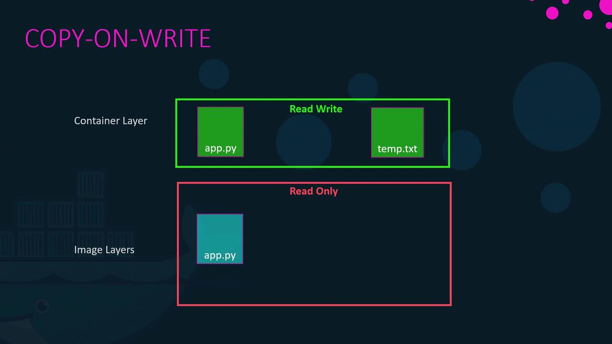
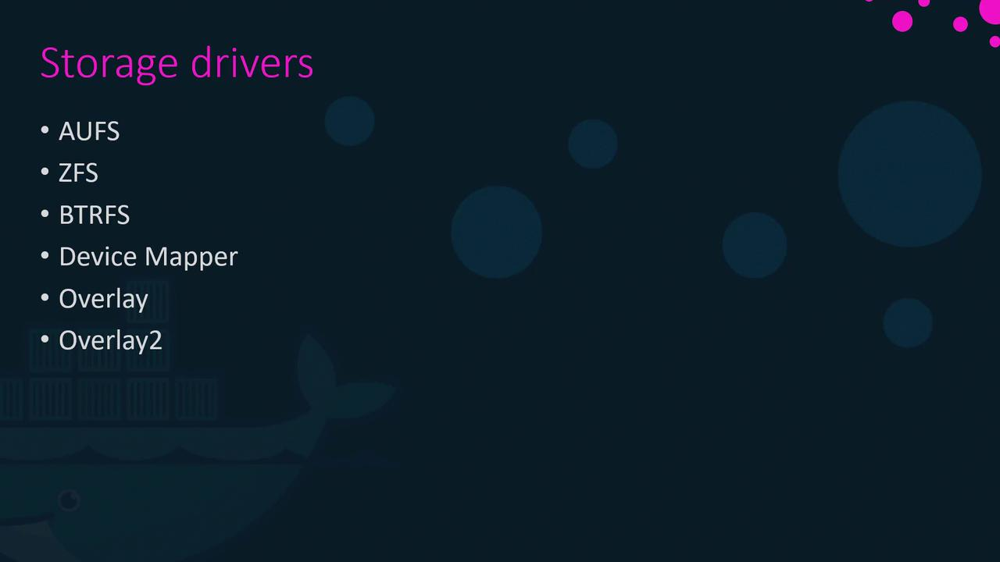

# Storage in Docker

> 💡 In this article, we explore advanced Docker storage concepts, how Docker handles storage drivers, manages data on the host file system, and implements a layered architecture to build images and run containers efficiently.

When Docker is installed, it creates a folder structure at `/var/lib/docker` containing subdirectories such as `overlay2`, `containers`, `images`, and `volumes`. These directories store Docker images, container runtime data, and volumes. For instance, files associated with running containers reside in the `containers` folder, image files are stored under `images`, and any created volumes are kept in the `volumes` folder.

## Docker Image Layers

Docker images are built using a layered architecture. Each instruction in a Dockerfile generates a new layer, containing only the modifications from the previous layer. Consider this Dockerfile for our first application:

```dockerfile theme={null}
# Dockerfile for Application 1
FROM ubuntu

RUN apt-get update && apt-get -y install python
RUN pip install flask flask-mysql

COPY . /opt/source-code

ENTRYPOINT FLASK_APP=/opt/source-code/app.py flask run
```

You can build the image using:

```bash theme={null}
docker build Dockerfile -t mmumshad/my-custom-app
```

The layers are created in the following order:

1. The base Ubuntu image (approximately 120 MB).
2. A layer installing APT packages (around 300 MB).
3. A layer for Python package dependencies.
4. A layer adding the application source code.
5. A layer that sets the entry point.

Because each layer stores only the changes made in the previous one, Docker caches them for reuse in similar images. For example, a second application with a slight modification might use the following Dockerfile:

```dockerfile theme={null}
# Dockerfile2 for Application 2
FROM ubuntu
RUN apt-get update && apt-get -y install python
RUN pip install flask flask-mysql
COPY app2.py /opt/source-code
ENTRYPOINT FLASK_APP=/opt/source-code/app2.py flask run
```

Build the second image with:

```bash theme={null}
docker build Dockerfile2 -t mmumshad/my-custom-app-2
```

Since the first three layers (base image, APT packages, and Python dependencies) are identical, Docker reuses these cached layers and builds only the layers related to the new source code and entry point. This efficient reuse reduces build times and conserves disk space.

> 💡 When application code changes (for example, modifying `app.py`), Docker leverages the cache for all unchanged layers and rebuilds only the layer with the new code.

## Container Writable Layer and Copy-On-Write

Once an image is built, its layers remain immutable (read-only). Running a container from that image with the `docker run` command creates an additional writable layer on top. This layer captures any runtime modifications such as log files, temporary files, or changes to the application. For example:

```bash theme={null}
docker run mmumshad/my-custom-app
```

If you log into the container and modify a file (say, creating `temp.txt`), Docker employs a copy-on-write mechanism. Before modifying a file originating from the read-only image layer, Docker first copies it to the writable layer, and subsequent changes are applied to the copied file—leaving the original image intact. When the container is removed, the writable layer and any changes in it are deleted.



## Persistent Data with Volumes and Bind Mounts

The container's writable layer is ephemeral, meaning any data stored there is lost when the container is removed. To retain data—such as for databases—Docker offers both volumes and bind mounts.

### Volume Mounts

Volumes are managed by Docker and stored under `/var/lib/docker/volumes`. Create and mount a volume with the following commands:

```bash theme={null}
docker volume create data_volume
docker run -v data_volume:/var/lib/mysql mysql
```

If you run a container with a volume name that doesn’t exist, Docker will automatically create it:

```bash theme={null}
docker run -v data_volume2:/var/lib/mysql mysql
```

### Bind Mounts

Bind mounts allow you to use a specific directory from the Docker host. For example, to use data from `/data/mysql`, run:

```bash theme={null}
docker run -v /data/mysql:/var/lib/mysql mysql
```

### Using the --mount Option

The `--mount` flag provides a more explicit syntax by requiring all parameters to be specified. The following command is equivalent to the bind mount example above:

```bash theme={null}
docker run \
  --mount type=bind,source=/data/mysql,target=/var/lib/mysql \
  mysql
```

## Docker Storage Drivers

Docker’s storage drivers manage everything from maintaining image layers to handling writable container layers with copy-on-write. Common storage drivers include AUFS, ZFS, BTRFS, Device Mapper, Overlay, and Overlay2. The selection of a storage driver depends on the host OS. For example, Ubuntu often uses AUFS by default, while Fedora or CentOS might prefer Device Mapper. Docker automatically selects the most appropriate driver for your system based on performance and stability factors.


For more detailed information on these storage drivers, please refer to the [Docker documentation](https://docs.docker.com/storage/).

## Summary

Docker's innovative approach to managing storage through image layers, copy-on-write, volumes, and storage drivers enables efficient container builds and resource usage. Understanding these concepts not only improves your workflow but also optimizes container performance and data persistence.
