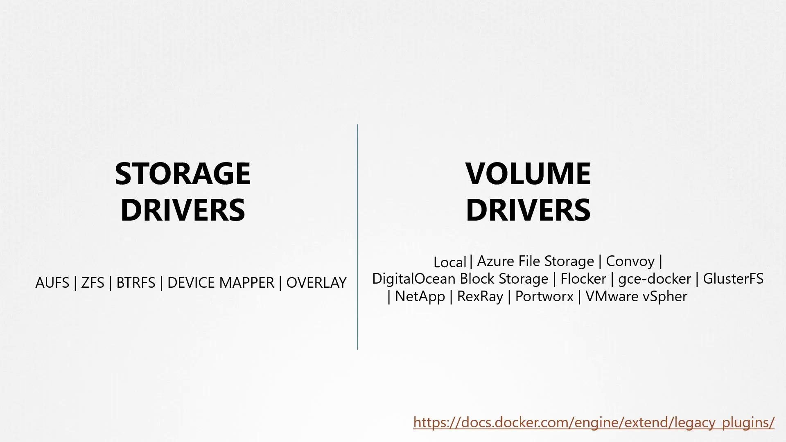

# Volume Driver Plugins in Docker

> 💡 This article discusses volume driver plugins in Docker for managing persistent storage across various third-party storage solutions.

In previous discussions, we explored storage drivers and their role in managing storage for images and containers. We also examined volumes and emphasized that if you need persistent storage, you must create volumes. It is important to note that volumes are not managed by storage drivers; instead, they are handled by volume driver plugins.

By default, Docker uses the local volume driver plugin. This plugin creates a volume on the Docker host and stores its data under the /var/lib/docker/volumes directory. However, many other volume driver plugins are available, enabling you to create volumes on third-party storage solutions such as Azure File Storage, Convoy, DigitalOcean Block Storage, Blocker, Google Compute Persistent Disks, ClusterFS, NetApp, Rex Ray, Portworx, and VMware vSphere Storage.



> 💡 When selecting a volume driver plugin, consider your storage infrastructure requirements. Plugins such as Rex Ray offer flexibility by supporting various storage providers.

For example, some volume drivers support multiple storage providers. The Rex Ray storage driver, for instance, can provision storage on AWS EBS, S3, EMC storage arrays (like Isilon and ScaleIO), Google Persistent Disk, or OpenStack Cinder. When running a Docker container, you can select a specific volume driver such as Rex Ray EBS to provision a volume from Amazon EBS. This approach ensures that your data remains safe in the cloud even if the container exits.

Below is an example of running a Docker container using a specific volume driver plugin:

```bash theme={null}
docker run -it \
  --name mysql \
  --volume-driver rexray/ebs \
  --mount src=ebs-vol,target=/var/lib/mysql \
  mysql
```

Later in the series, we will further explore how volumes are managed within Kubernetes.

For additional details, refer to the [Docker Documentation](https://docs.docker.com/) and learn more about [persistent storage in containers](https://docs.docker.com/storage/volumes/).
