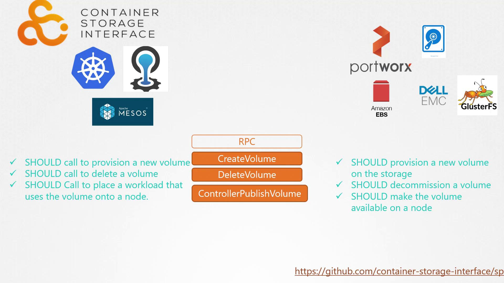

# Container Storage Interface

> 💡 This article explores the Container Storage Interface (CSI) and its role in integrating storage solutions with container orchestration platforms.

## Evolution in Container Orchestration

Historically, Kubernetes relied exclusively on Docker as the container runtime engine. All code for interfacing with Docker resided within the Kubernetes source. However, with the emergence of alternative container runtimes—such as Rocket and CRI-O—it became necessary to support multiple runtimes without altering Kubernetes' core codebase. This challenge led to the development of the Container Runtime Interface (CRI), a standard that enables orchestration tools like Kubernetes to communicate with different container runtimes seamlessly.

In a similar manner, the Container Networking Interface (CNI) was introduced to facilitate the integration of diverse networking solutions. CNI allows networking vendors to build plugins that adhere to standardized specifications, ensuring smooth operation within Kubernetes environments.

> 💡 CSI extends these standardization principles to the storage domain, enabling support for multiple storage systems without modifications to container orchestration platforms.

## The Role of CSI

The Container Storage Interface (CSI) empowers developers to create custom drivers for various storage systems. Popular examples include:

- Portworx
- Amazon EBS
- Azure Disk
- Dell EMC
- Isilon
- PowerMax
- Unity
- Extreme IO
- NetApp
- Nutanix
- HPE
- Hitachi
- Pure Storage

It is important to emphasize that CSI is not exclusive to Kubernetes. In fact, any container orchestration tool that implements the CSI standard can work with virtually any storage vendor supporting a CSI plugin. Currently, leading platforms such as Kubernetes, Cloud Foundry, and Mesos have adopted CSI.

## How CSI Works

When a pod is created that requires persistent storage, the container orchestrator (e.g., Kubernetes) calls the "create volume" Remote Procedure Call (RPC) defined by the CSI standard. This call includes vital details such as the volume name and other parameters. The storage driver then processes the request by provisioning a new volume on the associated storage array and returns the result to the orchestrator.

Similarly, when a volume is no longer needed, the orchestrator issues a "delete volume" RPC. The storage driver responds by removing the specified volume from the storage system. The CSI specification outlines the required parameters, expected responses, and error codes for these operations, ensuring consistency and interoperability across different storage solutions.

For those seeking deeper technical insights, the full CSI specification is available on [GitHub](https://github.com/container-storage-interface/spec).

## CSI Architecture Diagram

Below is an illustrative diagram outlining the fundamental components of CSI. The image highlights a series of RPCs defined by the CSI standard, demonstrating how container orchestrators interact with storage drivers:

> 💡 When integrating CSI, ensure that your storage drivers fully comply with the CSI specification to maintain seamless operation across diverse container orchestrators.

## Conclusion

The Container Storage Interface represents a significant advancement in the way container orchestration platforms interact with storage systems. By standardizing communication through defined RPCs, CSI allows developers to integrate a wide range of storage vendors into their containerized environments with minimal friction.

For more resources on container technologies, please refer to the following links:

- [Kubernetes Documentation](https://kubernetes.io/docs/)
- [Kubernetes Basics](https://kubernetes.io/docs/concepts/overview/what-is-kubernetes/)
- [Docker Hub](https://hub.docker.com/)
- [Terraform Registry](https://registry.terraform.io/)
