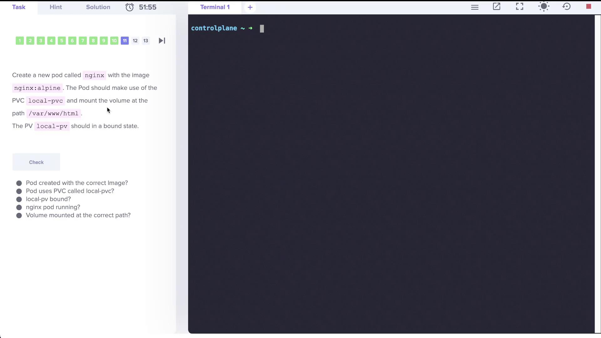

# Demo Storage Class

> 💡 You will learn how to list storage classes, examine their properties, create persistent volume claims (PVCs), and deploy a pod to trigger volume binding. Finally, we will create a new storage class with on-demand binding.

---

## Step 1: Checking Existing Storage Classes

Begin by determining how many storage classes exist in the cluster. Execute the following command:

```bash theme={null}
kubectl get storageclass
```

The output should display a storage class similar to:

```bash theme={null}
NAME                   PROVISIONER               RECLAIMPOLICY   VOLUMEBINDINGMODE      ALLOW_VOLUME_EXPANSION   AGE
local-path (default)   rancher.io/local-path     Delete          WaitForFirstConsumer   false                    15m
```

You can also use the abbreviated command:

```bash theme={null}
kubectl get sc
```

_Both commands yield identical results._

---

## Step 2: Reviewing Additional Storage Classes

Assume more storage classes have been created. Verify that there are now three storage classes:

```bash theme={null}
kubectl get storageclass
```

or

```bash theme={null}
kubectl get sc
```

An example output might be:

```bash theme={null}
NAME                           PROVISIONER                      RECLAIMPOLICY   VOLUMEBINDINGMODE      ALLOW_VOLUME_EXPANSION   AGE
local-path (default)           rancher.io/local-path            Delete          WaitForFirstConsumer   false                   15m
local-storage                  kubernetes.io/no-provisioner       Delete          WaitForFirstConsumer   false                   6s
portworx-io-priority-high      kubernetes.io/portworx-volume      Delete          Immediate              false                   6s
```

> 💡
>
> - **local-storage** uses the provisioner `kubernetes.io/no-provisioner`, meaning it does not support dynamic volume provisioning.
> - The **local-path** storage class is set to bind volumes using the `WaitForFirstConsumer` mode.
> - **portworx-io-priority-high** employs the `kubernetes.io/portworx-volume` provisioner.

---

## Step 3: Working with Persistent Volumes (PVs) and Persistent Volume Claims (PVCs)

First, check if there is any PVC consuming a persistent volume (PV) named **local-pv**:

```bash theme={null}
kubectl get pv
```

Example output:

```bash theme={null}
NAME       CAPACITY   ACCESS MODES   RECLAIM POLICY   STATUS      CLAIM           STORAGECLASS   REASON   AGE
local-pv   500Mi      RWO            Retain           Available local-storage   local-storage   -      110s
```

Next, verify that there are no PVCs created yet:

```bash theme={null}
kubectl get pvc
```

Expected output:

```bash theme={null}
No resources found in default namespace.
```

Since no PVC exists, create one that binds to the PV. The PVC must request 500Mi of storage, use the **ReadWriteOnce** access mode, and specify the **local-storage** storage class. Create a file named `pvc.yaml` with the following content:

```yaml theme={null}
apiVersion: v1
kind: PersistentVolumeClaim
metadata:
  name: local-pvc
spec:
  accessModes:
    - ReadWriteOnce
  resources:
    requests:
      storage: 500Mi
  storageClassName: local-storage
```

After applying the YAML file, check the PVC status:

```bash theme={null}
kubectl get pvc
```

Initially, the PVC may display a `Pending` status:

```bash theme={null}
NAME       STATUS    VOLUME   CAPACITY   ACCESS MODES   STORAGECLASS    AGE
local-pvc  Pending   <none>   <none>     <none>        local-storage   4s
```

For further details, inspect the PVC using:

```bash theme={null}
kubectl describe pvc local-pvc
```

You might see an event similar to:

```text theme={null}
Events:
  Type    Reason                 Age               From                                Message
  ----    ------                 ----              ----                                -------
  Normal  WaitForFirstConsumer   6s (x4 over 49s)  persistentvolume-controller         waiting for first consumer to be created before binding
```

This indicates that the **WaitForFirstConsumer** volume binding mode delays binding until a pod consumes the PVC.

---

## Step 4: Deploying a Pod to Trigger PVC Binding

Deploy a pod named **nginx** that uses the PVC to initiate binding. This pod will run the `nginx:alpine` image and mount the PVC at `/var/www/html`. Refer to the image below for guidance:



Create a file named `nginx.yaml` with the following configuration:

```yaml theme={null}
apiVersion: v1
kind: Pod
metadata:
  name: nginx
  labels:
    run: nginx
spec:
  containers:
    - name: nginx
      image: nginx:alpine
      volumeMounts:
        - mountPath: /var/www/html
          name: local-pvc-volume
  volumes:
    - name: local-pvc-volume
      persistentVolumeClaim:
        claimName: local-pvc
```

Deploy the pod with:

```bash theme={null}
kubectl create -f nginx.yaml
```

After a short wait, recheck the PVC status:

```bash theme={null}
kubectl get pvc
```

The output now should display that the PVC is **Bound**:

```bash theme={null}
NAME       STATUS  VOLUME    CAPACITY   ACCESS MODES   STORAGECLASS    AGE
local-pvc  Bound   local-pv  500Mi      RWO            local-storage   4m47s
```

This confirms that creating the consumer pod triggered the binding of the PVC to the PV.

---

## Step 5: Creating a New Storage Class with Delayed Binding

Finally, create a new storage class called **delayed-volume-sc**. This storage class utilizes a no-provisioner and employs the `WaitForFirstConsumer` volume binding mode. Prepare a file named `delayed-volume-sc.yaml` with the following content:

```yaml theme={null}
apiVersion: storage.k8s.io/v1
kind: StorageClass
metadata:
  name: delayed-volume-sc
provisioner: kubernetes.io/no-provisioner
volumeBindingMode: WaitForFirstConsumer
```

Create the storage class by running:

```bash theme={null}
kubectl create -f delayed-volume-sc.yaml
```

Verify by listing all storage classes:

```bash theme={null}
kubectl get sc
```

Expected output:

| NAME                      | PROVISIONER                   | RECLAIMPOLICY | VOLUMEBINDINGMODE    | ALLOW_VOLUME_EXPANSION | AGE |
| ------------------------- | ----------------------------- | ------------- | -------------------- | ---------------------- | --- |
| local-path (default)      | rancher.io/local-path         | Delete        | WaitForFirstConsumer | false                  | 26m |
| local-storage             | kubernetes.io/no-provisioner  | Delete        | WaitForFirstConsumer | false                  | 10m |
| portworx-io-priority-high | kubernetes.io/portworx-volume | Delete        | Immediate            | false                  | 10m |
| delayed-volume-sc         | kubernetes.io/no-provisioner  | Delete        | WaitForFirstConsumer | false                  | 3s  |

---

## Summary

In this exercise, we covered the following topics:

- Listing and determining the number of storage classes in a Kubernetes cluster.
- Understanding the difference between dynamic and non-dynamic volume provisioning.
- Creating a PersistentVolumeClaim (PVC) and observing its binding behavior under the `WaitForFirstConsumer` mode.
- Deploying a consumer pod (nginx) that triggers PVC binding.
- Creating a new storage class with delayed (on-demand) volume binding.
