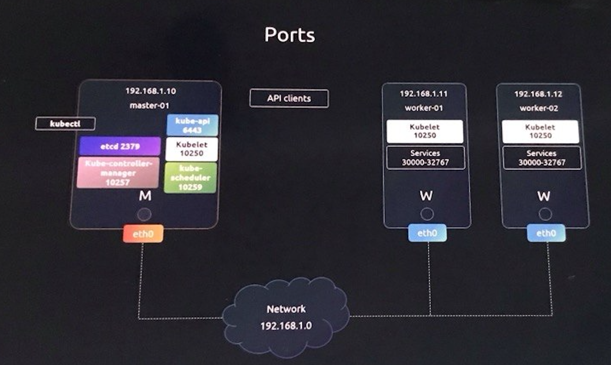
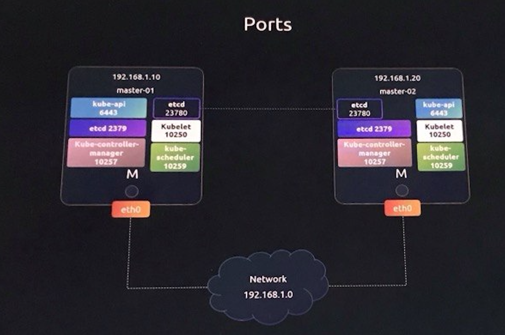

# Cluster Networking

> 💡 In this article, we explore the networking configurations necessary for both the master and worker nodes within a Kubernetes cluster. Each node must be equipped with at least one network interface configured with an IP address. Additionally, every host should have a unique hostname and MAC address—this is especially important when creating virtual machines (VMs) by cloning existing ones.

## Required Ports for Kubernetes Components


Effective communication among the control plane components and worker nodes relies on specific port configurations. The following table summarizes the key ports that must be open:

| Port Range  | Component                        | Description                                                                                                                           |
| ----------- | -------------------------------- | ------------------------------------------------------------------------------------------------------------------------------------- |
| 6443        | Kubernetes API Server (master)   | Used by worker nodes, the kube-controller-manager, external users, and other control plane components to access the API Server.       |
| 10250       | Kubelet (master and worker)      | Monitors cluster activities and manages nodes.                                                                                        |
| 10259       | Kube-scheduler (master)          | Required for scheduling operations.                                                                                                   |
| 10257       | Kube-controller-manager (master) | Needed for managing cluster state and various controllers.                                                                            |
| 30000–32767 | Worker Nodes Services            | Exposes services for external access on worker nodes.                                                                                 |
| 2379 & 2380 | etcd Server (master)             | Port 2379 is used for client communication, and port 2380 is used for communication between etcd servers in multi-master deployments. |



> 💡 For a comprehensive list of required ports and additional configuration details, refer to the [Kubernetes Documentation](https://kubernetes.io/docs/setup/production-environment/tools/kubeadm/control-plane-flags/). These details are crucial when configuring firewalls, IP tables, or network security groups across cloud platforms like GCP, Azure, or AWS.

## Verifying Network Configuration

To ensure that your cluster’s network environment is set up correctly, it is useful to run several common commands. These commands help you inspect interfaces, IP addresses, hostnames, routing tables, and active services:

```bash theme={null}
ip link
ip addr
ip addr add 192.168.1.10/24 dev eth0
ip route
ip route add 192.168.1.0/24 via 192.168.2.1
cat /proc/sys/net/ipv4/ip_forward
arp
netstat -plnt
```

> 💡 These commands are invaluable for gathering information about your network interfaces, IP configurations, and port usage. As you continue to explore your Kubernetes cluster setup, these tools will assist you in troubleshooting and ensuring network connectivity.
