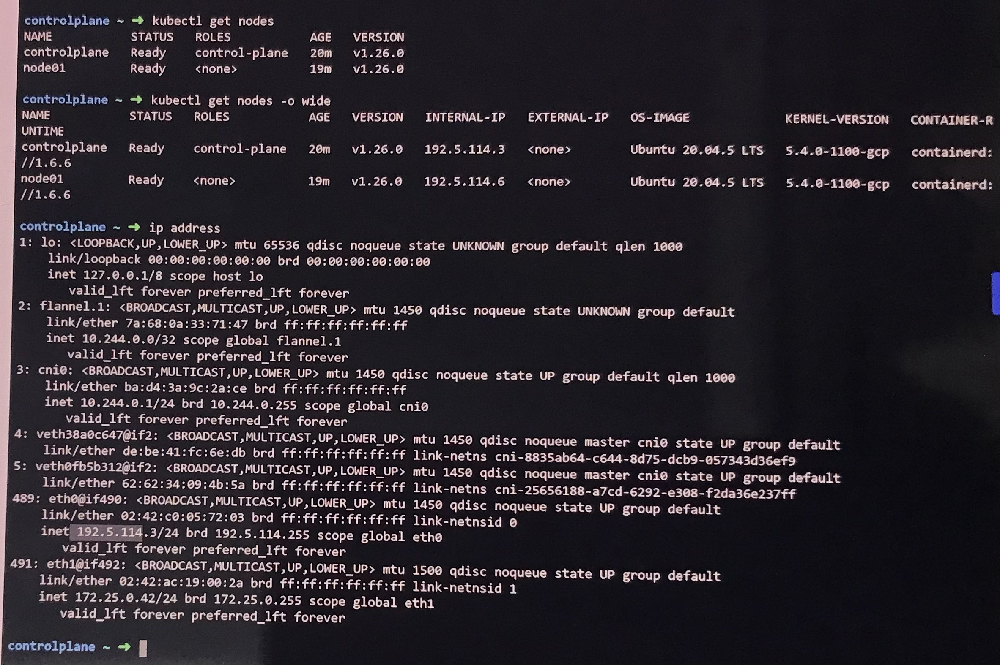
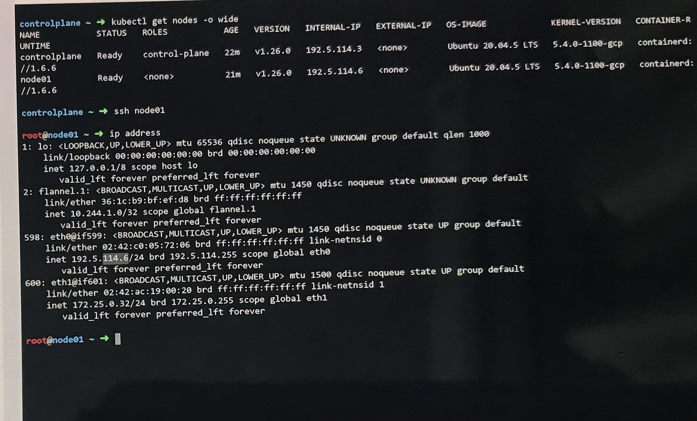
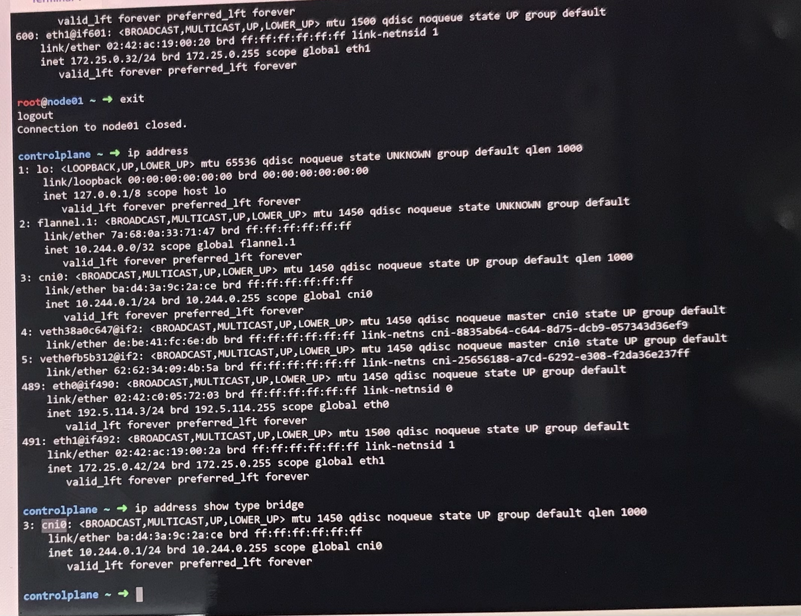

# Demo Networking Commands in Kubernetes

> 💡 How to gather network and runtime configuration details within your Kubernetes cluster environment.

---

## 1. How Many Nodes Are in the Cluster?

To find out how many nodes are part of your cluster, run:

```bash theme={null}
kubectl get nodes
```

The command outputs a list of nodes. In this example, there are two nodes—one functioning as the control plane and another as a worker node.

```bash theme={null}
controlplane ~ ➜ kubectl get nodes
NAME           STATUS   ROLES          AGE   VERSION
controlplane   Ready    control-plane   20m   v1.26.0
node01         Ready    <none>         19m   v1.26.0

controlplane ~ ➜
```

---

## 2. What Is the Internal IP Address of the Control Plane Node?

Use the `-o wide` option with `kubectl get nodes` to view additional details, including the internal IP address:

```bash theme={null}
kubectl get nodes -o wide
```

Locate the control plane node entry. In this sample output, the internal IP for the control plane is `192.5.114.3`.

```bash theme={null}
controlplane ~ ⟶ kubectl get nodes -o wide
NAME           STATUS   ROLES          AGE    VERSION      INTERNAL-IP     EXTERNAL-IP    OS-IMAGE                  KERNEL-VERSION       CONTAINERS
controlplane   Ready    control-plane  20m    v1.26.0      192.5.114.3     <none>         Ubuntu 20.04.5 LTS        5.4.0-1100-gcp       containerd
node01         Ready    <none>         19m    v1.26.0      192.5.114.6     <none>         Ubuntu 20.04.5 LTS        5.4.0-1100-gcp       containerd
```

---

## 3. Which Network Interface Is Configured for Cluster Connectivity on the Control Plane Node?

To determine which network interface is used for cluster connectivity, run:

```bash theme={null}
ip address
```

Review the output and look for the interface that shows the relevant IP address (in this case, an IP ending in `.3`). In the sample provided, the `eth0` interface has the correct binding.



> 💡 The interface selected for cluster connectivity is the one with the IP address matching that of the control plane node.

---

## 4. What Is the MAC Address of the Control Plane Node’s Network Interface?

Once you know the interface name (in this example, `eth0`), you can use the following command to display its MAC address:

```bash theme={null}
ip address show eth0
```


The MAC address appears in the output; for instance, you might see a value like `5e:9b:da:c5:43:fa`. Use this value as needed.

---

## 5. What Is the IP Address Assigned to Node One?

To discover the internal IP address of the worker node (node one), run:

```bash theme={null}
kubectl get nodes -o wide
```

Examine the entry corresponding to `node01`. In the sample output below, the worker node's internal IP address is `192.5.114.6`.

```bash theme={null}
NAME           STATUS   ROLES           AGE     VERSION      INTERNAL-IP     EXTERNAL-IP   OS-IMAGE            KERNEL-VERSION      CONTAINER-RUNTIME
controlplane   Ready    control-plane   21m     v1.26.0      192.5.114.3     <none>        Ubuntu 20.04.5 LTS   5.4.0-1100-gcp      containerd
node01         Ready    <none>         21m     v1.26.0      192.5.114.6     <none>        Ubuntu 20.04.5 LTS   5.4.0-1100-gcp      containerd
```

---

## 6. What Is the MAC Address Assigned to Node One?

To retrieve node one's MAC address, SSH into node one and execute:

```bash theme={null}
ip address
```

Scroll through the output until you find the interface associated with the internal IP (e.g., matching `192.5.114.6`). The corresponding MAC address—in this case, `02:42:c0:05:72:06`—is the answer.


---

## 7. What Is the Container Runtime’s Bridge Interface on the Host?

ContainerD commonly uses a CNI plugin to manage networking, which creates a bridge interface. Typically, this interface is named `cni0`. Confirm by listing all network interfaces:

```bash theme={null}
ip address
```

In the output, the `cni0` interface is visible and serves as the bridge for container connectivity.

```bash theme={null}
controlplane ~ ⟶ ip address
...
3: cni0: <BROADCAST,MULTICAST,UP,LOWER_UP> mtu 1450 qdisc noqueue state UP group default
    link/ether 2a:4d:3a:9c:2f:a2 brd ff:ff:ff:ff:ff:ff
    inet 10.244.0.2/24 brd 10.244.0.255 scope global cni0
       valid_lft forever preferred_lft forever
...
```



> 💡 The `cni0` bridge interface is essential for container networking. Ensure your CNI configuration is correct for proper connectivity.

---

## 8. What Is the State of Interface cni0?

To check the current state of the `cni0` interface, run:

```bash theme={null}
ip address show cni0
```

The output will display details, including the interface state. In the provided output, the state is `UP`.

```bash theme={null}
controlplane ~ ➜ ip address show cni0
3: cni0: <BROADCAST,MULTICAST,UP,LOWER_UP> mtu 1450 qdisc noqueue master cni0 state UP group default
    link/ether ba:4d:3a:9c:1a:20 brd ff:ff:ff:ff:ff:ff
    inet 10.244.0.2/24 brd 10.244.0.255 scope global cni0
       valid_lft forever preferred_lft forever
```

---

## 9. What Is the Default Gateway Used When Pinging Google from the Control Plane Node?

To identify the route taken for external traffic, inspect the default routing table using:

```bash theme={null}
ip route
```

The output indicates the default gateway. For example, the default route via `172.25.0.1` on interface `eth1` is used for external connectivity.

```bash theme={null}
controlplane ~ ➜ ip route
default via 172.25.0.1 dev eth1
10.244.0.0/24 dev cni0 proto kernel scope link src 10.244.0.1
172.25.0.0/24 via 10.244.1.0 dev flannel.1 onlink
172.25.0.0/24 dev eth1 proto kernel scope link src 172.25.0.42
192.5.114.0/24 dev eth0 proto kernel scope link src 192.5.114.3
controlplane ~ ➜
```

Thus, the default gateway is `172.25.0.1`.

---

## 10. On Which Port Is the Kube Scheduler Listening?

To determine the port on which the Kube Scheduler is active, use the netstat command with filtering options:

```bash theme={null}
netstat -np1 | grep -i scheduler
```

The output shows that the scheduler is listening on port `10259` on localhost.

```bash theme={null}
tcp        0      0 127.0.0.1:10259        0.0.0.0:*              LISTEN      3281/kube-scheduler
```

---

## 11. Which ETCD Port Sees More Client Connections?

ETCD typically listens on multiple ports, such as `2379` (client communication) and `2380` (peer communication). To inspect ETCD-related sockets, run:

```bash theme={null}
netstat -npl | grep -i etcd
```

A sample output could be:

```bash theme={null}
0.0.0.0:2379 LISTEN 3318/etcd
0.0.0.0:2380 LISTEN 3318/etcd
0.0.0.0:12381 LISTEN 3318/etcd
127.0.0.1:12381 LISTEN 3318/etcd
```

To count established connections for each port, use the following commands:

```bash theme={null}
netstat -npa | grep -i etcd | grep -i 2379 | wc -l
netstat -npa | grep -i etcd | grep -i 2380 | wc -l
```

> 💡 Typically, port `2379` will show significantly more client connections compared to port `2380`, which is reserved for peer-to-peer communication among ETCD members.

---

For further reading on Kubernetes networking and node configuration, please visit the [Kubernetes Documentation](https://kubernetes.io/docs/).
