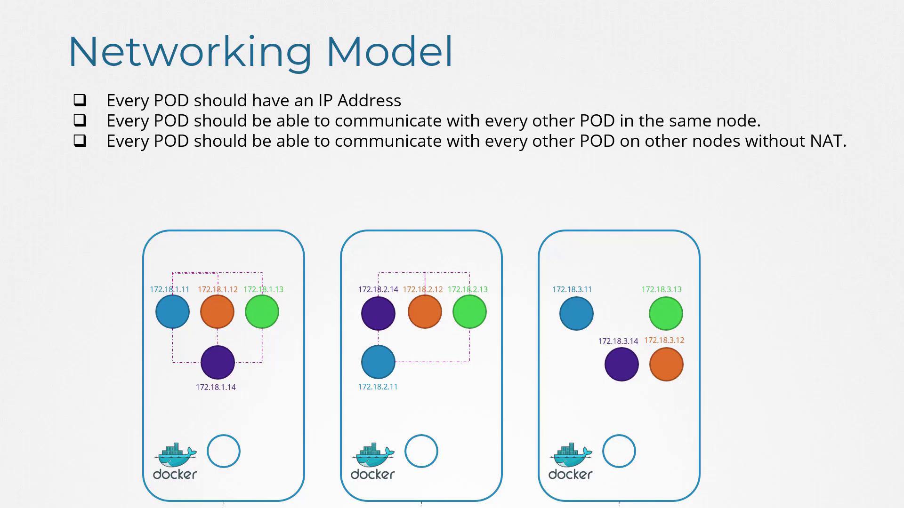
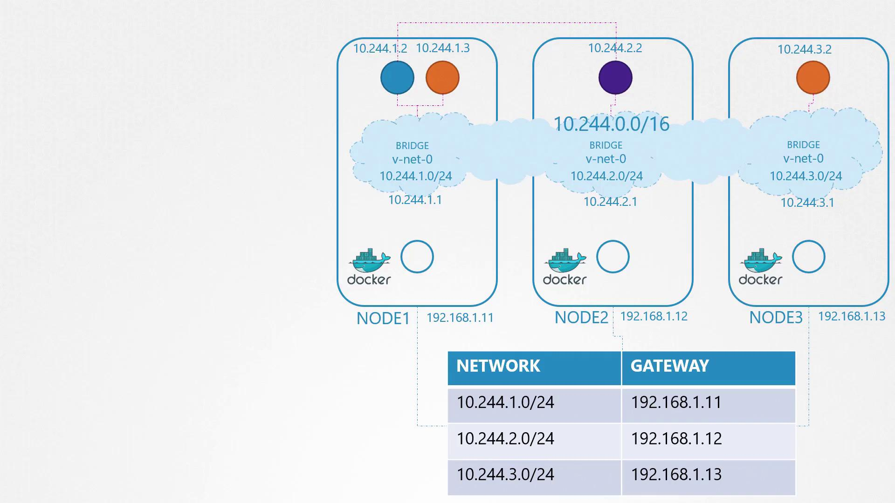
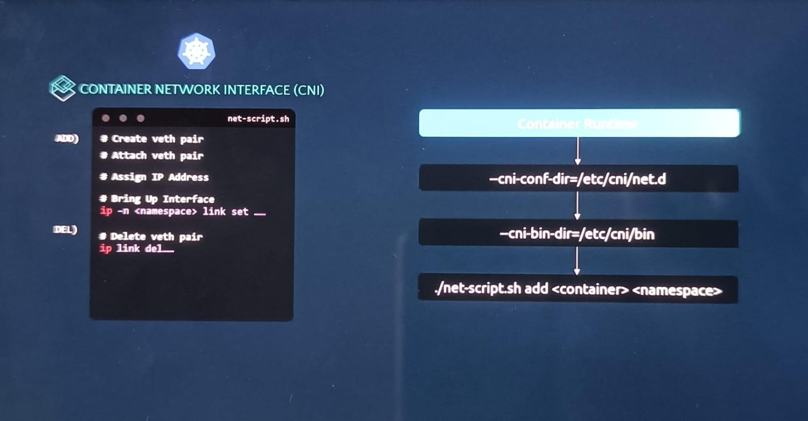

# Pod Networking

> This article explores pod networking in Kubernetes, covering IP address assignment, inter-pod communication, and the use of the Container Network Interface for automation.

We will explore how pods are assigned unique IP addresses and how they communicate both within a single node and across multiple nodes. By understanding these fundamentals, you’ll be better prepared to deploy resilient and scalable applications on your Kubernetes clusters.

So far, you have set up several Kubernetes master and worker nodes with proper networking configurations. The nodes are fully interconnected, and firewalls or network security groups are configured to allow the necessary communication between control plane components such as kube-apiserver, etcd, and kubelets. With control plane setup complete, the next crucial step is configuring the pod network.

Before deploying applications, consider these essential questions:

- How are pods addressed?
- How do pods communicate with one another?
- How can pod services be accessed both from within the cluster and externally?

Kubernetes does not include an out-of-the-box pod networking solution but defines strict requirements that your networking implementation must meet. These requirements include:

- Each pod must receive its own unique IP address.
- Every pod on the same node must be able to reach every other pod using its IP address.
- Every pod on different nodes should communicate with each other seamlessly with no additional Network Address Translation (NAT), regardless of the underlying IP ranges.



As long as your solution automatically assigns IP addresses and provides seamless connectivity both within a node and across nodes, it satisfies Kubernetes’ requirements.

> 💡 Ensure your networking solution supports automatic IP assignment and connectivity without relying on manual NAT configuration.

## Building a Pod Network

Let’s design a basic pod network solution using core networking concepts such as routing, IP address management, namespaces, and the Container Network Interface (CNI).

Imagine a three-node cluster where all nodes, regardless of their role, participate equally in the network. The external network assigns IP addresses in the 192.168.1.x range (e.g., node 1 receives 192.168.1.11, node 2 receives 192.168.1.12, and node 3 receives 192.168.1.13). When containers are created, each one is provided with its dedicated network namespace. To enable communication among these namespaces, attach each to a local bridge network on every node.

Begin by creating a bridge network on each node and configuring it with a specific IP address. For example:

```bash theme={null}
ip link add v-net-0 type bridge
ip link set dev v-net-0 up
ip addr add 192.168.15.5/24 dev v-net-0
ip link add veth-red type veth peer name veth-red-br
ip link set veth-red netns red
ip -n red addr add 192.168.15.1 dev veth-red
ip -n red link set veth-red up
ip link set veth-red-br master v-net-0
ip netns exec blue ip route add 192.168.1.0/24 via 192.168.15.5
iptables -t nat -A POSTROUTING -s 192.168.15.0/24 -j MASQUERADE
```

In this configuration, all nodes are treated equivalently since both management and workload pods rely on the same networking principles.

### Planning Pod Connectivity

Given that nodes have public IPs, assign each node’s bridge network its own private subnet. For example, you might allocate:

- Node 1: 10.244.1.0/24
- Node 2: 10.244.2.0/24
- Node 3: 10.244.3.0/24

Assign the corresponding IP addresses to each node’s bridge interface as follows:

```bash theme={null}
ip link add v-net-0 type bridge
# On node 1
ip addr add 10.244.1.1/24 dev v-net-0

# On node 2
ip addr add 10.244.2.1/24 dev v-net-0

# On node 3
ip addr add 10.244.3.1/24 dev v-net-0
```

Each container requires additional network configuration. A script that runs the following commands can automate the process for every new container:

1. Create a virtual Ethernet pair (veth pair) connecting the container’s network namespace with the node’s bridge.
2. Configure an IP address within the container and set up a default gateway.

For example, assume the free IP address 10.244.1.2 is allocated to a container:

```bash theme={null}
# Create veth pair
ip link add <veth_container> type veth peer name <veth_bridge>

# Attach veth pair to the appropriate network namespace and bridge
ip link set <veth_container> netns <namespace>
ip link set <veth_bridge> master v-net-0

# Assign IP address and configure routing inside the container’s namespace
ip -n <namespace> addr add 10.244.1.2/24 dev <veth_container>
ip -n <namespace> route add default via 10.244.1.1

# Bring up the interface in the namespace
ip -n <namespace> link set <veth_container> up
```

These commands configure a single container. To scale your Kubernetes deployment, replicate and automate this script across nodes.

## Enabling Inter-Node Communication

After establishing unique IP addresses for each pod on every node, the next challenge is to enable cross-node communication. Consider a scenario where a pod at 10.244.1.2 on node 1 needs to communicate with a pod at 10.244.2.2 on node 2. Without an appropriate route, node 1 wouldn’t know how to reach the pod on node 2.

To resolve this issue, add a route in node 1’s routing table that directs traffic for the 10.244.2.0/24 subnet via node 2’s external IP address (192.168.1.12):

```bash theme={null}
# On node 1
ip route add 10.244.2.2 via 192.168.1.12
```

After configuring this route, pods on node 1 can communicate with those on node 2. Similar routes should be configured on all nodes to ensure seamless inter-node connectivity.

> 💡 Manually configuring routes on each node may suffice for small setups, but as your infrastructure grows, consider using a centralized router or dynamic routing protocols to manage these routes efficiently.

For more complex networks, a centralized router can simplify the management of the aggregated subnet (e.g., combining 10.244.1.0/24, 10.244.2.0/24, and 10.244.3.0/24 into a single 10.244.0.0/16 network).



## Automating Networking with CNI

Manually configuring bridge networks and routing for every container is impractical in large environments where thousands of pods could be created per minute. The Container Network Interface (CNI) automates these tasks by executing networking scripts as pods are initiated.

The container runtime on each node reads a CNI configuration that specifies the networking script. Upon pod creation, the runtime invokes the script with the "add" command, passing the necessary container details (such as container name and namespace). The script then sets up the pod’s networking. Here is a simplified example of such a script:



```bash theme={null}
# Create a virtual Ethernet pair
ip link add <veth_container> type veth peer name <veth_bridge>

# Attach veth pair to the designated namespace and bridge
ip link set <veth_container> netns <namespace>
ip link set <veth_bridge> master v-net-0

# Assign an IP address and configure default routing in the container's namespace
ip -n <namespace> addr add <container_ip>/24 dev <veth_container>
ip -n <namespace> route add default via <bridge_ip>

# Bring up the interface in the container's namespace
ip -n <namespace> link set <veth_container> up
```

To maintain consistency with CNI standards, the script must also support a delete operation to clean up the container’s network interfaces and free the assigned IP address when the pod is terminated:

```bash theme={null}
ip -n <namespace> link set <veth_container> down
ip link del <veth_bridge>
```

The container runtime executes the script as follows when a container is created:

```bash theme={null}
./net-script.sh add <container> <namespace>
```

And when a container is deleted:

```bash theme={null}
./net-script.sh del <container> <namespace>
```

## Conclusion

In this guide, we explored the fundamental principles of pod networking in Kubernetes. We explained how each pod receives a unique IP address and established connectivity by configuring bridge networks on nodes and setting up inter-node routing. We also introduced the Container Network Interface (CNI), which automates these processes in dynamic environments.

In upcoming articles, we will examine additional networking solutions and provide deeper insights into IP address management and network troubleshooting within Kubernetes clusters.
