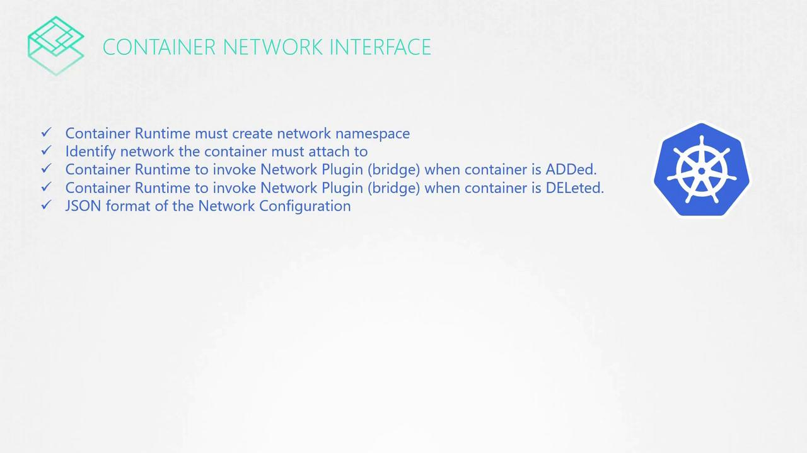
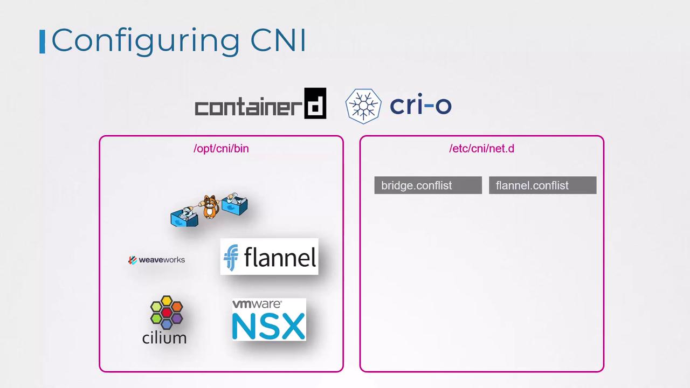

# CNI in kubernetes

> 💡 In this article, we explore how Kubernetes leverages the Container Network Interface (CNI) to manage container networking. You will gain an understanding of how network plugins are configured and used in a Kubernetes environment.

Earlier, we reviewed:

- The basics of networking and namespaces
- Docker networking fundamentals
- The evolution and rationale behind CNI
- A list of supported CNI plugins

Now, we focus on how Kubernetes is configured to use network plugins.

As discussed in previous lessons, the CNI specifies the responsibilities of the container runtime. In Kubernetes, container runtimes such as Containerd or CRI-O create the container network namespaces and attach them to the correct network by invoking the appropriate network plugin. Although Docker was initially the primary container runtime, it has largely been replaced by Containerd as an abstraction layer.



## Configuring CNI Plugins in Kubernetes

When a container is created, the container runtime invokes the necessary CNI plugin to attach the container to the network. Two common runtimes that demonstrate how this process works are Containerd and CRI-O.

> 💡 Container runtimes look for CNI plugin executables in the `/opt/cni/bin` directory, while network configuration files are read from the `/etc/cni/net.d` directory.

### Directory Structure for CNI Plugins and Configuration

The network plugins that are installed reside in `/opt/cni/bin`, and the configuration files that dictate which plugin to use are stored in `/etc/cni/net.d`.

For example, you might see the following directories:

```bash theme={null}
ls /opt/cni/bin
```

```bash theme={null}
bridge  dhcp  flannel  host-local  ipvlan  loopback  macvlan  portmap  ptp  sample  tuning  vlan  weave-ipam  weave-net  weave-plugin-2.2.1
```

```bash theme={null}
ls /etc/cni/net.d
```

```bash theme={null}
10-bridge.conflist
```

> 💡 If multiple configuration files exist in the directory, kubelet selects the first file in alphabetical order. A common configuration file is 10-bridge.conf.

In this case, the container runtime chooses the "bridge" configuration file.



### Understanding a CNI Bridge Configuration File

A typical CNI bridge configuration file, adhering to the CNI standard, might look like this:

```bash theme={null}
cat /etc/cni/net.d/10-bridge.conf
```

```json theme={null}
{
  "cniVersion": "0.2.0",
  "name": "mynet",
  "type": "bridge",
  "bridge": "cni0",
  "isGateway": true,
  "ipMasq": true,
  "ipam": {
    "type": "host-local",
    "subnet": "10.22.0.0/16",
    "routes": [{ "dst": "0.0.0.0/0" }]
  }
}
```

In this configuration:

- The `"name"` field (e.g., `"mynet"`) represents the network name.
- The `"type"` field set to `"bridge"` indicates the use of a bridge plugin.
- The `"bridge"` field (e.g., `"cni0"`) specifies the network bridge's name.
- The `"isGateway"` flag designates whether the bridge interface should have an IP address to function as a gateway.
- The `"ipMasq"` option enables network address translation (NAT) through IP masquerading.
- The `"ipam"` (IP Address Management) section uses `"host-local"` to allocate IP addresses from the specified subnet (`"10.22.0.0/16"`) and defines a default route.

> 💡 Understanding these configuration fields is crucial for troubleshooting and optimizing Kubernetes networking. The settings in this bridge configuration align with fundamental networking concepts such as bridging, routing, and NAT masquerading.

For more information on related topics, consider reviewing:

- [Kubernetes Basics](https://kubernetes.io/docs/concepts/overview/what-is-kubernetes/)
- [Kubernetes Documentation](https://kubernetes.io/docs/)
- [Docker Hub](https://hub.docker.com/)
