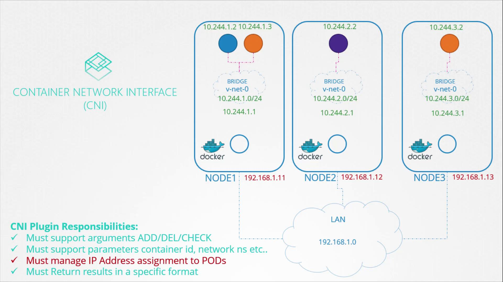

# Kubernetes IP Address Management (IPAM)

## The Role of CNI in Pod Networking

Kubernetes distinguishes between node IPs and pod IPs. This article focuses on the allocation of an IP subnet to the virtual bridge networks on each node and the subsequent assignment of IPs to pods. Node IP addresses are managed separately, often using external IP management solutions.

IP assignment is governed by the Container Network Interface (CNI) standards. The CNI plugin—the network solution provider—is responsible for assigning IPs to containers.



## The Fundamentals: Hard-Coded IP Assignment

Recall the basic plugin developed earlier, which handled IP assignment within the container network namespace.

- This usually involves assigning an IP to the veth pair interface and setting up the default gateway.

```bash theme={null}
# Assign IP Address in a specific namespace

ip -n <namespace> addr add <ip_address>/<subnet_mask> dev <interface>
ip -n <namespace> route add <destination> via <gateway>

```

## The Core Challenge: Ensuring IP Uniqueness

- In a Kubernetes cluster, every Pod must have a unique IP address within the cluster network. If two Pods are assigned the same IP, network packets will be misrouted, causing application failures.
- **_The Solution:_** IPAM (IP Address Management). Kubernetes itself doesn't dictate how to store these IPs; it delegates that responsibility to CNI plugins to ensure no duplicates are ever assigned.

# Evolution of IP Management Strategies:

- The methods below show the evolution of how we ensure no two containers ever claim the same address.

## Approach 1: Manual IP Management via Local State

One straightforward approach to IP management is to store the list of assigned IPs in a file. A script then retrieving a free IP from this file and assigns IP addresses and routes within a specific network namespace. For example:

```bash theme={null}
#  Check the 'ledger' for a unique, unassigned IP
ip=$(get_free_ip_from_file)
# Assign IP Address in a specific namespace
ip -n <namespace> addr add <ip_address>/<subnet_mask> dev <interface>
ip -n <namespace> route add <destination> via <gateway>
```

> 💡 This manual method is best suited for simple environments or testing purposes. For larger deployments, consider using built-in IPAM solutions.

## Approach 2: Standardizing with Built-in IPAM Plugins

Rather than implementing custom IP assignment logic, you can leverage built-in IPAM plugins provided by the CNI. The host-local plugin, for instance, manages IP addresses locally on each node.

### Static Invocation of the host-local Plugin in your script:

The CNI project provides specialized IPAM plugins. The most common is host-local.

- In this approach, your main CNI script doesn't manage the "ledger" itself; it executes the host-local binary, which handles the file locking and state management on the node's disk safely.

- In this method, it is still your responsibility to directly invoke the host-local plugin within your script to fetch an available address:

```bash theme={null}
# Invoke IPAM host-local plugin to retrieve a free IP
ip=$(get_free_ip_from_host_local)

# Assign IP Address in a specific namespace
ip -n <namespace> addr add <ip_address>/<subnet_mask> dev <interface>
ip -n <namespace> route add <destination> via <gateway>
```

> 💡 Leveraging CNI plugins such as host-local reduces custom code maintenance and aligns with Kubernetes best practices for network management.

## Approach 3: Dynamic Plugin Execution in our script via CNI Configuration:

The IPAM configuration is specified in the CNI configuration file. This file includes details such as the plugin type, subnet, and routing rules. This allows your CNI "Main" plugin to read parameters at runtime and invoke whichever plugin is specified (e.g., host-local, dhcp) without hard-coding the logic.

### Example CNI Configuration (.conf)

The following JSON defines the subnet range and routing rules for the host-local plugin:

```json theme={null}
{
  "cniVersion": "0.2.0",
  "name": "mynet",
  "type": "net-script",
  "bridge": "cni0",
  "isGateway": true,
  "ipMasq": true,
  "ipam": {
    "type": "host-local",
    "subnet": "10.244.0.0/16",
    "routes": [
      {
        "dst": "0.0.0.0/0"
      }
    ]
  }
}
```

## How Kubernetes Ensures Cluster-Wide Uniqueness

While host-local prevents duplicates on a single node, Kubernetes prevents duplicates across the entire cluster by assigning a unique PodCIDR to every node via the Controller Manager.

- Cluster CIDR: $10.244.0.0/16
- Node A: Assigned $10.244.1.0/24
- Node B: Assigned $10.244.2.0/24

Because Node A and Node B have completely different subnets, their local IPAM plugins will never accidentally assign the same IP address.

# Summary

<table style="min-width: 75px;"><colgroup><col style="min-width: 25px;"><col style="min-width: 25px;"><col style="min-width: 25px;"></colgroup><tbody><tr><td colspan="1" rowspan="1"><p><strong>Method</strong></p></td><td colspan="1" rowspan="1"><p><strong>Risk of Duplication</strong></p></td><td colspan="1" rowspan="1"><p><strong>Best For</strong></p></td></tr><tr><td colspan="1" rowspan="1"><p><strong>Manual File</strong></p></td><td colspan="1" rowspan="1"><p><strong>High</strong> (Race conditions)</p></td><td colspan="1" rowspan="1"><p>Learning &amp; Lab environments</p></td></tr><tr><td colspan="1" rowspan="1"><p><strong>host-local Plugin</strong></p></td><td colspan="1" rowspan="1"><p><strong>Low</strong> (Node-level locking)</p></td><td colspan="1" rowspan="1"><p>Standard single-node setups</p></td></tr><tr><td colspan="1" rowspan="1"><p><strong>CNI Config</strong></p></td><td colspan="1" rowspan="1"><p><strong>Zero</strong> (Standardized Policy)</p></td><td colspan="1" rowspan="1"><p>Production Kubernetes clusters</p></td></tr></tbody></table>

By understanding both manual and plugin-based IP management strategies, you can implement a robust and scalable network configuration in your Kubernetes clusters.

For more detailed information on CNI configuration options, refer to the [Kubernetes Documentation](https://kubernetes.io/docs/concepts/extend-kubernetes/compute-storage-net/network-plugins/).
