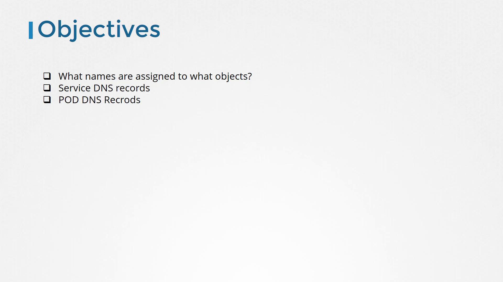
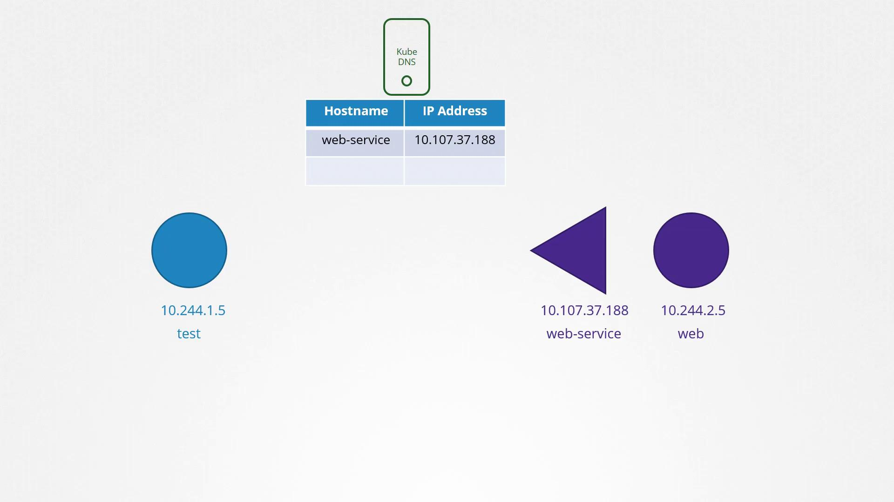
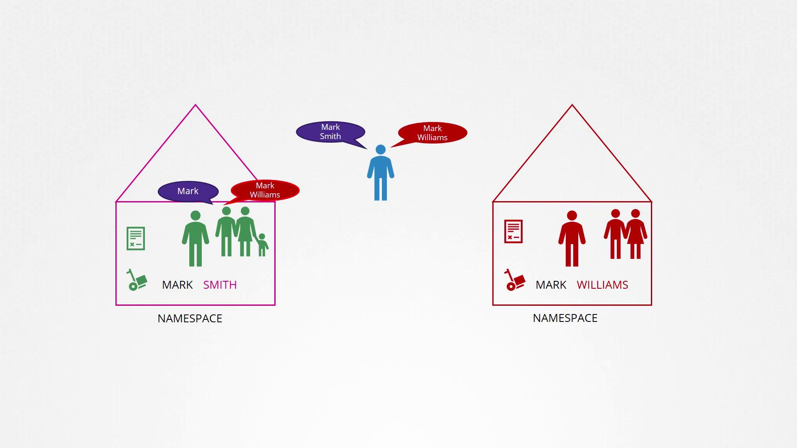
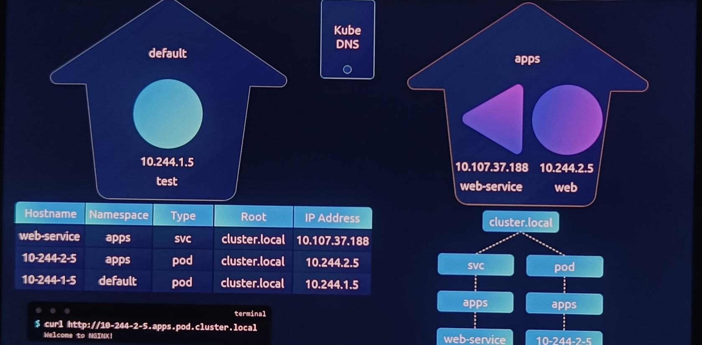

# DNS in kubernetes

> 💡 This article explains how DNS is managed in Kubernetes, covering service and pod DNS records and their role in pod communication.

Previously, we covered the fundamentals of DNS, including common tools such as `host`, `nslookup`, and `dig` alongside various DNS record types (A, CNAME, etc.) and the domain name hierarchy. We even demonstrated how to set up your own DNS server using CoreDNS. Now, we shift our focus to the DNS names assigned to various Kubernetes objects—like services and pods—and the different methods of accessing one pod from another.



## Cluster Internal DNS

Imagine a three-node Kubernetes cluster with multiple pods and services distributed across them. Each node typically has a unique name and IP address registered in your organization's DNS server. However, our focus here is on the internal DNS resolution among the cluster’s pods and services. By default, when you create a cluster, Kubernetes deploys a built-in DNS server (unless manually configured otherwise), which facilitates name resolution for pods and services.

## Service Discovery via DNS

> 💡 Consider a simple scenario with two pods and a service in your cluster:
>
> - A **test pod** with IP `10.244.1.5`.
> - A **web pod** with IP `10.244.2.5`.
>
> Even if these pods reside on different nodes (as indicated by their IP addresses), Kubernetes DNS assumes that all pods and services can be reached via their IP addresses. To allow the test pod to communicate with the web pod, a service named **web-service** is created. This service is assigned its own IP address (e.g., `10.107.37.188`) and automatically gets a DNS record mapping the service name to its IP.



Within the cluster, any pod can resolve and access the web service using its service name. For example, to access the web-service from the test pod, you could use:

```bash theme={null}
curl http://web-service
# Output: Welcome to NGINX!
```

## Namespace Isolation and FQDNs

Earlier, we discussed namespaces in Kubernetes. Remember that pods within the same namespace (default namespace is usually "default") can communicate using just their short names. The image below illustrates the concept of separate namespaces and how naming differs between them.



### When the service is in the default namespace

In our scenario, because the test pod, web pod, and web-service are all in the **default** namespace, the test pod can simply refer to the service as "web-service."

### When the service resides in the 'apps' namespace

However, if the web-service were deployed in another namespace (for example, "apps"), you would need to access it using "web-service.apps." Here, "apps" becomes part of the fully qualified service name.

To illustrate DNS resolution with namespaces, consider the following examples:

```bash theme={null}
# When the service is in the default namespace
curl http://web-service
# When the service resides in the 'apps' namespace
curl http://web-service.apps
# Using the fully qualified domain name (FQDN)
curl http://web-service.apps.svc.cluster.local
# Output: Welcome to NGINX!
```

For each namespace, DNS server creates a subdomain with its name. All services within that namespace are grouped under a subdomain called "svc." Additionally, the entire cluster is associated with a root domain (by default, `cluster.local`). Thus, the fully qualified domain name for a service in the "apps" namespace is:

-   `web-service.apps.svc.cluster.local`

## DNS Records for Individual Pods

Now, let’s discuss pod DNS records. By default, DNS records for pods are not created. However, this behavior can be explicitly enabled. When pod DNS records are activated, Kubernetes generates a DNS record for each pod by converting the pod’s IP address into a hostname—replacing dots (`.`) with dashes (`-`). The record includes the pod's namespace, is set to type "pod," and utilizes the cluster's root domain.

For example, if a test pod in the default namespace has the IP `10.244.2.5`, the corresponding DNS record becomes:

-  `10-244-2-5.apps.pod.cluster.local`

This DNS entry resolves to the pod's IP address. You can test the resolution with the command below:

```bash theme={null}
curl http://10-244-2-5.apps.pod.cluster.local
# Output: Welcome to NGINX!
```



By understanding these DNS concepts, you can better manage communication within your Kubernetes cluster and ensure reliable service discovery in your environment.
